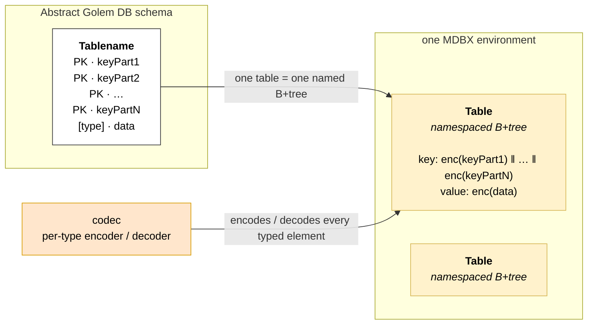
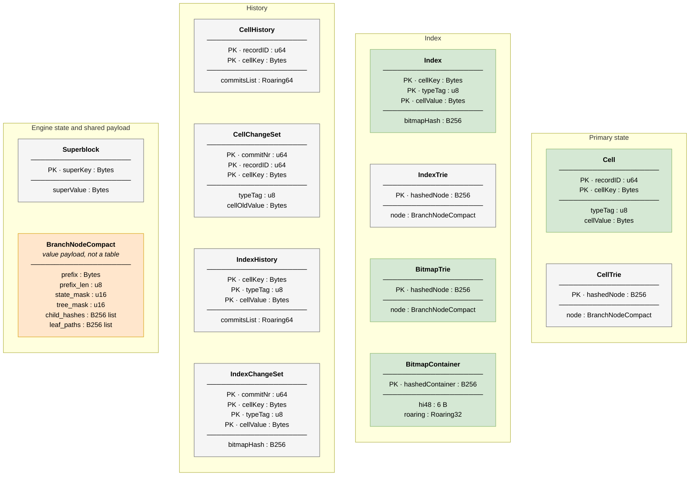
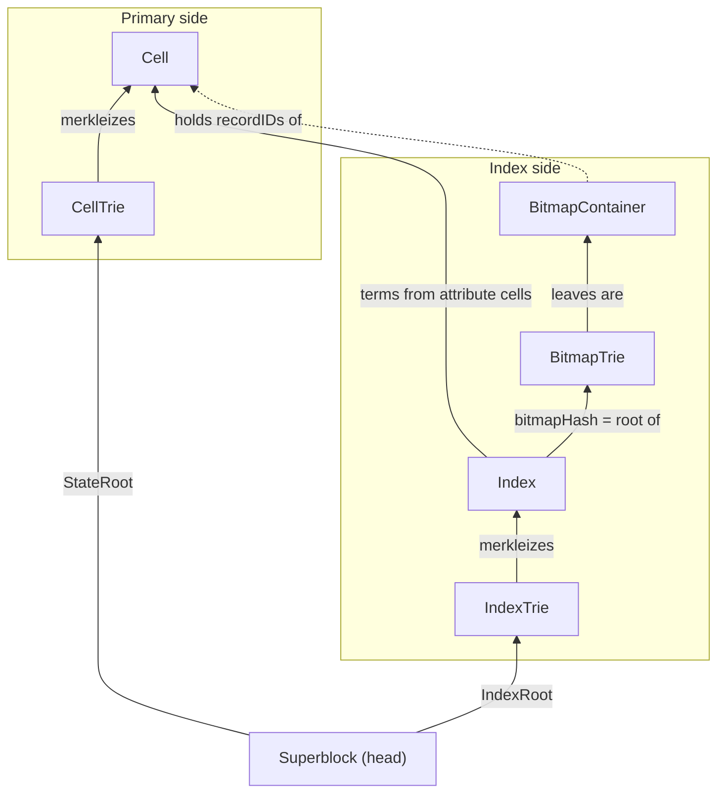
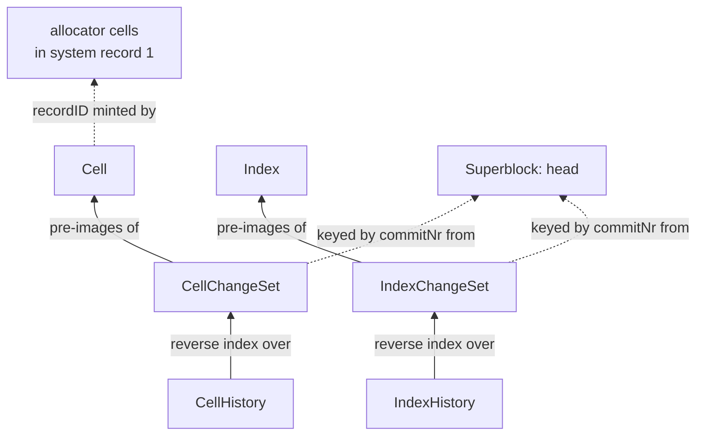
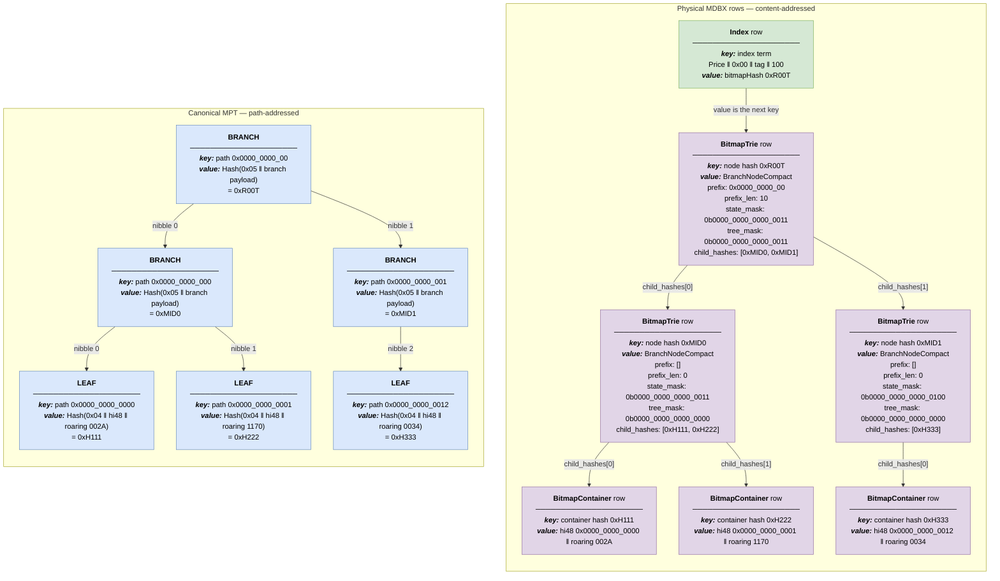
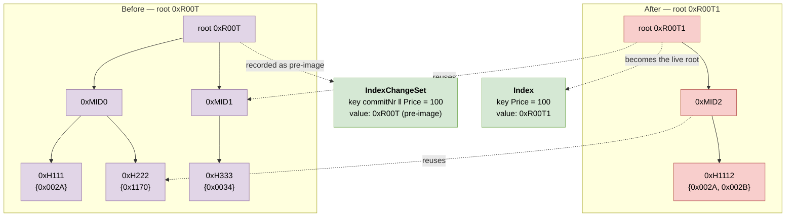
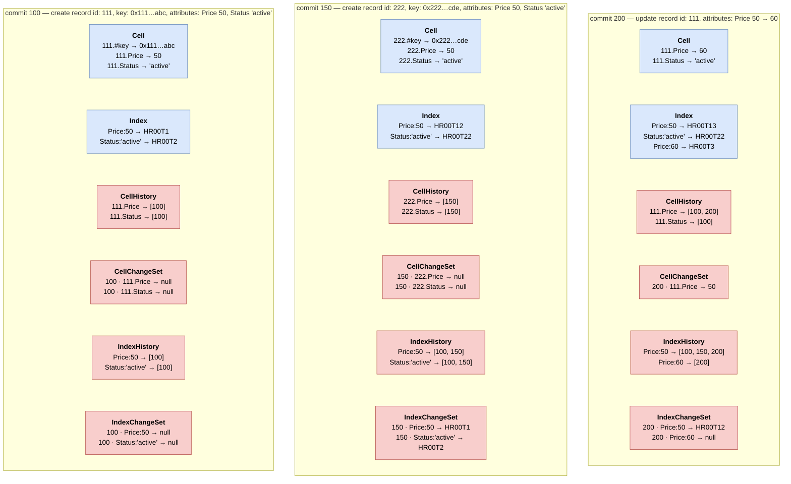
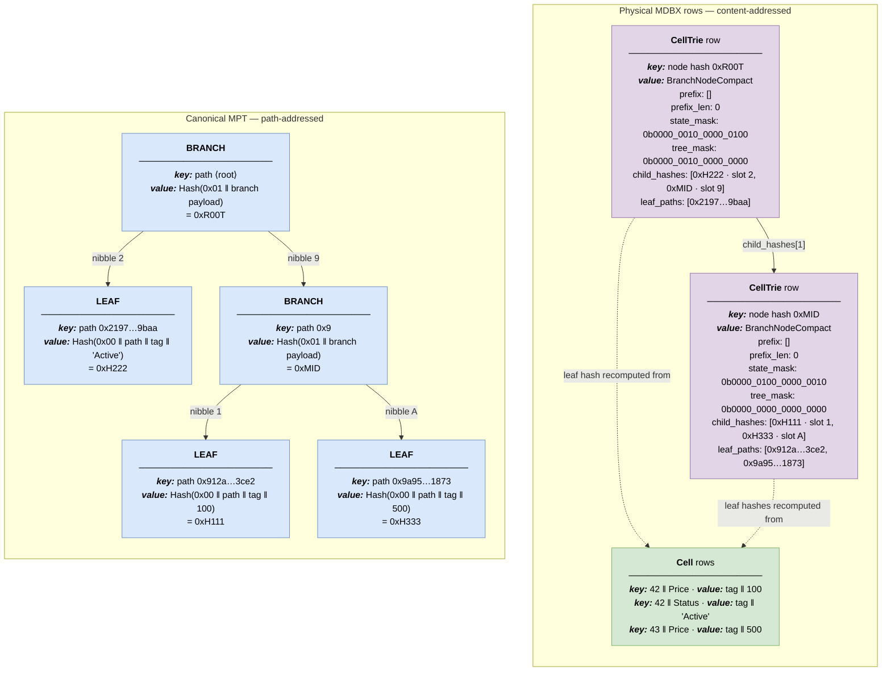
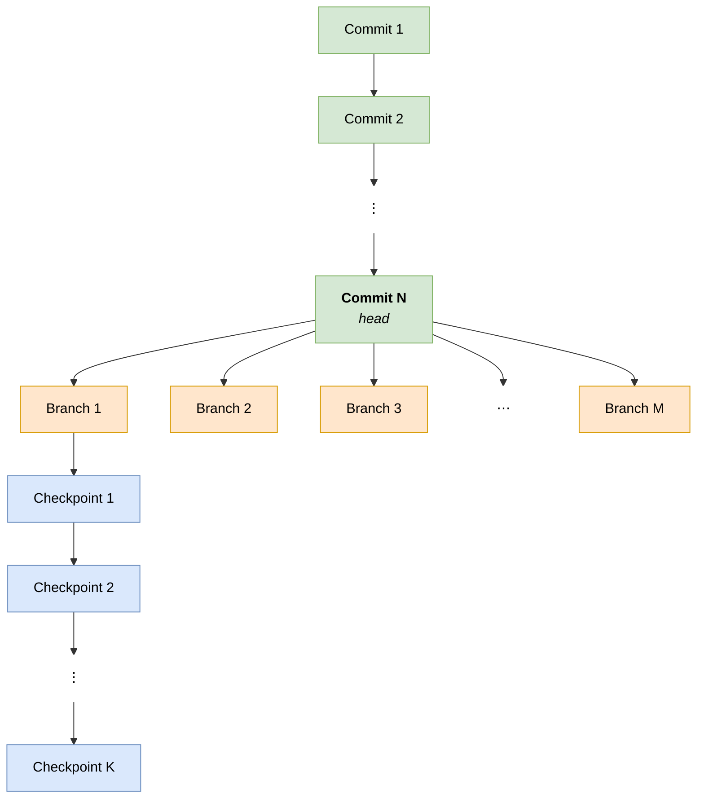
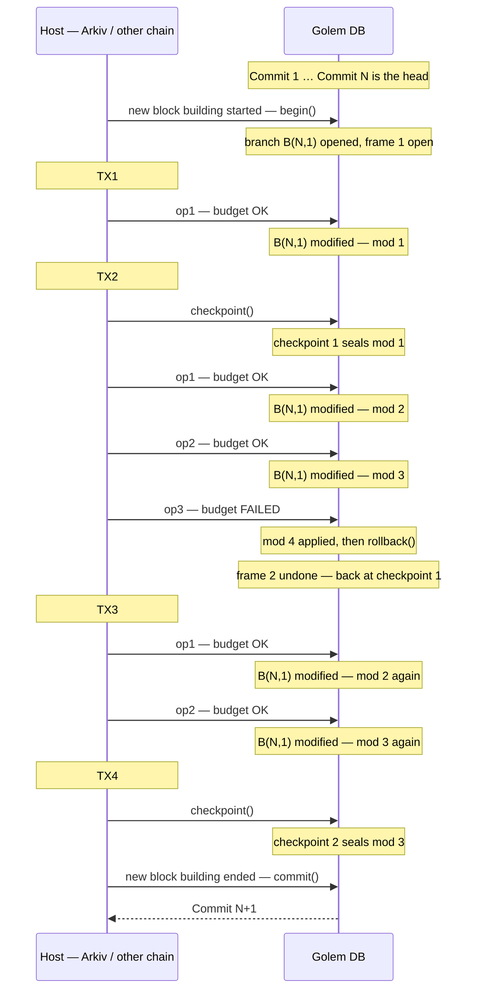

# Golem DB — Technical Design

This document records the **settled design** of the Golem DB storage engine: the schema, the
commitment, the history mechanism, and the reserved-record structure that carries the engine's own
state. It supersedes the working draft [golem-db-architecture.md](../golem-db-architecture.md) and
the change set collected in [golem-db-proposals.md](../golem-db-proposals.md) for everything it
covers.

One layer built on top of what is described here — **metering and cost** — is not yet settled and is
deliberately absent. Where a chapter has to mention it, it does so in prose or points at the working
draft.

A companion document, [golem-db-design-short.md](golem-db-design-short.md), carries the same chapter
structure with the decisions alone: no explanation, no reasoning, no examples.

## Contents

- **[1. Fundamentals](#1-fundamentals)**
  - [What Golem DB Is For](#what-golem-db-is-for)
  - [Abstract Primitives to Physical MDBX Mapping](#abstract-primitives-to-physical-mdbx-mapping)
- **[2. System Schema](#2-system-schema)**
  - [Table Dictionary](#table-dictionary)
  - [Dependencies](#dependencies)
  - [Bitmap Encoding](#bitmap-encoding)
  - [The `BranchNodeCompact` Structural Payload](#the-branchnodecompact-structural-payload)
  - [Note on Hashing](#note-on-hashing)
- **[3. Records and Cells](#3-records-and-cells)**
  - [The Cell Key](#the-cell-key)
  - [Record Identity: the `#key` Cell](#record-identity-the-key-cell)
  - [Cell Names](#cell-names)
  - [Cell Kinds and Types](#cell-kinds-and-types)
  - [Benefits and Trade-offs of the Cell Decomposition](#benefits-and-trade-offs-of-the-cell-decomposition)
- **[4. System, Admin and User Records](#4-system-admin-and-user-records)**
  - [The Superblock](#the-superblock)
  - [Record Classes and the Reserved Catalogue](#record-classes-and-the-reserved-catalogue)
  - [What the Engine Enforces](#what-the-engine-enforces)
  - [Genesis, and Roots as Cells](#genesis-and-roots-as-cells)
- **[5. Indexing Cells for Filtering](#5-indexing-cells-for-filtering)**
  - [Structural Index Key Formulation](#structural-index-key-formulation)
  - [Free Range Queries via MDBX Lexicographical Ordering](#free-range-queries-via-mdbx-lexicographical-ordering)
  - [Why the Posting List Gets a Second Tier](#why-the-posting-list-gets-a-second-tier)
- **[6. Merkleizing the Posting List (`BitmapTrie`)](#6-merkleizing-the-posting-list-bitmaptrie)**
  - [Binding a Container to Its Path](#binding-a-container-to-its-path)
  - [Update Mechanics (Copy-on-Write)](#update-mechanics-copy-on-write)
  - [Structural Deduplication and Zero-Cost History](#structural-deduplication-and-zero-cost-history)
- **[7. Historical Data and Bitemporality](#7-historical-data-and-bitemporality)**
  - [Resolving a Value as of a Commit](#resolving-a-value-as-of-a-commit)
  - [Historical Query Execution Example](#historical-query-execution-example)
- **[8. State Commitment and Global Root](#8-state-commitment-and-global-root)**
  - [The Two Tries](#the-two-tries)
  - [Domain Separation and Preimage Encoding](#domain-separation-and-preimage-encoding)
  - [Bare-Leaf Roots and Virtual Leaves](#bare-leaf-roots-and-virtual-leaves)
  - [Which Tables Are Under Commitment](#which-tables-are-under-commitment)
  - [Depth Bounds and Future Optimization Paths](#depth-bounds-and-future-optimization-paths)
- **[9. Trie Representation: Canonical vs. Physical](#9-trie-representation-canonical-vs-physical)**
  - [The Canonical Trie and the Physical Trie](#the-canonical-trie-and-the-physical-trie)
  - [Precedent: How Ethereum Clients Chose](#precedent-how-ethereum-clients-chose)
  - [Trade-offs: Content-Addressed vs. Path-Based Physical Storage](#trade-offs-content-addressed-vs-path-based-physical-storage)
- **[10. Write Branches and Checkpoint Frames](#10-write-branches-and-checkpoint-frames)**
  - [Branches over the Head](#branches-over-the-head)
  - [Frames and Checkpoints](#frames-and-checkpoints)
  - [The In-Memory Overlay](#the-in-memory-overlay)
  - [The Change-Set Log and Rollback](#the-change-set-log-and-rollback)
  - [Sealing a Branch](#sealing-a-branch) · [Why the Split Exists](#why-the-split-exists)
  - [Committing a Branch](#committing-a-branch)
- **[11. Commit Immutable-Data Segments](#11-commit-immutable-data-segments)**
  - [Why Cells Are the Wrong Shape](#why-cells-are-the-wrong-shape)
  - [The Model](#the-model) · [On-Disk Form](#on-disk-form)
  - [Writing Against a Sealed Commit](#writing-against-a-sealed-commit)
  - [The System Segment](#the-system-segment)
  - [Operations](#operations)
  - [Genesis Declaration](#genesis-declaration)
  - [What This Assumes of the Schema](#what-this-assumes-of-the-schema)
  - [Rejected Alternatives](#rejected-alternatives)
- **[12. Sorting](#12-sorting)**
  - [Fetching and Sorting a Materialised Match Set](#fetching-and-sorting-a-materialised-match-set)
  - [Typed Sort Terms and Multi-Key Sorts](#typed-sort-terms-and-multi-key-sorts)
  - [Result Order](#result-order)
  - [The Alternative: Index-Ordered Emission](#the-alternative-index-ordered-emission)
- **[13. Paging](#13-paging)**
  - [What a Page Costs](#what-a-page-costs)
  - [Walking and Jumping](#walking-and-jumping) · [The position key](#the-position-key)
  - [Pinned and Live](#pinned-and-live) · [What pinning costs](#what-pinning-costs)
  - [The Cursor and the Warm Node](#the-cursor-and-the-warm-node)
  - [Open Question on Paging](#open-question-on-paging)

---

## 1. Fundamentals

Golem DB is a generic database built on two abstractions: **records** and **cells**. A record is the
basic logical unit and acts as a container of cells. On top of that model the engine provides
queries over records by their cell values — filtering, sorting and paging — and the ability to
operate over historical states. Equally central are **determinism** and **commitment**: the state as
of any point in history must be reproducible and cryptographically committed to.

### What Golem DB Is For

Taken one at a time, most of the seven properties below are unremarkable — each is standard
somewhere, in some class of system, and several are standard everywhere. What no existing engine
combines is **all seven at once**, and it is their combination — not any one of them — that Golem DB
is built to deliver.

| #   | Property                         | What it means here                                                                                                                                                                                                                       |
| --- | -------------------------------- | ---------------------------------------------------------------------------------------------------------------------------------------------------------------------------------------------------------------------------------------- |
| 1   | **Record / cell storage**        | A record is a container of independently addressed, individually typed cells — the sparse, column-family shape of a wide-column store rather than a fixed schema, over an ordered key-value substrate ([§3](#3-records-and-cells)).      |
| 2   | **Filtering and querying**       | Records are queryable by cell value, with equality, **range** and **prefix** predicates, plus sorting and paging — served by a reverse index over index terms rather than by scanning ([§5](#5-indexing-cells-for-filtering)).           |
| 3   | **State commitment with proofs** | Every state has a single 32-byte root, and any cell or index term in it can be proved against that root to a party holding nothing but the root ([§8](#8-state-commitment-and-global-root)).                                             |
| 4   | **Determinism**                  | The same content written in the same order yields byte-identical state and therefore an identical commitment, on every implementation and every machine — which is what makes the root agreeable between mutually distrusting parties.   |
| 5   | **Full history**                 | Every past state is retained and directly addressable: point-in-time reads and queries at any commit, and proofs against the root as of that commit, without replaying intermediate states ([§7](#7-historical-data-and-bitemporality)). |
| 6   | **Branches**                     | Several write transactions run concurrently over the head state, each seeing its own work in progress, with reversible checkpoints inside them and exactly one winner at commit.                                                         |
| 7   | **Budget-bounded execution**     | Every data-plane operation is priced in cost units against a versioned schedule and capped by a caller-supplied budget: exceeding it aborts with the cost spent and **no partial results**, so no call can consume unbounded work.       |

The engine is built on top of [**libmdbx**](https://github.com/erthink/libmdbx) (Lightning
Memory-Mapped Database Extended), an embedded key-value store structured as a collection of
memory-mapped B+trees. To build a bitemporal, Merkleized, cell-based database engine on top of MDBX,
Golem DB translates abstract logical database primitives into low-level MDBX physical byte
structures.

A note on granularity: while the high-level description and interface in
[golem-db-api.md](../golem-db-api.md) present the **record** as the basic unit, the implementation
architecture operates on the **cell** as its basic unit. This carries a number of physical
advantages (detailed in [§3](#3-records-and-cells)) and is the natural decomposition when building
on a key-value store.

**Scope of this document.** Property 7 is a real commitment of the design, but the chapter specifying
it — the cost model and its op classes — is not yet settled and is not part of this document.

### Abstract Primitives to Physical MDBX Mapping

To realise the record-level API of [golem-db-api.md](../golem-db-api.md) on a cell-based low-level
architecture, the engine introduces a schema of abstract entities — **tables**, each with one or
more key parts and an assigned value. Those abstract entities map onto the physical MDBX layer as
follows:

1. **Tables (namespaces).** An abstract table maps directly to an individual named B+tree within a
   single MDBX database environment (`mdbx_dbi_open`). This lets multiple isolated indices and state
   tables co-exist within the same unified transactional boundaries and memory-mapped file.
2. **Keys.** Logical composite keys are constructed by concatenating the encoded bytes of their
   constituent parts, in a fixed order. Parts are written back to back where every preceding part is
   fixed-width; a `0x00` separator is inserted where a variable-length part precedes another part.
   MDBX maintains lexicographical byte-order sorting over the result, which is what makes range scans
   efficient (`O(log N)` seeks followed by sequential page reads).
3. **Values.** Values are stored as opaque binary byte payloads (`[u8]`). MDBX attaches no meaning to
   them: a value is a length and a run of bytes.
4. **Codecs.** A **codec** is the encoder/decoder pair belonging to one type, and it is what turns a
   typed domain value into those opaque bytes and back. Every typed element of the schema — a `u64` key
   part, a `cellValue`, a `Roaring64` bitmap, a `BranchNodeCompact` node — is written through its
   type's codec and read back through the same one. The types available to a cell, and the codec and
   order-encoding fixed for each, are the type grid of
   [§3](#cell-kinds-and-types).

Three rules make codecs load-bearing rather than an implementation detail:

- **One valid byte form per value.** A codec is a bijection between the value domain and its byte
  encoding. Two nodes encoding the same value must produce identical bytes, or they derive different
  roots — determinism starts here, not at the hash function.
- **Anything that reaches a key must be order-preserving.** Its encoding has to satisfy
  _lexicographic byte order = domain order_, which is why every integer is fixed-width big-endian and
  signed types flip their sign bit; a varint or a little-endian integer would silently break it. The
  requirement is a property of the **type**, not of where the field happens to sit: an attribute's
  `cellValue` is a _value_ in `Cell`, but the same bytes are embedded in the `Index` key, and it is
  that encoding which makes equality, range and prefix queries fall out of MDBX's ordering for free
  ([§5](#free-range-queries-via-mdbx-lexicographical-ordering)). Fixed key parts — `recordID`,
  `commitNr` — obey the same rule, which is what keeps a record's cells and a commit's change-set
  rows contiguous and scannable.
- **Codecs are normative, not local.** Because encoded bytes are hashed into the commitment, each
  type's codec is part of the specification: the type grid of [§3](#cell-kinds-and-types) fixes the
  codec and the order-encoding for every type id, and custom types are registered with conformance
  vectors rather than prose.



_Figure 1 — An abstract Golem DB table — one to N key parts plus a typed value — maps to one
namespaced B+tree inside a single MDBX environment. A composite key is the concatenation of its
encoded parts, and the value is a byte payload; both sides pass through the type's codec._

---

## 2. System Schema

The schema is written entirely in the abstractions of [§1](#abstract-primitives-to-physical-mdbx-mapping):
a set of **tables**, each with a composite **key** of one or more typed parts and one typed **value**,
every field passing through its type's **codec**. Ten tables carry the data; an eleventh, the
`Superblock`, stands outside the cell machinery ([§4](#the-superblock)).



_Figure 2 — The complete schema. Each box is one abstract table and therefore one named MDBX B+tree:
the `PK` rows above the rule are its key parts, in order; the rows below are its value.
`BranchNodeCompact` (orange) is not a table but the value payload shared by the three trie tables.
**Green** boxes hold state the `GlobalRoot` commits to, **grey** ones are derived or historical
structures outside it — the split is worked through in
[§8](#which-tables-are-under-commitment). The `0x00` separator that follows the variable-length
`cellKey` on the index side is a byte-layout detail and is elided here; the dictionary below gives
the exact layouts._

### Table Dictionary

| Table             | Key schema                                                         | Value schema                          | Purpose                                                                                     |
| ----------------- | ------------------------------------------------------------------ | ------------------------------------- | ------------------------------------------------------------------------------------------- |
| `Cell`            | `recordID: u64` ‖ `cellKey`                                        | `typeTag: u8` ‖ `cellValue: Bytes`    | Primary state: the live value of every cell, prefixed by its kind/type tag.                 |
| `CellTrie`        | `hashedNode: B256`                                                 | `BranchNodeCompact`                   | Nodes of the primary-state MPT — produces `StateRoot`.                                      |
| `Index`           | `cellKey` ‖ `0x00` ‖ `typeTag: u8` ‖ `cellValue`                   | `bitmapHash: B256`                    | Tier 1: an index term → the root of that term's `BitmapTrie`.                               |
| `IndexTrie`       | `hashedNode: B256`                                                 | `BranchNodeCompact`                   | Nodes of the meta-trie over index terms — produces `IndexRoot`.                             |
| `BitmapTrie`      | `hashedNode: B256`                                                 | `BranchNodeCompact`                   | Tier 2: per-term trie over the chunks of that term's bitmap — produces `bitmapHash`.        |
| `BitmapContainer` | `hashedContainer: B256`                                            | `hi48: 6 B` ‖ `roaring`               | Bitmap chunks: the `recordID`s of one 48-bit region of a term's bitmap.                     |
| `CellHistory`     | `recordID: u64` ‖ `cellKey`                                        | `commitsList: Roaring64`              | Every commit number that modified a given cell.                                             |
| `CellChangeSet`   | `commitNr: u64` ‖ `recordID: u64` ‖ `cellKey`                      | `typeTag: u8` ‖ `cellOldValue: Bytes` | Pre-image of a cell **before** the change made at `commitNr`.                               |
| `IndexHistory`    | `cellKey` ‖ `0x00` ‖ `typeTag: u8` ‖ `cellValue`                   | `commitsList: Roaring64`              | Every commit number that modified a given index term.                                       |
| `IndexChangeSet`  | `commitNr: u64` ‖ `cellKey` ‖ `0x00` ‖ `typeTag: u8` ‖ `cellValue` | `bitmapHash: B256`                    | Pre-image of a term's bitmap root before the change made at `commitNr`.                     |
| `Superblock`      | `superKey: Bytes`                                                  | `superValue: Bytes`                   | The only uncommitted engine state: format identifiers and the head ([§4](#the-superblock)). |

The ten data tables fall into three groups — **primary state and its commitment** (`Cell`,
`CellTrie`), **indexing** (`Index`, `IndexTrie`, `BitmapTrie`, `BitmapContainer`) and **history**
(`CellHistory`, `CellChangeSet`, `IndexHistory`, `IndexChangeSet`) — with the `Superblock` standing
apart from all three as the one structure outside the transactional cell machinery.

The history group mirrors the primary/index split exactly: `CellHistory`/`CellChangeSet` stand to
`Cell` precisely as `IndexHistory`/`IndexChangeSet` stand to `Index`. `BitmapTrie` is named for what
it holds; the hash of a `BitmapTrie` root **is** the `bitmapHash` stored in `Index`.

**There is no identity table, no root table and no engine-singleton table.** The `recordKey →
recordID` mapping, the root history and the ID allocator are all ordinary committed cells of
reserved system records ([§4](#record-classes-and-the-reserved-catalogue)). Only the four
`Superblock` rows sit outside the commitment, and only because they structurally cannot sit inside
it.

### Dependencies

The abstraction of [§1](#abstract-primitives-to-physical-mdbx-mapping) resembles a key-value
database rather than a relational one: the schema above is a set of independent tables, with no
foreign keys, no joins and no relationships the engine declares or enforces. Yet the tables are
clearly not independent in meaning — one is the merkleization of another, one holds pre-images of
another, one's value is the root of another's trie. Those dependencies are real, they are what the
engine maintains by hand on every write, and since the schema itself cannot express them they are
worth pointing out in the diagram below.

Arrow semantics: **A → B means A depends on B** — A is derived from B, or references rows and values
in B. `BitmapContainer` is the sink of the index side: the `recordID`s it holds are payload for the
consumer, not references the container resolves (shown dashed).



_Figure 3 — Data and commitment. The `#recordKeys` reverse mapping is absent from this diagram
because it is no longer a table: it is a set of cells inside `Cell` itself
([§4](#recordkeys-recordid-3))._



_Figure 4 — History and engine state. Both change-set tables are keyed by the `commitNr` the
`Superblock` head supplies; the allocator that mints `recordID`s is itself a committed cell._

### Bitmap Encoding

Two distinct Roaring encodings appear in the schema and must not be conflated:

- **`Roaring64`** (`CellHistory`, `IndexHistory`) — a full 64-bit Roaring bitmap holding un-chunked
  commit numbers.
- **`hi48 ‖ roaring`** (`BitmapContainer`) — a posting-list leaf. `hi48` is the leaf's 48-bit trie
  path as **6 bytes big-endian**; `roaring` is a serialized 32-bit Roaring bitmap holding the 16-bit
  offsets of every `recordID` under that path. A 32-bit Roaring suffices because all members lie in
  `0..=65535`, and the fixed-width `hi48` prefix keeps the concatenation unambiguous. Carrying
  `hi48` in the payload is what binds a container to its position in the trie
  ([§6](#binding-a-container-to-its-path)).

> **Considered and rejected: a bare `Roaring64` of full `recordID`s.** Noted here so the question
> does not have to be re-opened. Letting a 64-bit Roaring carry the whole ID looks simpler, but
> Roaring does not store wide integers — it decomposes them into `[high 32][mid 16][low 16]`, and the
> 48-bit trie path falls exactly on the boundary before the last 16. Every ID in one container shares
> the upper 48 bits, so both outer levels collapse to one entry each: the container bytes are
> identical either way, and all that differs is the framing around them — 6 B of `hi48` against
> roughly 12 B of an outer map that indexes nothing. The bytes are close to a wash; two structural
> points settle it. **Normative surface:** one serialization format to pin instead of two nested
> ones, and the 32-bit portable format is far more uniformly specified across implementations than
> the 64-bit wrappers — which matters directly, given the note below. **Redundancy:** Roaring's outer
> levels exist to index high bits so scans can skip regions — `BitmapTrie` already _is_ that index.

> **Canonical serialization is consensus-critical.** Roaring admits array, bitmap and run containers
> for the same value set, and run optimization is optional — so two implementations can serialize
> identical sets to different bytes and thereby derive different roots. The format version, the
> container-type selection rule and whether run optimization is applied are all pinned normatively,
> and the rule version is recorded in the `Superblock` ([§4](#the-superblock)).

### The `BranchNodeCompact` Structural Payload

All three trie tables — `CellTrie`, `IndexTrie` and `BitmapTrie` — share one branch node format:

```rust
pub struct BranchNodeCompact {
    // ---- hashed: these fields form the HASH_NODE preimage ----
    pub prefix: SmallVec<[u8; 6]>, // Common nibble prefix shared by all children
    pub prefix_len: u8,            // Number of valid nibbles in prefix
    pub state_mask: u16,           // Bitmask of active child slots (bits 0..15)
    pub tree_mask: u16,            // Bitmask indicating if slot is sub-branch (1) or leaf (0)
    pub child_hashes: Vec<B256>,   // 32-byte hashes of active children (len = popcnt(state_mask))

    // ---- stored only: never part of any hash ----
    pub leaf_paths: Vec<B256>,     // Full trieKey of each leaf child
                                   // (len = popcnt(state_mask & !tree_mask))
}
```

- **Slot navigation.** `state_mask` uses 16 bits to denote active branch slots (`0x0`–`0xF`).
- **Child categorization.** `tree_mask` bit _i_ = 1 means slot _i_ points to a sub-branch; bit _i_ = 0
  means slot _i_ terminates in a leaf.
- **Leaf paths.** `leaf_paths` carries the complete routing path of every child that terminates in a
  leaf, in the same ascending slot order as `child_hashes`; entry _j_ belongs to the _j_-th set bit of
  `state_mask & !tree_mask`. Both lengths are derivable from the masks, so neither needs a length
  tag. Its purpose — making structural changes possible without materialising leaves — is covered in
  [§8](#bare-leaf-roots-and-virtual-leaves).

`leaf_paths` is populated for `CellTrie` and `IndexTrie`, whose leaves are virtual. `BitmapTrie`
leaves it empty: its leaves **are** materialised, since `child_hashes[i]` is the `hashedContainer`
key under which the container row — carrying its own `hi48` — is stored.

### Note on Hashing

Throughout this document, `Hash(…)` denotes the engine's canonical cryptographic hash function,
producing a 32-byte digest (`B256`). The concrete function is a **protocol parameter and is
deliberately left unpinned here** — the design does not depend on the choice, only on the digest
width and on the same function being used consistently wherever the commitment is computed.
Selecting it is a separate decision driven by host-chain compatibility for proof verification and by
ZK-friendliness. The selected function's identifier is recorded in the `Superblock` `hash_fn` row,
so a deployment's choice is discoverable before any decoding takes place.

---

## 3. Records and Cells

While client-facing APIs operate on standard entity objects (**records**), Golem DB internally
decomposes every record into discrete **cells**. A record's internal **`recordID`** acts as a
namespace prefix for a set of independent keys.

This chapter pins the cell itself, byte for byte: how a cell is addressed, what its name may be, and
what its value carries. [§2](#2-system-schema) says which tables a cell appears in; this chapter says
what a cell _is_.

### The Cell Key

```
Cell Primary Key = recordID ‖ cellKey
```

`recordID` is the dense 8-byte identifier minted by the allocator in `#alloc`
([§4](#alloc-recordid-1)), not the 32-byte logical `recordKey`. It is fixed-width, so plain
concatenation is unambiguous and **no `0x00` separator is required** — the first eight bytes are
always the ID, and everything after them is the cell key. `cellKey` is the raw cell name, per the
grammar of [§3](#cell-names).

```
                                  LOGICAL RECORD
              recordKey "user:100"  →  recordID 42
                     { Price: 100, Status: "Active" }
                                         │
                   ┌─────────────────────┴─────────────────────┐
                   │                                           │
                   ▼                                           ▼
             PRIMARY CELL 1                              PRIMARY CELL 2
   Key  : 0x000000000000002A ‖ "Price"           Key : 0x000000000000002A ‖ "Status"
   Value: typeTag ‖ 100                          Value: typeTag ‖ "Active"
```

The name appears in full in every key that embeds a cell key, on both the cell side and the index
side:

```
Cell            recordID ‖ cellKey
CellHistory     recordID ‖ cellKey
CellChangeSet   commitNr ‖ recordID ‖ cellKey
Index                      cellKey ‖ 0x00 ‖ typeTag ‖ cellValue
IndexHistory               cellKey ‖ 0x00 ‖ typeTag ‖ cellValue
IndexChangeSet  commitNr ‖ cellKey ‖ 0x00 ‖ typeTag ‖ cellValue
```

> **Future proposal — cell-name interning (`cellID`).** The name is carried once per cell in `Cell`
> and `CellHistory`, once per _modification_ in `CellChangeSet`, and inside every term key of
> `Index`, `IndexHistory` and `IndexChangeSet`. MDBX has no key prefix compression, so every copy is
> fully materialised on disk, and the change-set copies grow without bound over a cell's life. The
> standing answer is **interning** — the same move already made for `recordKey → recordID`: map each
> distinct name once to a dense 8-byte `cellID`, hold the binding in a further system record so it
> stays under commitment, and embed the fixed-width ID everywhere the name is embedded today
> (which also lets the index key's `0x00` separator go, since a fixed-width ID parses by position).
> **This document does not specify that change and reserves nothing for it.** No encoding
> discriminator is carried in the key: a cell key is the name, and only the name. Because routing
> paths are `Hash(recordID ‖ cellKey)` ([§8](#the-two-tries)), switching to `cellID`s moves every
> leaf and shifts the roots, so it is a migration to be designed — with its own rewrite or
> coexistence rules — if and when it is taken, not a door held open here at a per-key cost.

**Key-addressed access costs one indirection.** A caller-supplied `recordKey` resolves to a
`recordID` through the `#recordKeys` system record ([§4](#recordkeys-recordid-3)) — a `Cell` point
read — before any cell of the record can be touched. The opposite direction needs no lookup at all:
a record's own key is one of its cells ([§3](#record-identity-the-key-cell)). Reads that
already hold a `recordID` — everything reached through the index, which resolves posting lists to
`recordID`s — skip that step entirely and address cells directly.

### Record Identity: the `#key` Cell

Every record — user, system or admin alike — carries one reserved meta cell holding its own logical
key:

```
Cell:  recordID ‖ "#key"   →   typeTag(field, bytes32) ‖ recordKey
```

It is a **`field`**, never an attribute: record keys are not index terms, and indexing them would
duplicate the reverse mapping inside the index tier. Its name starts with `#`, which no user cell
name may ([§3](#cell-names)), so it cannot be shadowed or overwritten from the data plane.

Three things follow from identity being an ordinary cell rather than a side table:

- **`recordID → recordKey` needs no lookup structure.** The key is simply one of the record's cells,
  read by the same point seek as any other. The reverse direction, `recordKey → recordID`, is the
  `#recordKeys` system record ([§4](#recordkeys-recordid-3)).
- **A record cannot be committed under two keys.** Exactly one cell per record holds it.
- **Identity is committed and historised like any other cell.** `#key` is routed and hashed by the
  ordinary rules of [§8](#8-state-commitment-and-global-root) — no new formula, no new domain byte,
  no new table — so a proof that `recordID 42` holds `Price = 100` can be paired with a proof of the
  key that `recordID` stood for at that commit.

### Cell Names

User-supplied cell names follow an ASCII identifier grammar. The length cap is `#maxCellNameLen`, a
chain parameter ([§4](#params-recordid-0)).

```
name   = ["$"] first *rest          ; 1 .. #maxCellNameLen bytes, including "$"
first  = ALPHA
rest   = ALPHA / DIGIT / "_" / "-" / "." / ":"
ALPHA  = %x41-5A / %x61-7A          ; A–Z a–z   (ABNF byte ranges, RFC 5234)
DIGIT  = %x30-39                    ; 0–9
```

- **Engine-reserved prefixes are unreachable through this grammar.** `#` denotes system names
  (`#key`, `#nextRecordID`, …); `@` denotes admin names. Neither may begin a caller-supplied cell
  name. Named engine cells use an identifier after their reserved prefix; raw keys in reserved
  records follow their own layouts ([§4](#record-classes-and-the-reserved-catalogue)).
- **`$` is ordinary to Golem DB.** A single leading `$` is allowed before the initial letter and
  counts toward the length cap. It grants no privilege and assigns no record class. A host protocol
  may reserve it for its own attributes and enforce who may write them; Arkiv uses `$owner`,
  `$expiresAt` and `$payload` directly. `$` alone, repeated prefixes and interior `$` are invalid.
- **No leading digit,** for the same reason: names stay visually distinct from numeric literals in
  query tooling, and numeric-looking identifiers remain available to the engine.
- **ASCII only, case-sensitive, no normalization.** Names are identifiers stored as bytes in keys and
  hashed into the commitment. `Price` and `price` are two different names.
- **`_` `-` `.` `:` as interior separators**, so `price.usd`, `erc20:balance`, `created-at`,
  `snake_case` and `camelCase` all work without a canonical style being imposed. No structural rules
  on separators (trailing, doubled) — versatility over tidiness; a host may be stricter.
- **Layout constraints are satisfied automatically:** no `0x00` byte (the index-key separator), no
  control or whitespace bytes, and predictable byte ordering for name-prefix discovery.

Names remain byte-exact, with no ambiguity at any point in the pipeline.

### Cell Kinds and Types

Every cell value is prefixed by a single **type tag** byte carrying both properties
[golem-db-api.md](../golem-db-api.md) attaches to a cell:

```
        bit   7   6   5   4   3   2   1   0
            ┌───┬───┬───┬───┬───┬───┬───┬───┐
   typeTag  │ k │ t │ t │ t │ t │ t │ t │ t │
            └─┬─┴───┴───┴───┴─┬─┴───┴───┴───┘
              │               │
              │               └─ typeCode (7 bits) — see the grid below
              └───────────────── kind: 0 = field     (never indexed)
                                 1 = attribute (indexed, queryable)
```

A `field`'s tag is numerically its `typeCode`; an attribute's tag is `0x80 | typeCode`. Type
codes start at `0x01`, so **no valid `typeTag` is `0x00`** — a reserved value the engine uses as an
unambiguous "absent" marker wherever one is needed.

Kind and type are fixed **per record**, not globally: the same cell name may be an `i32` in one
record and a `dec256` in another, because a global name→type binding would let the first writer of
`price` permanently deny that name to every other user. The tag therefore lives at exactly the
granularity of the `Cell` table itself and needs no registry — validating a write is the point
lookup of `(recordID, cellKey)` that the mutation performs anyway.

**The tag is part of the commitment.** It sits inside the hashed value, so the leaf hash binds not
only what bytes are stored but how they are to be read. Without it, two databases holding identical
bytes under different declared types would share a state root while returning different values.
For the same reason `CellChangeSet` stores the _tagged_ pre-image, making a retype historically
visible and a restored pre-image directly usable.

#### The type grid

Type ids are laid out as **family blocks of 4, with the low 2 bits as a width exponent**:
`id = familyBase + w`, numeric width = 32·2^w bits (fixed-bytes width = 4·2^w bytes). Family and
width are recoverable by arithmetic (`family = id & ~3`, `w = id & 3`), so codecs, order-encodings
and index classes are defined once per family and parameterized by width; within a family,
ascending id means ascending width.

| id     | type                                      | family                                        | value bytes                  | order-encoding `enc`     |
| ------ | ----------------------------------------- | --------------------------------------------- | ---------------------------- | ------------------------ |
| 1      | **`bool`**                                | singleton                                     | 1                            | —                        |
| 2      | **`str`**                                 | singleton                                     | var (≤ `#maxStrLen`)         | raw UTF-8                |
| 3      | **`bytes`** (field-only)                  | singleton                                     | var (≤ `#maxBytesLen`)       | —                        |
| 4      | **`bytes20`**                             | singleton                                     | 20                           | plain bytes              |
| 5–7    | _reserved singletons_                     |                                               |                              |                          |
| 8–11   | `bytes4` `bytes8` `bytes16` **`bytes32`** | `8 + w`                                       | 4·2^w                        | plain bytes              |
| 12–15  | `u32` `u64` `u128` **`u256`**             | `12 + w`                                      | 4·2^w                        | plain BE                 |
| 16–19  | **`i32`** `i64` `i128` `i256`             | `16 + w`                                      | 4·2^w                        | sign-bit-biased BE       |
| 20–23  | `dec32` `dec64` `dec128` **`dec256`**     | `20 + w`                                      | 4·2^w (fixed scale per spec) | sign-bit-biased BE       |
| 24–25  | `f32` `f64`                               | floats (26–27 reserved: `f16` / `f128`)       | 4 / 8                        | IEEE total-order (below) |
| 28–29  | `date32` `timestamp64`                    | time (30–31 reserved: `duration64` candidate) | 4 / 8                        | sign-bit-biased BE       |
| 32–63  | _reserved — future core families_         | 8 aligned blocks of 4                         |                              |                          |
| 64–127 | _custom types_                            | per deployment, registered                    |                              |                          |

**Bold marks the initial implementation target.** These are the types the Arkiv client vocabulary
requires ([arkiv-node-api.md §2](../arkiv-node-api.md#2-type-vocabulary)), and therefore the set the
**first Golem DB version must implement**: `bool`, `str`, `bytes`, `bytes32`, `u256`, `i32` and
`dec256`, plus `bytes20` — Arkiv's `addr`; its `key` is `bytes32`, and its `dec` is `dec256` (`i256`
at 18 dp). Every other id in the grid is **assigned now and implemented later**, when a deployment
needs it; adding one is a release, not a redesign, since its codec, ordering and index class are
already implied by its family.

Note that the reserved-record cells of [§4](#4-system-admin-and-user-records) carry their own fixed
value layouts (`u32` caps, `u64` allocator and model values, the 64-byte root pair) rather than
drawing on this grid, so what the engine needs internally is a separate question from the launch
subset above.

**Range split.** Core 1–31 is fully tiled: singletons 1–7 plus six aligned family blocks. The
in-block reserves (5–7, 26–27, 30–31) cover future _singletons_ and _widths_, not future _families_;
block 32–63 restores that headroom with eight aligned family blocks reserved for spec releases. The
custom range is therefore **64–127** — still 64 ids, and deployments are recommended to adopt the
same block-of-4 convention within it.

> **The concrete id assignment is not load-bearing.** What the design depends on is that a cell
> carries a type tag, that the tag is one byte with a kind bit and a 7-bit type code, and that each
> type has a pinned codec and order-encoding. _Which_ number a given type gets is a convenience. Implementation is free to land on a different mapping if one turns
> out to be more convenient; the grid is a good starting point, not a constraint. The one thing that
> hardens on launch is the map actually shipped: the tag is hashed into the commitment, so from the
> first live deployment onward an id may be added but never reassigned.

**Defined ≠ implemented.** The spec assigns every grid cell its id now; a launch subset implements a
few. Adding `u128` later is a one-line release at id 14 — its codec, ordering and index class are
already implied by its family.

Notes on the three additions beyond the obvious integers and strings:

- **`bytes20`.** The common 20-byte hash width — EVM addresses, Bitcoin hash160 — off the
  power-of-two grid, hence a singleton. Deliberately _not_ named `address`: the width is
  chain-neutral, the name would not be; a deployment aliases it (`address` in Arkiv's vocabulary)
  the way `uuid` aliases `bytes16`.
- **Time family.** Range queries over time are the dominant query pattern in practice, and Arkiv's
  BTL/expiry model makes timestamps load-bearing. `date32`: days since epoch, `i32` sign-biased.
  `timestamp64`: microseconds since the Unix epoch, `i64` sign-biased — semantically distinct from
  `u64` so tooling can render it and unit confusion (seconds vs. millis) is a type error rather than
  a runtime bug.
- **Floats `f32`/`f64`.** The usual reason consensus systems ban floats is nondeterministic
  _computation_ — but Golem DB stores and compares, it never computes on values. Storage and
  ordering are exact.

**Attributes must use order-preserving encodings.** The free range queries of
[§5](#free-range-queries-via-mdbx-lexicographical-ordering) rely on lexicographical byte order
matching value order — which is why signed types flip their sign bit and every numeric type is
fixed-width big-endian rather than a varint. The encoding column above is part of each type's
normative definition, not an implementation choice. A `dec*` scale must likewise be pinned globally:
with a per-value scale, ordering and equality both stop being well-defined. `str` is
variable-length but always the trailing field of both the `Cell` value and the index term, so it
introduces no ambiguity.

**Float encoding.** Order-preserving encoding is one branch and one XOR per value — O(1), no lookup
tables:

```
enc(bits):   sign bit 0 (≥ 0)  →  bits XOR 0x80…00     (flip sign bit only)
             sign bit 1 (< 0)  →  NOT bits              (flip all bits)
```

Under this transform, unsigned lexicographic byte order equals numeric order across the full range
(−∞ … +∞) — the standard IEEE-754 total-order trick used by every ordered float index. Decoding
inverts the same way. Determinism follows from the codec rule _one valid byte form per value_:
**NaN is rejected** by the codec (`InvalidArgument`), so there is no NaN ordering question and no
payload canonicalisation; **`-0.0` normalizes to `+0.0`** on encode, since otherwise `x = 0.0` would
have two byte forms and therefore two index terms. Subnormals and infinities are single bit patterns
already and need no rule.

**Why both `dec*` and floats.** They cover different value classes. `dec*` is for **exact
quantities** — money, token amounts, fees: every decimal fraction has exactly one representation (so
eq-indexing is reliable), precision is absolute at every magnitude (`f64` is integer-exact only to
2⁵³ — about 0.009 ETH in wei), and client-side add/subtract is order-independent, so distrusting
parties computing the same balance commit the same bytes. `f32`/`f64` are for **measurements** —
sensor data, scores, ML outputs: the source data is already float, relative precision is the right
model, and forcing it through a fixed scale would round it for no gain. Dropping either type forces
the other into a role it is wrong for.

**Deliberate exclusions,** documented so the question does not return:

| excluded                     | why                                                                                                                                                                                                                                                                                      |
| ---------------------------- | ---------------------------------------------------------------------------------------------------------------------------------------------------------------------------------------------------------------------------------------------------------------------------------------- |
| `u8` / `u16` / small ints    | every value carries a tag byte anyway, so the saving is ~2–3 B per value; small domains ride in `u32`. Excluded on merit, not on space.                                                                                                                                                  |
| `f128` / `f256`              | storage and sorting would be trivial (the total-order encoding works at any width) — excluded because nothing produces them: no hardware, no language, no interchange format (Arrow, Parquet, protobuf, CBOR) carries them. Precision beyond `f64` is almost always `dec128` / `dec256`. |
| arbitrary-precision numerics | var-length order-preserving numeric encodings are complex and gas-hostile; `u256` / `dec256` cover the range; custom-type territory beyond.                                                                                                                                              |
| collections (array/map/set)  | the record is the composite. The interesting case — set-valued attributes, one cell → many index terms — is an indexing-semantics feature, not a type id.                                                                                                                                |
| `null`                       | absence of the cell already expresses it; a null value would create a second way to say the same thing.                                                                                                                                                                                  |
| enums, collated strings      | per-deployment semantics: custom range, or app-side normalization. `str`'s raw-UTF-8 order stays the one canonical rule.                                                                                                                                                                 |

Naming only: `uuid` ≡ `bytes16` as a spec alias (tooling renders it as a UUID), not a distinct id.

### Benefits and Trade-offs of the Cell Decomposition

What the decomposition buys:

1. **Granular delta modifications.** Updating a single cell (`Status` from `"Active"` to
   `"Suspended"`) writes only the mutated cell. The remaining cells of the record are untouched.
2. **Independent bitemporal lineage.** History and change-sets are logged per cell. Field-level
   time-travel queries incur no write amplification or log-replay overhead from un-mutated fields.
3. **Projection acceleration.** A projection query (`SELECT Price WHERE …`) issues point-seeks
   strictly on `(recordID, "Price")`, skipping every un-requested cell on disk.
4. **Efficient record scans.** Reconstructing a full record leverages MDBX page-locality with a
   prefix scan over the 8-byte `recordID`. Because IDs are allocated densely and monotonically,
   records created together sit together in the B+tree, so the scan is short and page-local.

What it costs:

- **B+tree key overhead.** Storing cells individually repeats the record's prefix across every one of
  its keys, which costs more metadata per record than a monolithic record BLOB would, and MDBX has
  no key prefix compression, so the duplication is fully materialised on disk. Prefixing with the
  8-byte `recordID` rather than the 32-byte `recordKey` is what keeps it affordable — roughly 24
  bytes saved per cell.
- **Indirection on key-addressed reads.** A caller-supplied `recordKey` must be resolved through
  `#recordKeys` before any cell can be touched: one extra point lookup per record, amortised across
  all of that record's cells and avoided entirely on index-driven paths.
- **Scan amplification for wide records.** Reconstructing records with hundreds of small cells means
  iterating multiple B+tree keys rather than reading one contiguous value buffer. The same
  decomposition pays in the opposite direction wherever one named cell is wanted from many records
  rather than many cells from one — sorting reads exactly one cell per record and nothing else.

---

## 4. System, Admin and User Records

The engine has state of its own: format identifiers, the current roots, the ID allocator, the
`recordKey → recordID` mapping, the metering model. The obvious home for such state is a set of
dedicated side tables outside the cell machinery. Examined closely, only two things genuinely need
that — everything else works better as **committed cells of reserved records**, gaining commitment,
provability, branch semantics and history for free.

Notably, the next-ID allocator is _not_ derivable from live state (deletes never rewind it), so
committing it closes a real gap: without it two nodes could agree on every root while disagreeing on
the allocator.

### The Superblock

Two pieces of engine state cannot be cells, for structural reasons rather than convenience:

1. **Format identifiers** are needed _before_ any decoding machinery — typeTag codecs, hash function,
   Roaring rules — can be selected. A committed cell would have to be decoded by the very rules it
   names. This is the classic superblock fixed point.
2. **The head** — a commit's own roots cannot be a cell in that commit's state, because the cell
   would change the root that the cell records. Self-reference, with no fixed point.

Everything else moves into reserved records. What remains is one tiny uncommitted table, rows typed
by key:

| Key       | Value                                                               | Written                                                          |
| --------- | ------------------------------------------------------------------- | ---------------------------------------------------------------- |
| `format`  | schema/layout version: `u32` (BE)                                   | genesis                                                          |
| `hash_fn` | hash function ID: `u16` (BE)                                        | genesis                                                          |
| `roaring` | Roaring serialization rule version: `u16` (BE)                      | genesis                                                          |
| `head`    | `commitNr: u64` (BE) ‖ `StateRoot: B256` ‖ `IndexRoot: B256` (72 B) | once per commit, atomically within the commit's MDBX transaction |

The `head` row is the entry point for everything: current roots for proofs and root maintenance, the
current `commitNr` that keys the history tables, and crash recovery on restart.

The metering model is deliberately _not_ a superblock row: its versioning is committed state
(`@meteringModel` below), and a node that finds an activated model version its code does not
implement halts — the same "upgrade required" behaviour as a fork activation.

### Record Classes and the Reserved Catalogue

Three classes of record, distinguished by `recordID` range alone:

| recordID | Class      | Display prefix | Written by                                                                                |
| -------- | ---------- | -------------- | ----------------------------------------------------------------------------------------- |
| 0–31     | **system** | `#`            | the engine only — as side effects of commits and client operations; no API addresses them |
| 32–63    | **admin**  | `@`            | admin operations only; cell keys governed by the engine                                   |
| ≥ 64     | **user**   | none           | the data plane; name grammar excludes `#` and `@` prefixes                                |

The user allocator starts minting at 64. Class is a pure function of the `recordID`; prefixes are
naming conventions, not class discriminators or authorization. `#` is reserved for system names,
`@` for admin names; `$` is available to host protocols in ordinary cell names.

**Deployment compatibility.** Renaming admin records from `$` to `@` changes their name-derived
record keys and committed `#key` values, although their reserved IDs remain 32 and 33. Adopt the
names at genesis/reset; an existing deployment needs a coordinated migration. Renaming Arkiv's
stored cells also changes commitment paths. Raw binary keys inside reserved records do not change.

| recordID | Type   | Record           | Holds                                                    |
| -------- | ------ | ---------------- | -------------------------------------------------------- |
| 0        | system | `#params`        | genesis-fixed chain parameters — immutable               |
| 1        | system | `#alloc`         | ID allocator                                             |
| 2        | system | `#roots`         | root history                                             |
| 3        | system | `#recordKeys`    | `recordKey → recordID` bindings                          |
| 4–31     | system | _reserved_       |                                                          |
| 32       | admin  | `@meteringModel` | model activation index: modelVersion → activation commit |
| 33       | admin  | `@modelWeight`   | individual weights, per model                            |
| 34–63    | admin  | _reserved_       |                                                          |

System records are ordered by **ascending mutability**: record 0 never changes and describes the
deployment itself; 1–2 are touched by the commit machinery every commit; 3 grows per item. Bootstrap
order happens to match — a node validates `#params` first, needs the allocator before it can create
anything, roots before it can prove anything, and mappings last.

#### Common properties of reserved records

- **recordKey: the record's own name, zero-padded to 32 bytes.** `#alloc` has the key
  `"#alloc"` ‖ `0x00`×26, `@modelWeight` has `"@modelWeight"` ‖ `0x00`×20, and so on for every row of
  the catalogue above. The names are ASCII and short, so the encoding is unambiguous and readable in
  a hex dump. Reserved keys are therefore an **enumerated set of constants**, not a reserved prefix
  range: a caller-assigned key collides only by reproducing one exactly, which a hash-derived key
  does with probability 2⁻²⁵⁶, and `create` rejects it deterministically if it ever happens. Nothing
  is forbidden to users beyond those few exact strings.
- **One meta cell, `#key`,** carrying that key — the same cell every user record has
  ([§3](#record-identity-the-key-cell)), so record identity stays committed uniformly across all
  three classes. It is also what makes the database self-describing: an ordinary `get` of record 0's
  `#key` returns `"#alloc"`, so the catalogue is provable rather than conventional, and the class
  character (`#` or `@`) lives in the key itself rather than in a separate display cell.
- **Cell keys come in two forms.** Named system cells carry `#` (`#nextRecordID`); named admin
  configuration cells use `@`. Every record's structural `#key` remains a system cell, including
  on admin records. These cannot collide with caller names, which may start with neither prefix
  ([§3](#cell-names)). Cells whose key _is_ a value use the raw bytes of that value — a `commitNr` (8 B),
  a `recordKey` (32 B), `modelVersion ‖ weightName`. Raw keys are safe because `cellKey` is the
  _trailing_ field of every key that embeds it, behind fixed-width prefixes, so any length parses
  unambiguously; and because reserved records are engine-written, no user naming rule applies inside
  them.
- **All cells are `field`s** (kind bit 0, never indexed); values are the fixed layouts below.
- **Written only by the engine.** `#params` is written once, at genesis; `#recordKeys` is written _as
  part of_ client operations and covered by their charged op class; `#alloc` and `#roots` belong to
  the pre-paid commit path; the admin records are written by admin operations. None appears in a
  data-plane receipt.

#### `#params` (recordID 0)

| Cell key          | Value      | Semantics                                                 |
| ----------------- | ---------- | --------------------------------------------------------- |
| `#maxStrLen`      | `u32` (BE) | cap on `str` values (attribute values land in index keys) |
| `#maxBytesLen`    | `u32` (BE) | cap on `bytes` values (field-only, never in an index key) |
| `#maxCellNameLen` | `u32` (BE) | cap on user cell names                                    |

**Chain parameters** — a third kind of configuration beside _code_ (protocol rules, changed by
upgrade) and _governance data_ (weights, tuned at runtime): fixed per deployment at genesis,
consensus-visible, never tuned. Ethereum's genesis/chain config is the model. They are committed
cells rather than superblock rows because nothing needs them _before_ decoding — they are validation
limits, not format identifiers — and committing them means every node provably runs the same limits:
a genesis-file mismatch surfaces as a root mismatch, not a silent divergence. Readable by an ordinary
`get`, so clients and tooling discover the caps instead of hardcoding them.

Two rules:

- **Immutable.** Written once from the genesis file; there is no admin operation to change a chain
  parameter. Should one ever need to move, it graduates to the admin class with activation semantics
  like the metering model — not designed now.
- **Validated against physical ceilings at genesis.** The ceilings themselves stay in code, versioned
  by the `Superblock` `format` row: the engine refuses a genesis whose `#maxStrLen` (plus name and
  tag) cannot fit an MDBX index key. The caps are policy within physics; the physics is
  not a parameter.

Stricter _economic_ caps (a host limiting payloads to 64 KB, say) are host policy, enforced before
the operation is issued — the same layer as record ownership — with `#params` as the hard ceiling
underneath.

#### `#alloc` (recordID 1)

| Cell key        | Value      | Semantics                             |
| --------------- | ---------- | ------------------------------------- |
| `#nextRecordID` | `u64` (BE) | next `recordID` to mint (genesis: 64) |

Read-modify-written in the branch overlay during execution; a discarded branch's allocations vanish
with its records, and concurrent branches resolve through the ordinary single-winner commit — no
bespoke allocator rules.

#### `#roots` (recordID 2)

| Cell key (raw bytes)      | Value                                        | Semantics                   |
| ------------------------- | -------------------------------------------- | --------------------------- |
| `commitNr: u64` (BE, 8 B) | `StateRoot: B256` ‖ `IndexRoot: B256` (64 B) | the roots as of that commit |

**Lag-one, append-only:** a system write at the _start_ of commit `n+1` inserts the cell for commit
`n`, taking the value from the `Superblock` `head`. State as of commit `n` therefore holds the roots
of commits `0 … n−1`, and since `root_n` covers the cell holding `root_{n−1}`, the head root
transitively commits the entire root history — a hash chain for free. Cells are created once and
never patched (change-set pre-image `null`, history bitmap one entry), and they are never pruned, at
~72 B per commit.

#### `#recordKeys` (recordID 3)

| Cell key (literal bytes) | Value                | Semantics                     |
| ------------------------ | -------------------- | ----------------------------- |
| `recordKey: B256`        | `recordID: u64` (BE) | the key's current internal ID |

The `recordKey → recordID` lookup is a `Cell` point read at
`recordID(#recordKeys) ‖ recordKey` — the same cost as a dedicated side table, with three
properties such a table could not offer:

- **Historised re-creation.** The binding is an ordinary cell: re-creating a deleted key `patch`es it
  to the new `recordID`, the old incarnation's ID lands in the change-set, and historical
  key-addressed reads of deleted records resolve through standard cell time-travel — no bespoke
  rules for removal.
- **Non-existence proofs.** "No record with key K" is a trie non-inclusion proof at
  `Hash(recordID(#recordKeys) ‖ K)` — impossible with an uncommitted map.
- **Both directions committed.** `#key` cells give ID → key (record content, used by reads) and
  `#recordKeys` gives key → ID (used by lookups and proofs). The pair is maintained atomically by the
  engine; each direction serves proofs and reads the other cannot.

#### `@meteringModel` (recordID 32)

| Cell key (u64 BE) | Value                          | Semantics                            |
| ----------------- | ------------------------------ | ------------------------------------ |
| `modelVersion`    | `activationCommitNr: u64` (BE) | when this model version takes effect |

The activation index — tiny and append-only. The active model at commit `c` is the greatest version
with `activation ≤ c`; at most one **pending** model (activation > head) may exist. Nothing executes
at the activation commit: the flip is a pure boundary event, a consequence of commit numbering.

**A model version is a code version.** Everything structural about a metering model — the op-class
taxonomy, the counting rules, the byte-term definition, the set of weight names it expects — is code,
identified by `modelVersion`; there is no data representation of it. The only _data_ in the model
layer is the weights below, and any tunable constant (a modeled depth, a calibration factor) is
expressed as a named weight, which is what keeps the split clean.

#### `@modelWeight` (recordID 33)

| Cell key (raw bytes)                           | Value              | Semantics               |
| ---------------------------------------------- | ------------------ | ----------------------- |
| `modelVersion: u64` (BE) ‖ `weightName: Bytes` | `weight: u64` (BE) | one weight of one model |

Weights are individual, patchable cells in a **per-model namespace** (fixed 8-byte prefix plus a
trailing name):

- **Live state is the current pricing.** No version scan on the hot path; the engine reads (in
  practice, caches) the active model's weight cells directly.
- **Staging for free.** The pending model's weights are built up in advance under its own
  `modelVersion` prefix, invisible to pricing until `@meteringModel` flips — and a name whose
  _meaning_ changed across models can never silently reuse the old value.
- **Tuning is a `patch`,** effective next commit; the superseded weight lands in the change-set, so
  the engine's own bitemporality versions the weights and no explicit weight-version scheme is
  needed. The flip side, accepted deliberately: deep pricing audit is a _historical_ read, and past
  the retention window it becomes an archival-node service.
- **Completeness is validated against the weight names the model's code expects** — at _activation_
  for a new model, and on every patch of the active model (no removing or adding names the code does
  not declare); violations ⇒ `InvalidArgument`.

**Lifecycle rules, spanning the two records:**

1. **Install, then validate at activation.** Creating model `v+1` writes, in one admin commit, its
   `@meteringModel` activation `A` > head and its `@modelWeight` set. At install, only what _any_
   node can check is checked — `v+1` > current, `A` > head, cells parseable — because a node not yet
   running `v+1` code cannot know the expected weight names. Completeness is checked at `A`: an
   incomplete set fails the activation, deterministically for every node running `v+1` code; nodes
   that are not halt at `A` regardless ("upgrade required"). Deferring the check is what preserves
   the upgrade window between install and `A`.
2. **Current model → immediate only.** Weight patches on the active model take effect at the next
   commit; there is no future scheduling for the current model, so no queue of pending tweaks can
   race or contradict. Future work is staged only under the pending model's prefix.
3. **Priced at branch base, never re-priced.** An operation applies the model and weights live at its
   branch's base commit, and the receipt records that commit. This keeps pricing deterministic for
   branches in flight when a change lands.

### What the Engine Enforces

#### The embedded-store model

Golem DB follows MDBX, SQLite and RocksDB. **A process that can open the database files and link the
library can read and write everything.** There are no users, roles, credentials or ACLs inside the
engine; it authenticates nothing and sees operations, not identities. Securing an instance is the
job of the application that embeds it and of its deployment — for Arkiv, the node.

This is sufficient because the two kinds of integrity that matter are provided elsewhere. **Local**
integrity is the operating system's — file permissions and the process boundary, exactly as for MDBX
itself. **Global** integrity is the commitment's — a tampered node computes a different `StateRoot`
and disagrees with every honest node at the next commit. An access-control layer inside the engine
would defend only against an adversary who has already bypassed the host, and that adversary bypasses
the engine just as easily; the defences that survive a hostile machine are the cryptographic ones,
and those exist.

#### Structural invariants

Not permissions, but **structural invariants** of the reserved record classes — checked as validation
on every operation, regardless of who issues it:

| #   | Invariant                                                                                                                                                                                                                                      | Where enforced                    |
| --- | ---------------------------------------------------------------------------------------------------------------------------------------------------------------------------------------------------------------------------------------------- | --------------------------------- |
| 1   | **System records (0–31) are managed only by library code.** A data-plane write addressing one (`create`, `patch`, `delete`) fails with `Reserved`.                                                                                             | operation admission               |
| 2   | **Records in the reserved range (`recordID` < 64) are created only by library code**, at genesis. The allocator never mints below 64, and `create` rejects a caller-assigned key equal to any reserved record's key with `Reserved`.           | allocator, `create`               |
| 3   | **System and admin records cannot be deleted — by anybody, through any surface, library code included.** They are created at genesis and live for the lifetime of the database.                                                                | `delete`, engine invariant        |
| 4   | **Metering state changes only through the metering API.** `@meteringModel` and `@modelWeight` are unreachable from the data plane (`Reserved`); the metering API owns their cell keys and validates every write against the lifecycle rules.   | operation admission, metering API |
| 5   | **No restrictions for `recordID` ≥ 64.** Any caller with the library may create, patch or delete any user record and any of its cells — subject only to validation (name grammar, types, caps) and budget. Ownership is not an engine concept. | —                                 |
| 6   | **Reads are unrestricted across all classes.** `get` on a reserved record works like any other — that is how `#key`, `#params` and the active weights are discovered.                                                                          | —                                 |

As a matrix:

| API operation     | system 0–31                                      | admin 32–63                    | user ≥ 64 |
| ----------------- | ------------------------------------------------ | ------------------------------ | --------- |
| `get`             | allowed                                          | allowed                        | allowed   |
| `query` / `count` | n/a — reserved cells are `field`s, never indexed | n/a                            | allowed   |
| `create`          | `Reserved` (genesis only)                        | `Reserved` (genesis only)      | allowed   |
| `patch`           | `Reserved`                                       | `Reserved` (metering API only) | allowed   |
| `delete`          | `Reserved` (nobody)                              | `Reserved` (nobody)            | allowed   |
| metering API      | n/a                                              | allowed, validated             | n/a       |

**The `Reserved` error.** One entry in the shared error set: _the operation addresses a reserved
record through a surface that may not modify it._ It is raised at admission, before any work, so the
receipt reports zero cost. It is distinct from `InvalidArgument` so a host can tell malformed input
from a reserved-structure violation.

**Determinism.** Every invariant is a pure function of the operation and of state (a record's class
is its `recordID` range), so the verdict is identical on every node — consensus-safe, and enforced at
operation admission on the branch, never deferred to commit.

#### What the engine does not do

Left to the host, by design:

- **Identity and authentication** — the engine has no notion of a caller.
- **Record ownership** — "who may `patch` whose record" is host policy: an owner attribute, checked by
  the host before it issues the operation (for Arkiv: signature → account → owner cell).
- **Authorization of the metering API** — the engine exposes it; the host decides who may call it. On
  a replicated host that is governance: a metering change arrives as a protocol transaction,
  consensus is the authorization, the metering API the enforcement point.
- **Confidentiality** — replicated state is public by construction; anything private is encrypted
  above the engine. There are no read restrictions to build on, deliberately.
- **Rate limiting beyond budget** — budget bounds work per call; anything per caller is the host's.

#### Conventions

Ergonomics that make the invariants easy to honour — not security boundaries:

- **Separate handles.** `open()` returns a data handle and a metering/admin handle; the host wires
  each where it belongs (the embedded analogue of a migrations user vs. an app user). Admin
  operations take no branch — each forms its own single-purpose commit — which makes the next rule
  structural rather than validated.
- **No mixing.** A commit contains either admin operations or data operations, never both (the
  commit-level analogue of activating fork rules only at block boundaries). Every commit is
  homogeneous: pricing and model changes exist only _between_ data commits, an admin change can never
  hide inside a data batch, and "which operations in this commit saw the new weights" is unaskable.
- **Read-only opens.** MDBX's `RDONLY` mode is inherited directly: query-serving replicas and tooling
  open the environment read-only and are physically unable to write (the reth pattern — node process
  `RW`, CLI and external readers `RO`). The one operational caveat is MDBX's: a long-lived read
  transaction pins old pages against reuse.

### Genesis, and Roots as Cells

**Genesis (commit 0)** performs, in order: `Superblock` format rows written; every assigned reserved
record created with its `#key` cell; `#params` written from the genesis file and
validated against the physical ceilings; `#alloc` initialized (`#nextRecordID = 64`); `#roots` and
`#recordKeys` empty; model version 1 installed complete (`@meteringModel` activation 0, full
`@modelWeight` set); `head = (0, SR_0, IR_0)`.

**Worked example — root history as cells.** State of the world just after commit **100** is sealed:

```
Cell table (#roots, recordID 2):
┌──────────────────────────────────┬─────────────────────────────────┐
│ Key: recordID ‖ cellKey          │ Value: typeTag ‖ cellValue      │
├──────────────────────────────────┼─────────────────────────────────┤
│ 0x…02 ‖ 0x…62  (= 98)            │ tag ‖ SR_98 ‖ IR_98             │  under root_100
│ 0x…02 ‖ 0x…63  (= 99)            │ tag ‖ SR_99 ‖ IR_99             │  under root_100
└──────────────────────────────────┴─────────────────────────────────┘
   no cell for commit 100 — self-reference forbids it

Superblock:  head = (100, SR_100, IR_100)
```

Commit **101** then runs as:

```
1. SYSTEM WRITE (commit start):  cell (#roots, 100) ← SR_100 ‖ IR_100   (from head)
2. ordinary transactions of commit 101
3. merkleize                  →  SR_101, IR_101
4. superblock                 →  head = (101, SR_101, IR_101)
```

Three uses follow directly:

- **Historical walk or proof at commit `T`:** point-read cell `(#roots, T)` from **live** state —
  written once, never modified, so no time-travel is involved — then descend from `SR_T`.
- **Proving a historical root:** an ordinary cell proof against the head root. A light client holding
  only the current root can verify the root at any past commit, then descend from it — where a
  dedicated root table would have required trusting an uncommitted table or an out-of-band root.
- **Current roots:** the `Superblock` `head`.

**Per-commit overhead** is one `#roots` cell plus its trie path, plus one small rewrite each for the
touched `#alloc` cell — a handful of rows. Mapping writes
gain one `CellTrie` path each over an uncommitted predecessor: the price of making bindings provable
and historised.

---

## 5. Indexing Cells for Filtering

To support filtering queries on cell values (`WHERE Price = 100`, `WHERE Price >= 100 AND
Price <= 500`), the engine maintains an index over those values in the `Index` table. `Index` is the
first tier of a two-tier structure: it resolves an _index term_ to a single 32-byte commitment, while
the list of records matching that term lives behind the commitment in the second tier
([§6](#6-merkleizing-the-posting-list-bitmaptrie)).

### Structural Index Key Formulation

An index entry maps a cell name/value pair to the set of `recordID`s whose cell holds that value — a
**reverse (inverted) index**. The term itself forms the key:

```
Index Key = cellKey ‖ 0x00 ‖ typeTag ‖ cellValue
```

Two parts of that key earn their place beside the name and the value:

- **`0x00`** separates the variable-length name from what follows. The name grammar of
  [§3](#cell-names) excludes `0x00`, so the separator is unambiguous by construction.
- **`typeTag`** sits between the name and the value and is load-bearing rather than decorative.
  Because kind and type are fixed per record, one cell name may carry different types in different
  records; without the tag, a single term prefix would interleave incompatible encodings and a range
  scan would walk across bytes belonging to another type. Ordering by `(name, type, value)` gives
  each type its own contiguous, correctly-ordered run, so a scan stays inside one encoding.

Query predicates and sort keys are correspondingly typed: a predicate matches only cells of its own
type, and so does a sort term — a cell of any other type under the same name is treated as absent
rather than ordered against it.

For readability, the worked examples in this document write terms in their short form —
`"Price\x00100"` rather than `"Price" ‖ 0x00 ‖ typeTag ‖ 100` — eliding the tag that every real term
carries.

### Free Range Queries via MDBX Lexicographical Ordering

Because MDBX maintains strict lexicographical byte ordering over all keys inside a named B+tree,
formatting the `Index` key as above provides **native range queries for free**:

- **Exact match (`WHERE Price = 100`):** a cursor issues a direct point-seek to `"Price\x00100"`.
- **Range scan (`WHERE Price >= 100 AND Price <= 500`):** a cursor seeks to `"Price\x00100"` and walks
  forward sequentially until reaching keys exceeding `"Price\x00500"`.
- **Prefix scan (`WHERE Name LIKE 'Alice%'`):** a cursor seeks to `"Name\x00Alice"` and reads
  contiguous keys sharing that prefix.

```
MDBX B+Tree Page ("Index"):
┌─────────────────────────────────────┬─────────────────────────────────┐
│ Page Key                            │ Value (bitmapHash)              │
├─────────────────────────────────────┼─────────────────────────────────┤
│ "Price\x00100"                      │ 0xR00T_A...                     │ ◄── Seek Start
│ "Price\x00105"                      │ 0xR00T_B...                     │
│ "Price\x00200"                      │ 0xR00T_C...                     │ ◄── Sequential Scan
│ "Price\x00500"                      │ 0xR00T_D...                     │ ◄── Seek Stop
└─────────────────────────────────────┴─────────────────────────────────┘
```

### Why the Posting List Gets a Second Tier

Nothing forces the posting list to be Merkleized: storing a **monolithic bitmap of `recordID`s**
directly as the value in `Index` would be perfectly correct, and the bitmap could be hashed as-is to
commit the term. The second tier is therefore not a requirement but an optimisation — one motivated
strongly enough to be worth its complexity:

- **Update cost.** Flipping a single `recordID` in a term matching millions of records would mean
  reading, deserializing, modifying, serializing and re-writing the entire bitmap — potentially
  megabytes of I/O for a one-bit change.
- **History bloat.** `IndexChangeSet` stores one pre-image per modification. With monolithic values,
  every single-bit update would snapshot the full bitmap.
- **Simpler metering.** Every container is a bounded 16-bit Roaring chunk, so an index write is
  metered as a flat cost per container touched, with no need to account for how long the posting list
  behind it is. Cost then scales with how many containers a write touches rather than with how many
  records already match the term — a far easier quantity to price deterministically.

Accordingly, the engine splits the bitmap into a **Merkle Patricia Trie of 16-bit Roaring chunks**
(`BitmapTrie`), storing only that sub-trie's 32-byte root (`bitmapHash`) as the value in `Index`.

---

## 6. Merkleizing the Posting List (`BitmapTrie`)

The second index tier replaces a term's monolithic bitmap with a Merkle Patricia Trie whose leaves
are small Roaring containers. Each 64-bit `recordID` splits into a routing part and a container part:

```
  64-bit recordID:  [ 0x0000_0000_0001 ] [ 0x1170 ]
                    └────────┬────────┘ └───┬───┘
                       48-bit Path      16-bit Container Offset
                      (Trie Route)       (Stored in Roaring)
```

1. **48-bit trie path (12 nibbles)** navigates down `BitmapTrie` to the container responsible for this
   region of the ID space.
2. **16-bit container offset** — the remaining 16 bits, held as a member of the Roaring chunk stored
   in `BitmapContainer`.

All `recordID`s sharing a 48-bit prefix land in the same container, and a term's posting list spans
as many containers as it has distinct prefixes. This is what bounds update cost: adding or removing a
single `recordID` rewrites exactly one container and re-hashes only the nodes on its path to the
root.

### Binding a Container to Its Path

`BranchNodeCompact` is a **compressed** patricia node, so a child slot may terminate as a leaf
(`tree_mask` bit `0`) at any depth — not only after all 12 nibbles have been consumed. The nibbles
between that slot and the full 48-bit path are held by neither the parent nor the child, so a leaf
hash computed over the container contents alone would leave the tail of the path uncommitted: two
containers with identical contents at different paths would be indistinguishable to the root.

The container payload therefore carries its own **full** 48-bit path (`hi48`,
[§2](#bitmap-encoding)), and the leaf hash covers it:

```
HASH_BITMAP_LEAF = Hash( 0x04 ‖ hi48 ‖ roaring )
```

This value is simultaneously the leaf hash used in the parent's `child_hashes` **and** the
`hashedContainer` key under which the payload is stored — one hash serving both roles, not two
separate domains.

Branch nodes in `BitmapTrie` are hashed over their structural components, under their own domain
([§8](#domain-separation-and-preimage-encoding)):

```
HASH_BITMAP_NODE = Hash( 0x05 ‖ prefix_len ‖ prefix ‖ state_mask ‖ tree_mask ‖ child_hashes )
```

Binding the _whole_ path rather than the tail below the parent is the rule for all three tries;
`hi48` is simply its form here. The property it buys is that a leaf hash is independent of trie
shape, so a split or collapse above a leaf invalidates only branch nodes, never the leaf itself.

**Worked example — the term `Price = 100`.** Three matching records:

| recordID  | 48-bit path        | 16-bit offset |
| --------- | ------------------ | ------------- |
| 42        | `0x0000_0000_0000` | `0x002A`      |
| 70 000    | `0x0000_0000_0001` | `0x1170`      |
| 1 179 700 | `0x0000_0000_0012` | `0x0034`      |

All three share the 10-nibble prefix `0x0000_0000_00`; they diverge at nibbles 11 and 12.



_Figure 5 — The same trie in both representations. **Left:** the canonical, path-addressed MPT the
commitment is defined over. Every node is a **key** — the accumulated path that reaches it — bound to
a **value** — the hash of that node's payload: a branch payload for a branch, `hi48 ‖ roaring` for a
leaf. Edge labels are the nibble consumed at each step. **Right:** the same trie as physically
stored. **Read across the two panels:** a canonical node's *value* — its hash — is
the physical row's *key*. `0xR00T` is the value of the canonical root and the key of the
`BitmapTrie` row that holds it; `0xH111` is the value of a canonical leaf and the key of a
`BitmapContainer` row. Both panels
yield the same root; the distinction is developed in
[§9](#9-trie-representation-canonical-vs-physical)._

### Update Mechanics (Copy-on-Write)

Inserting `recordID` 43 (`0x…002B`) into `Price = 100` illustrates the whole write path. It shares
the 48-bit path of `recordID` 42, so exactly one container changes:



_Figure 6 — Copy-on-write insert; **left:** the trie before, **right:** the nodes the write creates.
Only the leaf on the affected path is rewritten (`0xH111` → `0xH1112`), and every node above it is
re-hashed (`0xMID0` → `0xMID2`, `0xR00T` → `0xR00T1`). Untouched siblings — `0xMID1`, `0xH222`,
`0xH333` — keep their keys and are referenced by both the old and the new root. `Index` advances to
the new root while `IndexChangeSet` records the previous one under the mutating commit._

### Structural Deduplication and Zero-Cost History

Because `BitmapTrie` and `BitmapContainer` are **content-addressed** (`Key = Hash`), the engine gets
structural deduplication for free — the general mechanism is discussed in
[§9](#9-trie-representation-canonical-vs-physical); its concrete effects here are three:

1. **Cross-term container sharing.** If `Status = 'Active'` and `IsDeleted = 'False'` are held by an
   identical set of `recordID`s within some 48-bit region, both tries reference the exact same
   `hashedContainer` and the payload is written to disk only once. Because `hi48` is part of the
   payload, sharing requires the same region as well as the same offsets — identical offset patterns
   under _different_ paths no longer collapse, which is the price of binding a container to its
   position.
2. **Self-healing convergence.** If a series of additions and deletions returns a term to a state it
   previously held, its root hash naturally collapses back to the original without leaving duplicate
   branches behind.
3. **Zero-cost copy-on-write history.** Modifying a term creates a new root via CoW, as in Figure 6.
   Unmodified branch nodes and containers keep their hashes and are shared between the old and new
   roots rather than copied — so retaining the previous version of a term costs only the nodes on one
   path.

---

## 7. Historical Data and Bitemporality

Golem DB implements native point-in-time state resolution across both primary cells and index terms.
This requires four tables — two for cells, two for index terms — arranged in the same pattern on both
sides:

- **Change-set** (`CellChangeSet`, `IndexChangeSet`) — keyed by `commitNr` together with the item's
  identity, storing the **pre-image**: the value the item held immediately _before_ that commit
  modified it. A creation writes a `null` pre-image, which is how "did not exist yet" is represented.
- **History** (`CellHistory`, `IndexHistory`) — keyed by the item alone, storing the `Roaring64` set
  of every `commitNr` at which that item was modified. It acts as a reverse index over the
  change-set: without it, discovering _when_ an item changed would require scanning the change-set
  across all commits.

The two are read in sequence: history answers _when_ an item changed, and the change-set answers
_what it held_ before a given change.

### Resolving a Value as of a Commit

For any item — a primary cell or an index term — its value at commit `T` follows from one rule:

1. Read the item's history and take `c_min`, the smallest recorded commit **strictly greater than**
   `T`.
2. If no such commit exists, nothing has modified the item since `T`, so the **live** value in `Cell`
   / `Index` already _is_ the value as of `T`.
3. Otherwise, read the change-set entry at `c_min`; its pre-image is exactly the value the item held
   at `T`.

The cost is one history lookup plus at most one change-set lookup, independent of how far back `T`
lies — no intermediate commits are replayed.

> **Retention affects queries and proofs differently.** Historical _queries_ depend only on
> `CellHistory` and `CellChangeSet`; those rows are written once and never rewritten, and pruning them
> discards that history irrecoverably. Historical _proofs_ additionally need the trie as it stood at
> commit `T` — the branch nodes from the `#roots` cell for `T` ([§4](#roots-recordid-2)) down to the
> leaf. While those nodes survive, a proof is a cheap descent. Once garbage collection reclaims them
> (they are orphaned, being unreachable from the current root —
> [§9](#the-canonical-trie-and-the-physical-trie)), the proof is not lost but becomes _expensive_: the
> trie at `T` must be rebuilt by resolving every cell from history. Retaining trie nodes is therefore
> what keeps historical proofs O(depth) rather than O(state).



_Figure 7 — The bitemporal tables followed across three commits, one column per commit (100, 150,
200 from left to right). Every commit appends its number to the history entry of each item it
touches, and writes the superseded value into the change-set
(`null` where the item did not previously exist). Note that the term `Price:50` accumulates the
timeline `[100, 150, 200]`: commit 200 modifies it too, because record 111 leaves the term when its
price changes._

### Historical Query Execution Example

The rule above applies uniformly to both tiers. Consider a filtering query evaluated against the
state as of **commit 150**, over the data of Figure 7:

```sql
FIND RECORDS WHERE Price = 50 AT COMMIT 150 SELECT *
```

It resolves in three phases: time-travel the index term to obtain the matching `recordID`s, translate
those to record keys, then time-travel each cell of each matching record.

```
                               QUERY EXECUTION FLOW
                      WHERE Price = 50 AT COMMIT 150 SELECT *
                                     │
                                     ▼
┌─────────────────────────────────────────────────────────────────────────────┐
│ PHASE 1: Index Time-Travel                                                  │
│                                                                             │
│ 1. Fetch the term's timeline:                                               │
│    IndexHistory("Price\x0050") ──► commitsList [100, 150, 200]              │
│                                                                             │
│ 2. Resolve the term's root hash as of commit 150:                           │
│    Smallest commit > 150 is 200, so commit 200 superseded it.               │
│    IndexChangeSet(200, "Price\x0050") ──► bitmapHash HR00T12...             │
│                                                                             │
│ 3. Read the historical posting list:                                        │
│    Walk BitmapTrie from HR00T12... and read the                             │
│    BitmapContainer leaves ──► recordIDs [111, 222]                          │
└────────────────────────────────────┬────────────────────────────────────────┘
                                     │
                                     ▼
┌─────────────────────────────────────────────────────────────────────────────┐
│ PHASE 2: recordID to recordKey Resolution                                   │
│                                                                             │
│ Read each record's `#key` cell:                                             │
│   • Cell(111 ‖ "#key") ──► 0x111…abc                                        │
│   • Cell(222 ‖ "#key") ──► 0x222…cde                                        │
└────────────────────────────────────┬────────────────────────────────────────┘
                                     │
                                     ▼
┌─────────────────────────────────────────────────────────────────────────────┐
│ PHASE 3: Primary Cell Reconstruction at Commit 150                          │
│                                                                             │
│ For recordID 111 (0x111…abc):                                               │
│   • "Price" : CellHistory(111 ‖ "Price")  ──► [100, 200]                    │
│     200 > 150 ──► CellChangeSet(200, 111 ‖ "Price") = 50                    │
│   • "Status": CellHistory(111 ‖ "Status") ──► [100]                         │
│     no commit > 150 ──► live Cell(111 ‖ "Status") = "active"                │
│                                                                             │
│ For recordID 222 (0x222…cde):                                               │
│   • "Price" : CellHistory(222 ‖ "Price")  ──► [150]                         │
│     no commit > 150 ──► live Cell(222 ‖ "Price") = 50                       │
│   • "Status": CellHistory(222 ‖ "Status") ──► [150]                         │
│     no commit > 150 ──► live Cell(222 ‖ "Status") = "active"                │
└────────────────────────────────────┬────────────────────────────────────────┘
                                     │
                                     ▼
┌─────────────────────────────────────────────────────────────────────────────┐
│ RESULT SET                                                                  │
│ [                                                                           │
│   {"recordKey": "0x111…abc", "cells": {"Price": 50, "Status": "active"}},   │
│   {"recordKey": "0x222…cde", "cells": {"Price": 50, "Status": "active"}}    │
│ ]                                                                           │
└─────────────────────────────────────────────────────────────────────────────┘
```

Because history is tracked per cell rather than per record, Phase 3 resolves each cell
independently: `"Price"` on record 111 is served from a change-set pre-image while its `"Status"` is
served from live state, in the same record. A projection (`SELECT Price`) simply omits the
un-requested cells from Phase 3 — the `"Status"` lookups disappear entirely rather than being read and
discarded.

---

## 8. State Commitment and Global Root

The overall database state is committed cryptographically using two top-level tries: **`CellTrie`**
(primary cells) and **`IndexTrie`** (index terms).

```
                              GLOBAL STATE ROOT
                 Hash( 0x06 ‖ StateRoot ‖ IndexRoot )
                                   │
            ┌──────────────────────┴──────────────────────┐
            │                                             │
            ▼                                             ▼
       CellTrie                                       IndexTrie
 (Primary State Trie)                            (Index Term Trie)
  Produces: StateRoot                            Produces: IndexRoot
```

### The Two Tries

Each trie is defined by two things: the **routing path** that decides where an item sits, and the
**leaf hash** that represents the item's value once it is there.

| Trie        | Routing path (`trieKey`)                     | Leaf hash built from             |
| ----------- | -------------------------------------------- | -------------------------------- |
| `CellTrie`  | `Hash(recordID ‖ cellKey)`                   | the cell's `typeTag ‖ cellValue` |
| `IndexTrie` | `Hash(cellKey ‖ 0x00 ‖ typeTag ‖ cellValue)` | the term's `bitmapHash`          |

Both are 32-byte digests, i.e. 64-nibble paths. Hashing the identity keeps each trie balanced
regardless of how `recordID`s, names and values are distributed.

The `bitmapHash` **cannot serve as an `IndexTrie` leaf hash on its own.** It commits _what_ is stored
but not _which term stores it_: two terms sharing a short prefix and holding the same posting list
would otherwise produce an identical leaf. The leaf hash must bind the position, which gives one
invariant holding across all three tries:

> **Every leaf hash binds the leaf's complete path** — `trieKey` for `CellTrie` and `IndexTrie`,
> `hi48` for `BitmapTrie`.

Binding the _complete_ path rather than only the portion below the parent has a consequence the
engine depends on: a leaf hash is **independent of trie shape**. Splitting or collapsing branches
above a leaf leaves its hash untouched, so restructuring never has to re-read a cell's value.

The top-level root committed in block headers combines the two:

```
GlobalRoot = Hash( 0x06 ‖ StateRoot ‖ IndexRoot )
```

### Domain Separation and Preimage Encoding

Every hash that produces a stored or committed value carries a one-byte **domain prefix**. This makes
it cryptographically impossible for one kind of preimage to produce a hash matching another kind —
preventing second-preimage attacks between leaves and branches, and keeping content-addressed keys
disjoint across tables should the engine ever run on a key-value backend without namespaced tables.

| Domain | Applies to                    | Preimage                                                      |
| ------ | ----------------------------- | ------------------------------------------------------------- |
| `0x00` | `CellTrie` leaf               | `trieKey ‖ typeTag ‖ cellValue`                               |
| `0x01` | `CellTrie` branch             | `prefix_len ‖ prefix ‖ state_mask ‖ tree_mask ‖ child_hashes` |
| `0x02` | `IndexTrie` leaf              | `trieKey ‖ bitmapHash`                                        |
| `0x03` | `IndexTrie` branch            | `prefix_len ‖ prefix ‖ state_mask ‖ tree_mask ‖ child_hashes` |
| `0x04` | `BitmapTrie` leaf / container | `hi48 ‖ roaring`                                              |
| `0x05` | `BitmapTrie` branch           | `prefix_len ‖ prefix ‖ state_mask ‖ tree_mask ‖ child_hashes` |
| `0x06` | `GlobalRoot`                  | `StateRoot ‖ IndexRoot`                                       |

Written out, the primary-state and index-term formulas are:

```
HASH_CELL_LEAF  = Hash( 0x00 ‖ trieKey ‖ typeTag ‖ cellValue )
HASH_CELL_NODE  = Hash( 0x01 ‖ prefix_len ‖ prefix ‖ state_mask ‖ tree_mask ‖ child_hashes )
HASH_INDEX_LEAF = Hash( 0x02 ‖ trieKey ‖ bitmapHash )
HASH_INDEX_NODE = Hash( 0x03 ‖ prefix_len ‖ prefix ‖ state_mask ‖ tree_mask ‖ child_hashes )
```

`leaf_paths` appears in none of these preimages — it is stored beside a node, never hashed with it.
`0x06` matters for the same reason as the rest: the `GlobalRoot` preimage is otherwise 64 untagged
bytes beginning with an arbitrary first byte of `StateRoot`, which may coincide with any node domain.

Domain prefixes separate _kinds_ of preimage; they do nothing about ambiguity _within_ a kind.
Because preimages are flat concatenations rather than a self-describing encoding such as RLP, the
field order is normative:

- **`prefix_len` precedes `prefix`.** It fixes the byte length of the nibble path
  (`ceil(prefix_len / 2)`), leaving `child_hashes` as the only trailing variable-length field. With
  `prefix` first, a byte string could admit more than one consistent parse, and two distinct nodes
  could hash identically.
- **`child_hashes` length is derived,** as `32 × popcnt(state_mask)`, so it needs no length tag.
- **Leaf preimages are unambiguous by construction:** every leaf begins with a fixed-width path
  (`trieKey`, 32 bytes; `hi48`, 6 bytes) followed by a single variable-length field, so no ordering
  rule is required.
- **Fixed-width fields are big-endian:** `prefix_len` as `u8`, `state_mask` and `tree_mask` as `u16`,
  `hi48` as 6 bytes.
- **Nibble packing of `prefix` is pinned** — two nibbles per byte, high nibble first — including how
  an odd `prefix_len` pads its final byte.

The **empty-trie root** (`EMPTY_ROOT`) is a normative constant every implementation must agree on for
a trie holding no entries.

### Bare-Leaf Roots and Virtual Leaves

Two structural facts about these tries shape how they are read and written: a single-item trie has no
branch node at all, and in `CellTrie` and `IndexTrie` leaves are never stored.

#### Single-item tries

A patricia trie has no single-child branch node — an interior node with one child is pure extension
and collapses into that child's path. A trie holding exactly one item is therefore **a bare leaf,
with no branch node**, and its root is that leaf's hash:

```
one cell        →  StateRoot = Hash( 0x00 ‖ trieKey ‖ typeTag ‖ cellValue ),  CellTrie holds no row
one index term  →  IndexRoot = Hash( 0x02 ‖ trieKey ‖ bitmapHash ),           IndexTrie holds no row
no entries      →  EMPTY_ROOT
```

Materialising a root branch node instead — a prefix plus a single slot — would produce a node the
canonical trie does not contain, and therefore a root the canonical merkleization never yields. This
is not a rare state: for `BitmapTrie`, every term whose matching `recordID`s share a 48-bit prefix has
exactly one container, which is every term while the database holds fewer than 65 536 records.

The root's kind is not recorded anywhere and does not need to be. It is recovered by **probe and
verify**:

1. Look up the root hash in the trie table. A hit means a branch root — descend normally.
2. A miss means a bare leaf (or an empty trie). Recompute the candidate leaf hash from the item
   itself and compare against the root.

The probe is sound because of domain separation: a leaf preimage (`0x00`, `0x02`, `0x04`) can never
hash to a value stored as a branch (`0x01`, `0x03`, `0x05`), so a leaf root cannot spuriously hit a
node. And step 2 never _assumes_ the shape — a matching recomputation is proof that the trie held
exactly that one leaf, since no larger trie could produce that root. For `BitmapTrie` the miss falls
through to `BitmapContainer`, where the leaf is materialised and carries its own `hi48`; that is also
how a later split recovers the lone container's path.

#### Proofs are generated top-down

Proofs are produced by descending from a root, never by ascending from a leaf. Content-addressed
nodes hold no parent pointer and cannot: a shared sub-trie genuinely has many parents, so "the
parent" is not a well-defined thing to record. Knowing a leaf's hash and `trieKey` therefore reveals
nothing about its ancestors.

Generation consumes `trieKey` nibble by nibble from the root — read the node, skip its `prefix`, take
the slot, follow `child_hashes[j]` — until `tree_mask` marks a leaf. Structural sharing causes no
ambiguity, because the descent is driven by the key rather than by the node: the same shared node
reached from two different roots is reached along the same nibble path.

The consequence is that **a historical proof requires the root as of that commit**, which the
`#roots` cell for that commit supplies ([§4](#roots-recordid-2)). Resolving the value at that commit
through `CellHistory`/`CellChangeSet` is only half the work; without the historical root there is no
entry point to descend from.

#### Leaves are computed, not stored

In `CellTrie` and `IndexTrie`, leaves are **not** stored as nodes. Raw cell values live in the flat
`Cell` table and term roots in `Index`; branch nodes recompute their children's leaf hashes in RAM
during root updates and proof generation.

The reason is storage: a leaf hash is already held once, in its parent's `child_hashes`.
Materialising the leaf as its own row would store that same 32-byte hash a second time, plus a node
header and key — pure duplication. Even the single copy in the parent is a poor ratio when the
committed value is small: a boolean cell yields a 32-byte hash for one bit of state. Keeping leaves
out of the table removes the duplicate copy at no cost to the commitment, since the canonical trie is
unchanged — the leaf still exists logically, it is simply derived rather than stored.

```
DYNAMIC LEAF CALCULATION IN RAM:
Cell Identity:    recordID 42 ‖ "Price"
Routing Path:     trieKey = Hash(identity) = 0x912a_adb0_3ce2... (64 nibbles)
Cell Value:       typeTag(attribute, i32) ‖ 100

HASH_CELL_LEAF = Hash( 0x00 ‖ 0x912a_adb0_3ce2... ‖ typeTag ‖ 100 )
```

Because the preimage is the **whole** path, this hash depends only on the cell — never on where the
trie happens to have split above it. A leaf hash is therefore computed exactly once per value change,
by the writer who already holds both the identity and the value.

**Worked example — `CellTrie` over three cells.** Two records, `user:100` (`recordID` 42) with
`{Price: 100, Status: "Active"}` and `user:200` (`recordID` 43) with `{Price: 500}`, decompose into
three cells with routing paths `0x912a…3ce2`, `0x2197…9baa` and `0x9a95…1873`.



_Figure 8 — Read exactly as Figure 5. **Left:** the canonical trie, five nodes, each a **key** (its
path) bound to a **value** (the hash of its payload). **Right:** the same trie physically stored,
where that hash becomes the row's **key**. Only **two** rows exist: the three leaves are never
written, their hashes being recomputed in RAM from the `Cell` rows whenever a parent is loaded — so
`0xH111`, `0xH222` and `0xH333` appear on the left and inside `child_hashes` on the right, but never
as a key of their own. `leaf_paths` carries each leaf child's full `trieKey` so restructuring never
has to read a value._

#### Restructuring: splits and merges

Virtual leaves create one difficulty. A slot whose `tree_mask` bit is `0` says only "a leaf lives
here"; `child_hashes[i]` is 32 opaque bytes. When an insert must convert `N → leafA` into
`N → M → {leafA, leafB}`, the engine needs `leafA`'s path — to compute `M`'s common prefix and to
know which slot `leafA` occupies inside `M`. Nothing in the hashed payload reveals it, and `trieKey`
cannot be inverted back to a cell identity, so scanning `Cell` would be the only recourse.

`leaf_paths` ([§2](#the-branchnodecompact-structural-payload)) supplies exactly that, and
shape-independent leaf hashes supply the rest:

- **Split.** Read `leafA`'s path from `leaf_paths`; compare with the incoming path to find the
  divergence nibble; build `M` with both slots. `leafA`'s hash is carried over **unchanged** — its
  value is never read.
- **Merge.** Deleting one of two siblings collapses `M`; the survivor's path is taken from `M`'s own
  `leaf_paths` and its hash again carries over unchanged. Cascading collapses repeat level by level.
- **Update vs. split.** Arriving at an occupied leaf slot, compare the incoming path against
  `leaf_paths[j]`: equal means an update in place, different means a split. Without it the two are
  indistinguishable, since the stored leaf hash covers the value that is about to change.

Only leaf children need this. A branch child's path is already known from the walk — accumulated
prefix, slot nibble, and the child's own `prefix`.

The cost is 32 bytes per leaf child, sitting in a copy-on-written node and therefore duplicated
across retained versions. The alternative — a companion table mapping `trieKey` to its cell — costs
the same 32 bytes per cell as a key, plus row overhead, plus a table to keep consistent with the
trie, plus a seek on every insert that lands on a leaf slot. Storing the path where it is used is
both smaller and simpler.

### Which Tables Are Under Commitment

Not every table contributes to the `GlobalRoot`, and Figure 2 marks the split directly: green tables
hold state the root commits to, grey tables are derived or historical structures outside it.

| Under commitment  | What binds it                                                                              |
| ----------------- | ------------------------------------------------------------------------------------------ |
| `Cell`            | Each row's tagged value is hashed by `HASH_CELL_LEAF`, feeding `StateRoot`.                |
| `Index`           | Each term's `bitmapHash` is hashed by `HASH_INDEX_LEAF`, feeding `IndexRoot`.              |
| `BitmapContainer` | Each container's `hi48 ‖ roaring` bytes are hashed by `HASH_BITMAP_LEAF`.                  |
| `BitmapTrie`      | Its nodes are hashed by `HASH_BITMAP_NODE` on the path from containers up to `bitmapHash`. |

| Out of commitment                                                | Why                                                                                                                                                                                                                                                            |
| ---------------------------------------------------------------- | -------------------------------------------------------------------------------------------------------------------------------------------------------------------------------------------------------------------------------------------------------------- |
| `CellTrie`, `IndexTrie`                                          | Derived: their nodes are the materialised merkleization of `Cell` and `Index`. The **canonical** trie is committed; the table storing it is a physical layout choice ([§9](#9-trie-representation-canonical-vs-physical)) and can change without a state fork. |
| `CellHistory`, `CellChangeSet`, `IndexHistory`, `IndexChangeSet` | They record **past** states, and the `GlobalRoot` commits the present one. Each historical state was committed by its own root when it was current.                                                                                                            |
| `Superblock`                                                     | Format identifiers must be readable before decoding, and the head cannot commit to itself ([§4](#the-superblock)).                                                                                                                                             |

Three observations are easy to lose here.

First, **"out of commitment" is not one property but two.** `CellTrie` and `IndexTrie` are outside it
because they are _derivable_, whereas the four history tables are outside it because they are _not
about the current state_ — irreplaceable data that simply is not what this root commits to.

Second, the asymmetry between the tries is deliberate. `CellTrie` is grey while `BitmapTrie` is green,
even though both are Merkle structures, because they hold different things: `Cell` retains every
value `CellTrie` commits, so the trie is purely derived — but `Index` retains only a 32-byte
`bitmapHash`, so the membership of a posting list exists **nowhere except** the second tier. Delete
`CellTrie` and it rebuilds from `Cell`; delete `BitmapTrie` and `BitmapContainer` and the index
contents are gone.

Third, and new relative to a design with dedicated side tables: **the engine's own operational state
is inside the commitment,** because it lives in `Cell`. The root history, the `recordKey → recordID`
mapping, the ID allocator and the chain parameters are all committed cells, so two nodes agreeing on
the root necessarily agree on all of them. The uncommitted surface is exactly four `Superblock` rows.

### Depth Bounds and Future Optimization Paths

Every trie mutation is copy-on-write: it does not update one node, it writes a new node for each level
on the path from the mutated leaf up to the root. Path length therefore caps how much structure a
single write disturbs:

| Trie         | Routing path                   | Max depth | Typical depth                |
| ------------ | ------------------------------ | --------- | ---------------------------- |
| `CellTrie`   | 64 nibbles (32-byte `trieKey`) | 64        | ⌈log₁₆ N⌉ over N cells       |
| `IndexTrie`  | 64 nibbles (32-byte `trieKey`) | 64        | ⌈log₁₆ T⌉ over T index terms |
| `BitmapTrie` | 12 nibbles (48-bit `hi48`)     | 12        | ⌈log₁₆ C⌉ over C containers  |

The two 64-nibble maxima are effectively unreachable. Reaching depth `d` requires `d` leaves sharing a
`d`-nibble prefix, and routing paths are hash outputs — uniformly distributed, and not chosen by the
writer. Depth tracks the population rather than the bound: at a billion cells, `CellTrie` sits around
8 levels. The `BitmapTrie` bound of 12 is different in kind — small, hard, and reachable — but `C` is
itself bounded by ⌈maxRecordID / 65536⌉, so with dense allocation a term's trie stays shallow.

Three upgrade paths are open. The first two are **non-breaking** — neither changes the canonical
trie, so neither requires a state fork; the third changes what keys look like and is therefore a
migration in its own right.

1. **Reth-style leaf hash stripping in `CellTrie`.** Today a branch node stores a 32-byte hash for
   every active child, leaves included — so a leaf hash is persisted once even though the value it
   commits to lives in `Cell` anyway. A future revision can strip those from
   `BranchNodeCompact::child_hashes` on disk, persisting hashes _only_ for sub-branch children, and
   recompute leaf hashes from raw `Cell` values whenever a node is loaded. This substantially reduces
   `CellTrie`'s disk footprint, since leaves are the majority of children in a wide trie. The cost is
   that proofs against **historical** commits become more involved: recomputing a leaf hash requires
   the cell value _as of that commit_, so each stripped leaf on the proof path must first be resolved
   through `CellHistory`/`CellChangeSet` rather than read from live state. Entirely doable, but no
   longer a local computation — which is why the optimization is deferred rather than adopted.
2. **Path-based storage mode for archival nodes.** The engine can transition between
   content-addressed and path-based physical storage as a compile-time or runtime configuration
   without modifying the canonical state hash. See [§9](#9-trie-representation-canonical-vs-physical)
   for why the two modes are interchangeable and how they compare.
3. **Cell-name interning (`cellID`).** Replacing the variable-length `cellKey` with a dense 8-byte
   `cellID`, interned once per distinct name, would make every key that embeds a cell name
   fixed-width and end the per-modification duplication of long names in `CellChangeSet`. The binding
   would live in a further system record, so it stays under commitment. Unlike (1) and (2), this one
   is **not** free of consequences for the state: routing paths are `Hash(recordID ‖ cellKey)`, so
   re-keying a cell moves its leaf and shifts the roots. Nothing in the current key layout is
   reserved to soften that ([§3](#the-cell-key)) — the migration is left to be designed alongside the
   change itself.

---

## 9. Trie Representation: Canonical vs. Physical

The engine holds three tries — `CellTrie`, `IndexTrie` and `BitmapTrie` — and all of them share the
`BranchNodeCompact` payload and the same structural split: what a trie _is_ (its canonical form, over
which the commitment is defined) is separate from how it is _stored_ in MDBX. Keeping the two apart
is the key to reading every trie diagram in this document, and it is what allows the storage layout to
be changed without forking the state.

### The Canonical Trie and the Physical Trie

**Canonically, a Merkle Patricia Trie is addressed by path.** A node's identity is the accumulated
sequence of nibbles consumed from the root to reach it, and its value is the hash of its payload. Node
hashes are defined recursively — a branch hashes its own structure together with its children's hashes
— so the single root hash binds the entire structure and every value beneath it. This is the only
representation the protocol cares about: **the state commitment is a function of the canonical trie
alone**, and the canonical definition says nothing about how nodes are laid out on disk.

**Physically, the engine stores each node keyed by the hash of its own payload** (`Key = HASH_NODE`),
which has three consequences:

- **Nodes are immutable.** A node's key is derived from its content, so a modified node is a
  _different_ node with a different key. Writes never overwrite; they append.
- **Updates are copy-on-write.** Changing a leaf re-hashes every node on its path to the root,
  producing a new root; every node _not_ on that path keeps its key and is referenced by both the old
  and the new root. Retaining history therefore costs only the nodes that actually changed.
- **Identical structure is stored once.** Two sub-tries with the same content collapse to the same key
  — deduplication is automatic rather than something the engine has to detect.

The price is that a node can no longer be addressed by where it sits: resolving a path means walking
down from the root, and superseded nodes are not deleted by the write that supersedes them, so
reclaiming them requires garbage collection.

**Caveat on deduplication.** Because leaf hashes bind the _complete_ path
([§8](#the-two-tries)), a sub-trie's hash encodes its absolute position, so two sub-tries at
_different_ positions can never be identical. Deduplication therefore operates only across versions of
the same position — which is where all of its practical value lies anyway: the same sub-trie shared
between an old and a new root, and a term returning to a state it previously held. Sharing between
unrelated positions is forfeited, but over 32-byte hashed paths it was never going to occur.

**Why the distinction matters.** Because both representations describe the same trie and yield the
**same root hash**, the physical layout is not consensus-critical. The engine can move between
content-addressed and path-based storage — or run different modes on different node types — without a
state fork or protocol migration. It also means a diagram showing a path-addressed trie and a diagram
showing hash-keyed MDBX rows may be depicting exactly the same state; Figures 5 and 8 show both side
by side.

### Precedent: How Ethereum Clients Chose

This is not a hypothetical trade-off — the Ethereum ecosystem has run both physical layouts and
migrated between them, which makes the consequences concrete:

- **Legacy Geth was content-addressed** ("hash-based" scheme): every trie node keyed by its own hash.
  Historical proofs came for free — an archive node simply retains the nodes of every past state, and
  any old root remains walkable. The cost is the disk footprint: a hash-based archive node
  [exceeds 20 TB on mainnet](https://geth.ethereum.org/docs/fundamentals/archive) and takes months to
  sync from genesis.
- **Geth's path-based state scheme (PBSS)**
  ([PR #25963](https://github.com/ethereum/go-ethereum/pull/25963), opt-in from v1.13) keys nodes by
  path. The [disk layer holds only the latest state](https://pkg.go.dev/github.com/ethereum/go-ethereum/trie/triedb/pathdb),
  with recent states stacked as in-memory diff layers; older states are recovered by applying **reverse
  state diffs** kept in a freezer, retained for a configurable window (`StateHistory`, default 90 000
  blocks). PBSS initially could not run in archive mode at all; path-based archive arrived in v1.16.0
  and stores history as reverse key-value diffs — roughly 2 TB for flat state, 6.5 TB including
  historical trie data.
- **Reth is path-based by construction.** Its `AccountsTrie` / `StoragesTrie` tables are keyed by
  nibble path and hold only the current state's
  [`BranchNodeCompact`](https://reth.rs/docs/reth_trie/index.html) nodes — the same struct this engine
  adopts. History lives in change-sets and history indices, the pattern mirrored in
  [§7](#7-historical-data-and-bitemporality). Historical proofs are therefore _derived_: reth reverts
  state in memory from those change-sets and recomputes the trie, bounded by a proof window
  (`--rpc.eth-proof-window`). Deep historical proofs are correspondingly expensive and memory-hungry,
  which is why downstream forks are building versioned trie-node stores to turn historical proof
  generation back into a lookup.

The pattern is consistent: path-based storage wins on the footprint of the _current_ state, then has
to re-acquire history through a second structure — reverse diffs, change-sets, or a versioned node
store. Golem DB deliberately takes the other branch. Content-addressing keeps every historical root
directly walkable, so a proof at commit 150 is the same operation as a proof at the tip, and the
change-set tables of [§7](#7-historical-data-and-bitemporality) exist to time-travel _values_, not to
reconstruct tries. The bill for that choice is the disk footprint and the garbage collection named
below.

### Trade-offs: Content-Addressed vs. Path-Based Physical Storage

| Property               | Content-addressed storage (chosen)                                                               | Path-based physical storage                                                                            |
| ---------------------- | ------------------------------------------------------------------------------------------------ | ------------------------------------------------------------------------------------------------------ |
| **Bitemporal history** | **Native copy-on-write:** updating a node writes a new hash key; past state roots remain intact. | **Destructive in-place writes:** overwrites path keys; requires auxiliary change-set logs for history. |
| **Node prefix splits** | **Append-only:** writing a split node creates a new payload hash without deleting existing keys. | **Complex renames:** shrinking prefixes require deleting old path keys and re-inserting children.      |
| **Deduplication**      | **Automatic:** identical sub-tries share physical MDBX keys (subject to the caveat above).       | **None:** storage footprint scales linearly per key path.                                              |
| **Addressing a node**  | Only top-down: a node's key is unknown until its parent has been read.                           | Direct: any node can be point-sought by its path without walking the trie.                             |
| **Disk footprint**     | Higher, due to orphaned historical branch nodes (requires periodic garbage collection).          | Minimal; holds only current state in place.                                                            |

---

## 10. Write Branches and Checkpoint Frames

Everything up to this point describes state that is already committed: `commitNr` keys the history
tables, `#roots` records the roots per commit, and the tries commit a state that exists. This chapter
covers the layer above — how a write reaches that state in the first place.

Two levels of grouping sit between a single operation and a commit:

- A **branch** is a write transaction opened over the current head. Operations applied to it see the
  branch's own work-in-progress state, so an operation reads what earlier operations in the same
  branch wrote. Several branches may be open over the same head concurrently, but only one of them can
  commit — **first-committer-wins**; the rest are invalidated by that commit.
- A **frame** is a span of operations inside a branch, delimited by **checkpoints**. A frame can be
  rolled back as a unit, undoing every operation in it and leaving the branch exactly as it stood at
  the previous checkpoint — and rolling back repeatedly steps further back through earlier
  checkpoints.

The branch layer is **volatile and node-local**. It lives in memory, is lost on restart, and is
outside the commitment: no branch state is hashed, and nothing in [§2](#2-system-schema) records it.
Only the transition a branch performs when it commits is durable and deterministic.



_Figure 9 — The commit lineage is linear and never forks (`Commit 1 … Commit N`). Over the head commit
`N`, M branches may be open at once; each is a candidate for commit `N+1` and only one of them gets
there. Inside a branch, operations are partitioned into frames by K checkpoints — a stack, not a
tree._

### Branches over the Head

A branch is opened with `begin()`, which returns a **branch handle**:

```
BranchHandle = (commitNr: u64, branchNr: u64)
```

`commitNr` is the origin — the head at the moment the branch opened — and `branchNr` distinguishes
concurrent branches over that same origin. The pair carries its own validity: the commit guard is the
handle comparison `handle.commitNr == head`, needing no side table, and a stale handle is recognisable
as stale by inspection. `branchNr` is assigned monotonically and never reused within an origin.

**First-committer-wins.** Concurrent branches are candidates for the same next commit, and the guard
resolves the race with no coordination: whichever branch commits first advances the head to
`commitNr + 1`, and every other open handle now names a `commitNr` that is no longer the head. Their
`commit` calls fail with `Conflict`.

**Losing branches are invalidated, not rebased.** This is the sharper consequence: a branch is a _diff
overlay_ over its origin commit, and every read that misses the overlay falls through to committed
state ([below](#the-in-memory-overlay)). Once the head advances, that fall-through would silently
resolve against a different base, mixing two states inside one branch. So a branch whose origin is no
longer the head is dead: **every subsequent call on it — reads included — fails with
`HandleInvalid`**, and the caller re-opens over the new head and re-executes.

### Frames and Checkpoints

Frames are **not** handle-addressed. There is no `openFrame()` returning something to pass around, for
the same reason the design exists at all: the client wrapping this API in a batch abstraction should
not have to thread an extra handle through every call site. Instead the frame is implicit and always
open:

| Call                        | Effect                                                                                                   |
| --------------------------- | -------------------------------------------------------------------------------------------------------- |
| `begin(at?) → BranchHandle` | Opens the branch **and** its first frame. Frame 1 is open from the first operation; nothing is declared. |
| `checkpoint(b)`             | Seals the open frame and opens the next — closing one batch and starting another. Returns nothing.       |
| `rollback(b)`               | Steps the branch back to the previous checkpoint boundary, undoing every operation since it. Repeatable. |
| `seal(b) → SealedCommit`    | Freezes the overlay and computes the roots, persisting nothing ([below](#sealing-a-branch)). Optional.   |
| `commit(b) → CommitId`      | Implies a final checkpoint, and a `seal` if none was taken: whatever has not been rolled back commits.   |
| `discard(b)`                | Drops the overlay and the log wholesale; no reverse replay needed.                                       |

So the only thing a caller ever says is _where a frame ends_, which is exactly the information the
engine cannot infer.

**Rollback is a stack pop, and it repeats.** Each call steps the branch back one checkpoint boundary,
so calling it _n_ times leaves the branch where it stood _n_ checkpoints ago. Nothing has to be named
to do this — the frame stack supplies the ordering, and no identifier ever crosses the API boundary:

```
   F1  ─cp1─  F2  ─cp2─  F3 (open)          state after each call
   ─────────────────────────────────────────────────────────────
   rollback(b)                              F3 undone; at cp2
   rollback(b)                              F2 undone; at cp1
   rollback(b)                              F1 undone; branch empty
```

Depth is cheap. The change-set log is a single ordered list held for the branch's whole lifetime
([below](#the-change-set-log-and-rollback)), so every frame a branch has ever sealed stays reversible,
and stepping further back is the same reverse replay continuing through more entries. Depth costs only
the operations actually undone.

**Why the engine exposes frames at all.** Golem DB is budget-driven: every data-plane call either
completes or aborts with `OutOfBudget`, and that abort is atomic _for the single call_. Nothing in the
engine extends atomicity across calls, because the engine has no concept of a **batch** — a batch is a
client-side grouping of several operations that must land together or not at all. Frames are the
primitive from which the client builds that guarantee: run the operations, then `checkpoint()` if all
succeeded, or `rollback()` if any failed — out of budget, a conflict, a validation error, or a
decision the engine cannot see. The engine never needs to know what a batch is, how many operations it
contains, or why one was abandoned; only how to make the boundary reversible.

Two properties follow, and both are load-bearing:

- **`rollback()` is unmetered.** A rollback that could itself exhaust the budget would be unusable —
  the failure it exists to clean up would leave the branch permanently inconsistent. It is safe to
  exempt for a structural reason: undoing _n_ operations costs work proportional to _n_ operations the
  caller has **already paid for**, so however large a frame grows, it opens no channel to unpaid work.
  It also issues no credit; a receipt is a return value, never state, so a receipt already returned is
  never revoked by a later rollback.
- **`checkpoint()` is unmetered and O(1).** It writes a marker; it touches no state.

> **`rollback()` is not idempotent.** Calling it twice undoes two frames, not one. A client that calls
> it defensively — in a `catch` block, on a retry path, in cleanup that may also run on the success
> path — will reach past the batch it meant to abandon and undo one that was already sealed. Frames
> are cheap and `checkpoint()` is O(1), so the discipline is to pair each batch with exactly one
> terminal call, `checkpoint()` or `rollback()`, and never both. Whether the engine should
> additionally _refuse_ a second consecutive rollback is left to the API surface.

Everything above is visible in a single block being built by a host chain:



_Figure 10 — One block, from the host's side and the engine's. Block building opens branch `B(N,1)`
over head commit `N`. Each transaction's operations apply in order against the branch's
work-in-progress state, each metered against its budget. `TX1` lands one modification, sealed by
`checkpoint 1`. `TX2` lands two more, then its third operation exceeds budget, and `rollback` returns
the branch to `checkpoint 1` — discarding all of `TX2`. `TX3` re-advances from that same state and is
sealed by `checkpoint 2`. Block completion commits the branch as `Commit N+1`._

Four things in the figure are worth reading closely:

1. **The handle is the origin.** The branch is `B(N,1)`, so the commit at the end is guarded by
   comparing `N` against the head, and a competing block builder holding `B(N,2)` loses that race with
   no coordination between them.
2. **A checkpoint marks a transaction boundary.** It appears at the _start_ of each new transaction,
   which is the same event as sealing the previous one.
3. **Rollback discards the whole transaction, not just the failing operation.** `mod 2`, `mod 3` and
   `mod 4` all disappear, because the frame — not the operation — is the unit of atomicity.
4. **State is genuinely restored, not compensated.** `TX3` produces `mod 2` and `mod 3` again, at the
   same positions `TX2` occupied. The branch really is back at `checkpoint 1` and re-advances from
   there; nothing of the abandoned transaction remains to be stepped over.

> **Note — a reverted transaction usually still has to land something.** The figure discards `TX2`
> entirely, which is the simple case. A real chain typically applies pre-execution effects (gas
> prepayment, nonce bump) that must survive a revert, and post-execution effects (refunds) afterwards.
> That needs one more checkpoint inside the transaction: seal the pre-execution patches, run the
> operation batch, and roll back on failure — which undoes only the batch and leaves the patches
> standing.

> **Checkpoints rather than `fork` / `merge`.** A checkpoint frame _is_ a forked child branch, minus
> the handle and minus the second overlay, and the nesting any real caller needs is strictly
> sequential — a stack, which is what checkpoints provide. Choosing them keeps **one overlay per
> branch**, so a read is one lookup regardless of depth and `checkpoint()` is a marker rather than a
> fold, and it threads no handles. What is given up is _concurrent sibling_ branches inside one
> branch; concurrency between independent branches over the head is unaffected. A per-branch `version`
> counter, which existed only to guard `merge`, goes with it.

### The In-Memory Overlay

To let an operation see the results of earlier operations in the same branch, the branch needs the
same structures the persistent engine has — but only the parts a write has to read or write, and only
for what the branch has touched.

| Structure mirrored               | Why the branch needs it                                                                                                                                                                                                               |
| -------------------------------- | ------------------------------------------------------------------------------------------------------------------------------------------------------------------------------------------------------------------------------------- |
| `Cell`                           | The work-in-progress primary state. Every read resolves here first; every write lands here — `#key` cells included.                                                                                                                   |
| `#recordKeys` bindings           | Records created in the branch have no committed identity yet, so `recordKey → recordID` must resolve against the branch. The forward direction needs no overlay of its own — a record's key is its `#key` cell in the `Cell` overlay. |
| `#alloc`                         | The `recordID` allocator, initialised from committed state at `begin()` and advanced per `create` in operation order.                                                                                                                 |
| `Index`                          | Terms whose posting list the branch has changed.                                                                                                                                                                                      |
| `BitmapTrie` / `BitmapContainer` | `Index`'s value **is** a sub-trie root ([§6](#6-merkleizing-the-posting-list-bitmaptrie)), so a posting list has no representation that does not involve the second tier.                                                             |

| Deliberately **not** mirrored                                    | Why                                                                                                                                                                                                                                                                                                                                                                                                                                 |
| ---------------------------------------------------------------- | ----------------------------------------------------------------------------------------------------------------------------------------------------------------------------------------------------------------------------------------------------------------------------------------------------------------------------------------------------------------------------------------------------------------------------------- |
| `CellTrie`, `IndexTrie`                                          | These exist solely to produce `StateRoot` and `IndexRoot`, needed **only at commit**. Maintaining them per operation would re-hash a root-to-leaf path on every write and throw the intermediate roots away — a cell written five times would be hashed five times. Deferring merkleization to commit collapses that to one pass over the branch's _net_ touched set. Branches serve no proofs, so nothing reads a root in between. |
| `CellHistory`, `CellChangeSet`, `IndexHistory`, `IndexChangeSet` | All four are keyed by `commitNr`, which a branch does not have. They are written at commit, from the branch's net diff.                                                                                                                                                                                                                                                                                                             |
| `#roots`, the `Superblock` head                                  | Per-commit singletons, written once by the commit itself.                                                                                                                                                                                                                                                                                                                                                                           |

#### Tombstones and the deleted-record set

The overlay holds only what the branch **touched**. Everything it does not hold is answered by falling
through to the committed `Cell` table — so in an overlay, _absence means "ask the committed state"_,
not "does not exist".

That is the whole problem with deletion. Removing a cell from the overlay would make the next read
fall through and return the committed value, resurrecting exactly what the delete was supposed to
remove. Deletion must therefore be recorded **positively**, at two granularities:

- **Cell-level: a tombstone in the overlay.** A `patch` that removes one cell writes an explicit "this
  cell is gone" entry at `(recordID, cellKey)`. [§3](#cell-kinds-and-types) reserves `0x00` as an
  invalid `typeTag` — real type codes start at `0x01` — so the tombstone needs no new field or side
  structure: a zero tag _is_ the marker, and no genuine cell value can collide with it.
- **Record-level: the deleted-record set.** A `delete` removes a whole record, and the branch usually
  has no idea how many cells that record has in committed state. Writing one tombstone per cell would
  mean enumerating the entire record on disk just to hide it. Instead the record's `recordID` goes
  into a single set, and that one entry blocks the fall-through for every cell of the record at once.

The set is written only by `delete`, and cleared for an ID only when a `delete` is rolled back. It is
derivable from the change-set log by scanning it for `delete` entries, but is materialised because
that scan would otherwise run on every read — it stands to the log exactly as `CellHistory` stands to
`CellChangeSet` in [§7](#7-historical-data-and-bitemporality): a reverse index that turns a scan into
a lookup.

Reading cell `c` of the record with id `R` — a caller-supplied `recordKey` is first resolved to `R`
through the branch's binding overlay, then committed state:

```
1. overlay Cell[(R, c)] ?
      hit, real value      ──►  return it
      hit, 0x00 tombstone  ──►  absent
      miss                 ──►  step 2

2. R in deleted set ?
      yes                  ──►  absent          (fall-through blocked)
      no                   ──►  step 3

3. committed Cell[(R, c)] at the origin commit
```

A full-record read is the same rule over a set of keys: take every overlay cell of `R` that is not a
tombstone, and — only if `R` is **not** in the deleted set — add every committed cell of `R` whose key
the overlay does not already cover.

**Deleting and recreating the same record within one branch** needs no special rule, which follows
directly from keying cells on `recordID` ([§3](#the-cell-key)). Because IDs are allocated
monotonically and never reused, a recreate is a different record as far as the cell namespace is
concerned: the delete puts the old ID in the deleted set, the create mints a fresh ID and writes its
cells under a different prefix, and the binding overlay maps the key to the new ID. The old record's
cells cannot resurrect underneath the new one because they are not underneath it — they are under a
different prefix.

### The Change-Set Log and Rollback

The overlay holds the _current_ branch state; it cannot undo anything on its own. Reversal is driven
by an append-only log of operations paired with their pre-images — the branch-layer analogue of
`CellChangeSet` ([§7](#7-historical-data-and-bitemporality)), keyed by checkpoint instead of by
commit:

```rust
struct OperationLog {
    kind:      Kind,                               // create | patch | delete
    recordID:  u64,                                // the record the operation touched
    oldCells:  Option<Map<CellKey, TaggedValue>>,  // pre-image of the touched cells
}

struct ChangeSet {
    checkpointNr: u64,
    opLogs:       Vec<OperationLog>,               // in application order
}
```

Three rules make reverse replay exact:

1. **The pre-image is captured against the branch's work-in-progress state, not against the origin
   commit.** If a record is patched twice in one frame, the second entry's pre-image is what the first
   entry wrote. Undoing them newest-first therefore lands on the right value; capturing both against
   committed state would make the two entries redundant and the ordering irrelevant, which is only
   correct by accident.
2. **Only touched cells are captured.** A `patch` of one cell in a fifty-cell record logs one cell. A
   `delete` is the exception — it logs the whole record, because that is what it touched.
3. **An absent cell has a pre-image too.** A `create` logs no `oldCells` at all; a `patch` that adds a
   new cell logs that cell as absent, so the undo removes it rather than restoring a value that never
   was.

The log is the only structure in the branch layer that grows with the _number_ of operations rather
than with the amount of distinct state touched. It is retained for the branch's whole lifetime:
`checkpoint()` places a delimiter in it and releases nothing, which is what keeps every sealed frame
reversible. `checkpointNr` is internal — it delimits frames and names them in diagnostics, but no
caller ever sees or supplies one.

`rollback()` replays the open frame's log **newest-first**, applying each entry's inverse:

| `kind`   | Inverse                                                                                                                                                                                                                                                    |
| -------- | ---------------------------------------------------------------------------------------------------------------------------------------------------------------------------------------------------------------------------------------------------------- |
| `create` | Remove the record's overlay cells (`#key` among them); drop the key binding; return the `recordID` to the branch allocator; remove the terms the create added from the index overlay. **The deleted-record set is not touched** — only `delete` writes it. |
| `patch`  | For each entry in `oldCells`: restore the value, or write a `0x00` tombstone where the pre-image is absent. Move the index term back — remove the term the patch added, restore the term it removed.                                                       |
| `delete` | Restore every cell from `oldCells` into the overlay, restore the key binding and the record's index terms, and **remove the `recordID` from the deleted-record set**, reopening the fall-through to committed state.                                       |

**Only `delete` touches the deleted-record set, in both directions**: it is the sole operation that
adds a `recordID`, so its inverse is the sole one that removes it.

Newest-first is not a stylistic choice — it is what makes rule 1 sufficient. Each pre-image is valid
only against the state that immediately followed its own operation, so entries must be consumed in
exactly the reverse of the order that produced them.

```
BRANCH  b = (commitNr 1042, branchNr 3)         ChangeSet log (append-only)

                                                ┌────┬────────┬──────────┬────────────────┐
 frame 1   create A                             │ cp │ kind   │ recordID │ oldCells       │
           patch  B.price  50 → 60              ├────┼────────┼──────────┼────────────────┤
                                                │  1 │ create │    A     │ —              │
 ─ checkpoint() ──────────────────► cp 1        │  1 │ patch  │    B     │ {price: 50}    │
                                                ├────┼────────┼──────────┼────────────────┤
 frame 2   patch  A.status → "x"                │  2 │ patch  │    A     │ {status: —}    │  ▲
           delete C                             │  2 │ delete │    C     │ {price: 7, …}  │  │ replayed
           patch  B.price  60 → 90              │  2 │ patch  │    B     │ {price: 60}    │  │ newest
              ◄── OutOfBudget                   └────┴────────┴──────────┴────────────────┘  │ first
                                                                                             │
 ─ rollback() ────────────────────►  frame 2 now empty; state identical to cp 1  ────────────┘
                                     frame 1 untouched: A exists, B.price == 60
```

Note what rollback does **not** do: it never re-reads committed state, never re-executes surviving
operations, and never touches anything outside the records the rolled-back frame named. Its cost is
proportional to the frame being undone, not to the size of the branch.

### Sealing a Branch

A commit does two separable things: it _computes_ the next state — merkleization, history,
change-sets — and it _persists_ the result. `seal` performs the first and stops:

```
begin(at?)  → BranchHandle       mutable overlay
  … writes, checkpoints, rollbacks …
seal(b)     → SealedCommit       overlay frozen; roots computed; nothing durable
commit(b)   → CommitId           the same state, now on disk; head advances
```

`SealedCommit` is a value — `{ commitNr, stateRoot, indexRoot }` — not a new storage tier. Sealing
introduces no new kind of volatility: a branch is already an in-memory overlay that is not durable
([above](#the-in-memory-overlay)), and `seal` only freezes it and computes what `commit` would have
computed anyway.

**`seal` is optional.** `commit` on an unsealed branch performs both halves itself, so a caller with
no use for the window never encounters the split — `begin … commit` remains the whole lifecycle. Two
situations need it, and both are described below.

The rules that keep it safe:

- **`head()` does not move at `seal`.** Head advances at `commit`, which remains the single
  durability point. Were it otherwise, a crash between the two would leave `head` naming a commit
  that is not on disk.
- **A sealed branch is still readable by `get`** through its overlay, exactly as an open one is.
  Writes are rejected — the net diff and the roots are fixed, which is the whole point.
- **Sealing does not reserve the head.** A sealed branch that loses the first-committer-wins race
  dies like any other. This needs no new rule: `root_n` covers the `#roots` cell for commit _n−1_
  ([below](#committing-a-branch)), so the roots already depend on the origin still being the head.
- **`commit(b)` without a prior `seal(b)` implies it.** A caller with no use for the split never
  sees it.

#### Why the Split Exists

Nothing in the cell model needs it, and a caller doing ordinary reads and writes never will. Two
situations do, and both arise from embedding Golem DB in something larger.

**1 — Writing data that contains the commitment.** A host may have to store something carrying the
root of the very commit it belongs to; a block header carries the state root of its own block. That
is unsatisfiable in one phase: the root is not known until the commit has been computed, and by then
a single-phase commit has already persisted everything. `seal` opens a window in which the root
exists and nothing is durable, which is exactly where such data can be written. Golem DB's own
facility for holding it is [§11](#11-commit-immutable-data-segments): append-only segments attached to a
commit, written in exactly this window.

**2 — Consensus.** Any protocol that separates _proposing_ a state from _accepting_ it needs the
execution side to produce a root before the proposal exists, and to persist only once the proposal is
adopted. A sealed branch is precisely a **computed-but-not-adopted state**: a node may hold several
over the same head at once — competing candidates — and whichever is adopted commits while the rest
die by first-committer-wins, leaving no trace. For a blockchain host the correspondence is exact:

| Ethereum Engine API                          | ABCI (CometBFT)   | Golem DB                                      |
| -------------------------------------------- | ----------------- | --------------------------------------------- |
| `forkchoiceUpdated(head, payloadAttributes)` | `PrepareProposal` | `begin()`                                     |
| execute the transactions                     | —                 | writes on the branch                          |
| `getPayload` → payload carrying `stateRoot`  | proposal returned | **`seal(b)`**                                 |
| `newPayload` on a validating node            | `ProcessProposal` | `begin` · replay · **`seal`** · compare roots |
| `forkchoiceUpdated(newHead)`                 | `FinalizeBlock`   | **`commit(b)`**                               |

A validating node answers _valid_ from `seal` alone, with no durable write in the path at all.

Two further consequences fall out of the split wherever it is used. **`commit` becomes pure I/O** —
everything expensive happens at `seal`, so by the time durability is paid for there is nothing left
to compute. And **the durable write leaves the critical path**: single-phase the order is compute →
persist → read the root → act on it, so the write sits inside whatever deadline the caller is working
against; two-phase it is compute → read the root → act → persist. That matters more than a figure
would suggest, because the write is not a fixed cost — it scales with how much the branch touched and
with how large the store already is.

Two limits, both structural. Sealed branches are **in-memory and lost on restart**, so a node
that crashes mid-decision recomputes; and each holds its overlay in RAM, so the number of
simultaneously live candidates is bounded by memory.

### Committing a Branch

Nine steps, of which **1–6 are the seal** and **7–9 the commit**. A caller that never calls `seal`
experiences all nine as one operation.

1. **Guard.** `b.commitNr == head`, else `Conflict`. No other check is needed; the handle carries its
   own origin.
2. **Assign** `commitNr = head + 1`.
3. **System write.** Insert the `#roots` cell for the _previous_ commit, taking its value from the
   `Superblock` head — the lag-one rule of [§4](#roots-recordid-2). It happens before merkleization
   because that cell is part of the state the new root covers.
4. **Net diff, from the overlay — not the log.** The overlay already _is_ the net result of every
   surviving operation; a cell written five times appears once. The log plays no part here. Its one
   contribution is free: the **oldest** log entry touching a given cell holds that cell's value at the
   origin commit, which is exactly the pre-image `CellChangeSet` needs — so the change-set pre-images
   require no additional reads of committed state.
5. **History and change-sets, computed.** For every touched cell: the new `Cell` value, the
   `CellHistory` append, the `CellChangeSet` pre-image from step 4. For every touched term: the new
   `Index` value, the `IndexHistory` append, the previous `bitmapHash` for `IndexChangeSet`.
6. **Merkleize once**, producing `StateRoot` and `IndexRoot`. This is where `seal` returns.

   — _nothing above this line has touched disk_ —

7. **Persist**, inside a single MDBX write transaction so the whole of it is atomic with respect to
   readers and to crashes: every row computed in steps 3–6.
8. **Advance the `Superblock` head** to `(commitNr, StateRoot, IndexRoot)`, and the `#alloc` cell to
   the branch's private high-water mark. The guard of step 1 is re-checked here, since an arbitrary
   interval may have passed since the seal.
9. **Invalidate every other open branch** whose origin is the superseded head. This needs no eager
   sweep: the handles carry the stale `commitNr`, so the next call on any of them detects it.

The single merkleization pass in step 6 is what the omission of `CellTrie` and `IndexTrie` from the
overlay buys. A branch that writes the same cell repeatedly, or writes many cells sharing a trie
prefix, pays for one root-to-leaf rewrite per distinct leaf rather than one per operation.

> **What is decided at the operation, and what only at commit.** Every operation is validated against
> the branch's _logical_ state, and the rule this design adopts is that **anything decidable from the
> overlay, the committed state beneath it, or a static limit must be checked when the operation is
> issued**. What genuinely depends on MDBX's own runtime accounting can only surface later: key and
> value size limits, the capacity of a single write transaction, exhaustion of the map or the
> underlying storage, and I/O failure. A branch can therefore accept a sequence of operations the
> physical layer would reject, and the caller learns of it at `commit`. Closing that gap would mean
> reproducing MDBX's page, key-size and transaction accounting in memory faithfully enough that a
> branch's verdict matches what MDBX would actually do, and keeping the reproduction correct across
> MDBX versions — a technical problem rather than an architectural one, and not one this design takes
> on.

---

## 11. Commit Immutable-Data Segments

Everything up to here stores **state**: records decomposed into cells, indexed, committed and historised. A host built on this engine may also produce data that is not state at all. The motivating case is a blockchain — block headers, transaction bodies and receipts — but the shape generalises: an append-only log of large opaque values, produced one batch per commit, never queried by content, outside the commitment, and useful only for as long as the commits it belongs to are retained.

This chapter proposes a home for such data that leaves Golem DB a generic engine. It gains **append-only, ordinal-addressed byte segments attached to commits**; it learns nothing about what a receipt is.

### Why Cells Are the Wrong Shape

Five properties put this data outside the cell model, and each is a separate argument:

- **Never queried by content.** No predicate ever selects a receipt by its fields, so every index term it would produce is dead weight. The `attribute`/`field` distinction of [§3](#cell-kinds-and-types) already lets a caller opt out of indexing, but that is the only cost it removes.
- **Individually large.** A block body is orders of magnitude larger than a typical cell value.
- **Outside the commitment.** Golem DB's `GlobalRoot` commits present state. A block body is not state; a chain commits it through its own header, not through the state root.
- **Retention-bound lifetime.** Its useful life tracks the commit-history retention window, not any record's lifetime.
- **It may have to contain the commitment itself.** A block header carries the state root of the very commit it belongs to. Written as a cell that is circular — the cell would be part of the state whose root it is recording, so the root would have to be known before the cell that changes it. This is the same self-reference that keeps the head out of committed state, and unlike the four above it is not a matter of cost: it is structurally impossible.

Performance points the same way. Three costs, none of which the cell model can avoid:

- **Page-locality pollution.** MDBX is one B+tree per table. Large values inflate the tree that the queryable data shares, so a range scan over `Index` walks pages that are mostly payload it will never read.
- **Copy-on-write write amplification.** Every cell write is a copy-on-write path rewrite ([§8](#depth-bounds-and-future-optimization-paths)) plus a change-set pre-image ([§7](#7-historical-data-and-bitemporality)). Both are the right price for data that is mutated and time-travelled; both are pure waste for data that is written once and never touched again.
- **Forgone compression.** Cell values are hashed individually into the commitment, so they cannot be compressed against one another. A column of receipts compresses extremely well against a shared dictionary — but only if something is allowed to look across rows.

### The Model

Five concepts, none of them domain-specific:

| Concept     | Definition                                                                                                                                                                                                                                                                                                                                                                                                                                                                  |
| ----------- | --------------------------------------------------------------------------------------------------------------------------------------------------------------------------------------------------------------------------------------------------------------------------------------------------------------------------------------------------------------------------------------------------------------------------------------------------------------------------- |
| **segment** | An append-only sequence of rows held outside MDBX, written once and never modified — the engine's second storage structure, alongside the tables of [§2](#2-system-schema). It is the unit of independent addressing: ordinals are dense within one segment and mean nothing across two. A segment is identified by name — `headers`, `bodies`, `receipts` — and its column arity and compression are fixed at genesis. Physically it is a _family_ of files, not one file. |
| **column**  | One of a segment's fixed positions within a row. Columns exist so that a segment can be compressed and read position by position rather than as one opaque blob — a caller wanting only the first field of every row reads only that column. A segment with a single column is the degenerate and perfectly ordinary case.                                                                                                                                                  |
| **row**     | One entry in a segment — one value per column, each an opaque byte array of arbitrary length. A three-column segment stores three such arrays per row.                                                                                                                                                                                                                                                                                                                      |
| **ordinal** | A dense `u64`, monotonic per segment, assigned in append order. Deterministic: the same operations in the same order yield the same ordinals.                                                                                                                                                                                                                                                                                                                               |
| **shard**   | One file of a segment, covering a fixed span of commits — the segment's name supplies the file's prefix, the span its suffix. The unit of pruning: a shard is deleted whole or not at all.                                                                                                                                                                                                                                                                                  |

So the structure nests — **segment → shard → row → column** — and the physical layout falls straight out of it, with `shardSpan` = 500 000 commits:

```
headers_0_500000          commits       0 … 499 999
headers_500000_1000000    commits 500 000 … 999 999
bodies_0_500000           commits       0 … 499 999
bodies_500000_1000000     commits 500 000 … 999 999
receipts_0_500000         …
```

Ordinals run across a segment, not within a shard, so a shard covers a contiguous ordinal range as well as a contiguous commit range. Which shard holds ordinal _n_ is answered the same way everything else is — `mark` at the shard's first commit gives the ordinal it starts at ([§11](#the-system-segment)).

The shape mirrors the primary store one level down: **a row is to a segment what a record is to `Cell`, and a column is to a row what a cell is to a record.** The differences are exactly the ones that make a segment cheap — cells are named and sparse, columns are positional and fixed; cells are typed, columns are not; cells are mutable and historised, rows are written once.

A row is addressed by `(segment, ordinal)` and by nothing else. There is no key, no index and no scan-by-value — anything more is the host's to build, on top of what the engine stores.

#### On-Disk Form

The chapter specifies a **format contract** rather than a file layout. A conformant implementation needs four things, and nothing beyond them:

- **Append-only.** Rows are written once; the only mutation is truncation from the tail.
- **Ordinal-addressed with an offset index**, so row _n_ is reachable without reading rows 0…_n−1_.
- **Single-row decode**, so a point read does not decompress its neighbours ([§11](#genesis-declaration)).
- **Sharded by commit span**, so pruning is a file deletion.

The intended implementation is **reth's NippyJar**, the format behind its static files: an append-only columnar container with per-column compression — `zstd`, optionally with a trained dictionary, or `lz4` — and an offset list giving random access by row number, alongside a small configuration file describing the container. It satisfies all four requirements directly, and [arkiv-execution-client.md](../arkiv-execution-client.md) already identifies reth's static files as a full-fit reuse candidate: _"the immutable block ledger — a log every chain has."_ _That characterisation of NippyJar should be validated against reth's source before this document relies on it, per the standing caveat on reth claims._

> **Open — are columns typed?** As written they are not: a column holds raw bytes and the application owns their format entirely, which is what keeps the engine ignorant of what a receipt is. The alternative is that a segment declares a type from [§3](#cell-kinds-and-types) per column, so a column carries a `typeTag` exactly as a cell value does — which would make segments self-describing, let tooling render them without application code, and complete the record/cell parallel above. The cost is dragging the type system into a structure that exists precisely to hold opaque payloads, and pinning at genesis the encoding of data the application may want to version independently. Unresolved.

### Writing Against a Sealed Commit

Immutable-data rows are appended in the window `seal` opens ([§10](#sealing-a-branch)) — after the roots
are computed, before anything is durable:

```
begin(at?)  → BranchHandle       mutable overlay
  … writes, checkpoints, rollbacks …
seal(b)     → SealedCommit       overlay frozen; roots computed; nothing durable
  … immutable_data_append(b, seg, row) …    may reference stateRoot
commit(b)   → CommitId           fsync segments, MDBX txn, head advances
```

Three properties of that window are load-bearing here. The head does not move until `commit`, so a
crash between the two loses only the window. A sealed branch that loses the first-committer-wins race
takes its staged rows with it. And `commit` without a prior `seal` implies one, so a caller storing
no immutable data never sees the split.

**Durability order: segments are fsynced first, then the MDBX transaction** — the whole reason
immutable data is written in the window rather than after `commit`, argued in
[Rejected Alternatives](#rejected-alternatives).

#### Appends are staged, not streamed

`immutable_data_append` does not write to the file. It stages the row on the branch, and the whole run is written at `commit`, in append order, as one contiguous block of ordinals.

This is load-bearing rather than an optimisation. Several branches may be sealed at once, and if appends streamed to the file their rows would interleave. Then a commit's rows would not be a contiguous range, truncation could not be an offset cut, and a shard could hold rows belonging to commits outside its own span — each of which breaks a mechanism below. Three things follow:

- **The ordinal `immutable_data_append` returns is provisional** — `mark + i`, valid only if this branch commits. Consistent with how branch handles already behave: a branch that loses the race was never real.
- **A losing branch leaves no trace in the segment file.** Truncation is therefore only ever needed for crash recovery and `rewind`, never to clean up after a lost race.
- **A commit's immutable-data rows are held in memory between `seal` and `commit`**, which bounds how much one commit can carry by RAM rather than by disk.

### The System Segment

Truncation and pruning both need to answer one question: **which ordinals belong to commit _n_?**

For a segment that receives exactly one row per commit — block headers, say — the question answers itself. The _n_-th row is commit _n_'s row; ordinal and commit number are the same number, and nothing has to be recorded.

For a segment that receives many rows per commit — the transactions of a block — it does not. Commit _n_ appended some number of rows, commit _n+1_ appended some other number, and nothing in the file says where one commit's run ends and the next begins. Something has to record it.

That something could be the application, in cells: it knows how many transactions each block held. But it forces every host into an indexing scheme it may not want, and — because cells are committed — forces that bookkeeping _into the commitment_, which is a heavy price for what is really file arithmetic. Better to leave the host's cells for what the host actually wants to index.

So the engine records it. Which raises the same question one level up: the record needs per-commit addressing of its own, which would need its own bookkeeping, and so on — **unless the structure holding it is one row per commit**, in which case its ordinal _is_ the commit number and the recursion terminates.

That structure is the **system segment**: an engine-owned segment, invisible to the host as a writer, whose sole content is where every other segment stood at the end of each commit.

```
system segment, row n  =  [ mark(seg₁), mark(seg₂), … ]
ordinal == commitNr,   by construction
```

**`mark(seg)` is a count, not an index** — the number of rows segment `seg` holds once that commit has been applied, which is the same as the next ordinal it will hand out, which is the same as the exclusive upper bound of everything written so far. It is not the last row's ordinal, and the distinction is load-bearing: every use below is a half-open range or a row count, and neither works with an inclusive index.

```
commit 0 appends 3 rows to `bodies`   ordinals 0,1,2      mark(0)[bodies] = 3
commit 1 appends 2 rows               ordinals 3,4        mark(1)[bodies] = 5
commit 2 appends nothing                                  mark(2)[bodies] = 5

range of `bodies` in commit 1  =  [3, 5)  =  ordinals 3 and 4
range of `bodies` in commit 2  =  [5, 5)  =  empty
```

`mark(−1)` is 0 by definition, so commit 0's range needs no special case.

The row is written **unconditionally at every commit**, including commits that append nothing anywhere. That is what makes `ordinal == commitNr` hold, and it costs roughly eight bytes per segment per commit.

Holding these marks in a **cell** record instead would have been the more uniform choice, and it is the wrong one: cells are live state and are never pruned, so a per-commit mark cell would accumulate forever exactly as `#roots` does. A segment prunes with its shard.

Everything else follows mechanically and stays inside the engine:

```
range of seg in commit n     =  [ mark(n−1)[seg] , mark(n)[seg] )

recovery, given MDBX head N  →  truncate the system segment to N+1 rows
                             →  read row N
                             →  truncate each segment to mark(N)[seg] rows

rewind(to)                   →  the same, against `to`
```

Truncating "to `mark(N)[seg]` rows" is exact precisely because the mark is a count: keep ordinals `0 … mark−1`, discard the rest.

Because the range is derived rather than declared, **one accessor answers every cardinality**: a segment that happens to receive exactly one row per commit simply always returns a range of length 1, and a segment that received nothing returns an empty range. No segment need declare how many rows it writes.

That is deliberate. A `one-per-commit` declaration would be marginally faster — it would make `ordinal == commitNr` for that segment and save one cached page touch — but it would require _every_ commit to append exactly one row to it, so **declaring a segment would constrain what a valid commit is**. That is the wrong direction for a generic engine, and the failure mode is poor: a commit appending zero or two rows breaks the identity silently, and every subsequent lookup in that segment is off by one, permanently.

### Operations

| op                        | signature                      | notes                                   |
| ------------------------- | ------------------------------ | --------------------------------------- |
| `immutable_data_append`   | `(b, seg, row) → ordinal`      | sealed branch only; staged, provisional |
| `immutable_data_get`      | `(seg, ordinal) → row`         |                                         |
| `immutable_data_range_of` | `(seg, commitNr) → [from, to)` | reads the system segment                |
| `immutable_data_rows_of`  | `(seg, commitNr) → [row]`      | the whole run, one contiguous read      |

**`truncate` and `prune` are not in the API.** Truncation is internal to crash recovery and `rewind`; pruning is the engine's existing retention mechanism, extended to drop whole shards whose commit span has fallen entirely outside the window. A host never asks for either.

`rewind(to)` uses the **mirror of commit's ordering — MDBX first, then truncate segments** — for the same reason commit orders them the other way: in the window between the two, segments ahead of MDBX is recoverable and MDBX ahead of segments is not. A property falls out of this that is worth naming: cells and segments unwind _together_, cells by change-set replay and segments by truncation, so a host's own mapping cells revert alongside the commits they describe with no separate fix-up.

Two additions to the shared surfaces:

- **`Pruned`**, a new error — the ordinal existed but is beyond the retention window — distinct from `NotFound`, which means it never existed. A node serving historical reads needs to tell a caller which of the two happened.
- **Metering.** Appends consume disk, so under the security property of [architecture §10](../golem-db-architecture.md#what-cost-must-be) they must be charged: a `immutable_data_append` op class plus the byte term, and `immutable_data_read` plus `bytes_read` on the way out.

### Genesis Declaration

```
#params.#shardSpan          →  commits per shard file        (one global parameter)
#params.#immutableDataSegments   →  [ (name, columns, compression) , … ]
```

- **`shardSpan` is global**, a single Golem DB parameter the pruning strategy reads. It is not per segment: shards from different segments covering the same commit span expire together, which is what makes pruning a single decision.
- **Retention is not declared here.** How long a segment's rows survive is a matter for the pruning configuration and strategy, which decides when a shard is safe to delete. What genesis fixes is only the shape of a segment, not its lifetime. Note that a strategy will want to distinguish segments — a chain keeps headers far longer than bodies and receipts, and any host with a compact index over a bulky log will want the same asymmetry — but that is the pruning layer's decision to express, not a field of the declaration.
- **Compression is engine-owned**, declared per segment (`none` / `lz4` / `zstd` / `zstd-dict`). Rows go in and come out as plain bytes. This is where dictionary compression pays, and it needs to see across rows to work at all — which is exactly what the cell model cannot offer. **One constraint, not a tuning choice: compression must permit single-row decode.** If a shard compressed as a unit, a point read would decompress the whole shard.
- **No row-size cap.** An oversize row surfaces at `commit` rather than at `immutable_data_append` — the same late-failure class [§10](#committing-a-branch) already documents for MDBX's own key and value limits, so it is consistent with the existing stance rather than a new hole.

Because `#params` is immutable ([§4](#params-recordid-0)), **the segment set is fixed at genesis**, and a deployment should declare generously. For a chain that means declaring `withdrawals` and blob-sidecar segments from the start: a Cancun-style upgrade introducing a new per-block segment would otherwise require a new genesis. Should that prove too rigid, the declaration graduates to the admin class with activation semantics, exactly as the metering model does.

### What This Assumes of the Schema

Two additions beyond the segments themselves.

**`#roots` gains a reverse direction.** A new system record — `#rootIndex`, at the currently reserved `recordID 4`:

| Cell key (raw bytes) | Value                | Semantics                       |
| -------------------- | -------------------- | ------------------------------- |
| `GlobalRoot: B256`   | `commitNr: u64` (BE) | which commit produced this root |

Written lag-one alongside `#roots`; the `#recordKeys` construction of [golem-db-design.md §4](#recordkeys-recordid-3) applied to commits. It is well-defined because every commit writes the previous commit's `#roots` cell, so state changes at every commit and roots are therefore unique. It costs one cell and one trie path per commit, and buys root → commit lookup plus non-inclusion proofs for roots.

What this gives a host is a **commit lookup by hash**, which is the shape a chain API needs to resolve a block number from a block hash. Whether it serves that directly depends on the host: `GlobalRoot` is the engine's own commit identity, so it works when the application defines its block hash as that root, and does not when the application's block hash covers a header carrying `parentHash`, `transactionsRoot`, a timestamp and other things Golem DB knows nothing about. In the second case the host keeps its own mapping and `#rootIndex` remains a general utility — a way to ask which commit produced a given root, and to prove that no commit produced one.

### Rejected Alternatives

> **Commit first, then write the immutable data.** The obvious shape — `commit()` durably, then a second call — and the ordering is backwards. With two durable stores there is always a crash window, and only the direction matters: **MDBX ahead of segments is unrecoverable**, because a committed block whose body was never written cannot be reconstructed from anything the engine holds; **segments ahead of MDBX is trivially recoverable**, by truncating to the last committed mark. Appending and fsyncing segments before the MDBX transaction, and truncating on startup, is the pattern reth uses for static files. _That characterisation of reth should be validated against its source before this document relies on it_, per the standing caveat on reth claims in [arkiv-execution-client.md](../arkiv-execution-client.md).

> **A blob cell type** — a cell whose value is the content hash of a payload held out of line. The hash, not an ordinal: an ordinal would leave the content uncommitted, so two databases holding different payloads would share a state root. With the hash, `CellTrie` commits the content exactly as it commits any other value and the cell row stays 32 bytes.
>
> Rejected on three counts, none of them about the commitment:
>
> - **Nothing prunes it.** Cells are live state. A hash cell outlives the blob it references, and no record's deletion removes it, so the references accumulate without bound while the payloads they name are reclaimed.
> - **It has no pre-image.** Rollback and change-sets require the prior value of every mutation ([§10](#the-change-set-log-and-rollback)). An append-only blob has none to give.
> - **Content addressing is not ordinal addressing.** A hash locates one blob and carries no order. The rows a commit appended, contiguous reads and truncate-by-offset — the three mechanisms this chapter rests on — all require ordinals.

---

## 12. Sorting

Filtering ([§5](#5-indexing-cells-for-filtering), [§6](#6-merkleizing-the-posting-list-bitmaptrie))
answers _which_ records a query selects. It says nothing about the order they come back in, and a
bitmap has no order beyond its own. This chapter covers how a match set becomes a sequence.

Sorting never changes which records are returned — it orders the set the filter already produced.

### Fetching and Sorting a Materialised Match Set

Filter evaluation ends with a Roaring bitmap of `recordID`s. Two properties of that bitmap decide the
whole design:

- **Its cardinality is free.** Roaring maintains it, so **N is known before any sorting work begins** —
  not estimated, counted.
- **Its members are `recordID`s, not record keys.** The index path resolved posting lists to IDs
  ([§6](#6-merkleizing-the-posting-list-bitmaptrie)), so no identity indirection is owed.

Sorting therefore proceeds by fetching, for each matched record, the one cell it is being sorted on:

```
for each recordID R in the match set:
    read  Cell[ R ‖ sortCellKey ]
```

That is a direct point lookup. `recordID` is fixed-width, so `R ‖ sortCellKey` is an unambiguous
composite key ([§3](#the-cell-key)), and because the walk already holds `R` there is no binding lookup.
It is precisely the access pattern [§3](#benefits-and-trade-offs-of-the-cell-decomposition) names
under _projection acceleration_: seek one named cell of one record and read nothing else. A record
with two hundred cells costs the same as a record with two.

The values are then ordered in memory and the sequence emitted. **N lookups, one per matched record** —
the sort touches no index and no trie.

### Typed Sort Terms and Multi-Key Sorts

A sort term is a triple:

```
(name, type, direction)
```

The type is not decoration. Kind and type are fixed **per record** ([§3](#cell-kinds-and-types)), so
one cell name may carry an `i32` in one record and a `u256` in another, and the values under a single
name need not share an encoding at all. A sort term names the encoding it wants, and every fetched
cell is tested against it:

| Fetch result                             | Outcome            |
| ---------------------------------------- | ------------------ |
| no such cell                             | **absent**         |
| cell present, `tag & 0x7F` ≠ `term.type` | **absent**         |
| cell present, type matches               | compared, bytewise |

With the type matched, both values share an encoding, and [§3](#cell-kinds-and-types) requires every
type's encoding to be order-preserving. Comparison is therefore a plain byte comparison of the
**value**, with the tag excluded — it has already done its work in the test above.

**Absent sorts below every present value.** Absence is not a value in any type's domain, so it is
resolved before the byte comparison rather than inside it; direction then applies to it as to anything
else — absent first under ASC, last under DESC.

**A sort is a list of terms, applied in order.** Only the first term's value is fetched for every
record; deeper terms are fetched only where they are needed to break a tie, and which records those
are is fixed by the data:

> A record needs its level-_k_ sort value **iff** it belongs to a group of ≥ 2 records tied on levels
> 1 … *k*−1.

Singleton groups are already ordered and are never descended into. Because any correct sort must
resolve tied records against each other, this set is the same whichever algorithm produces it — the
fetch count is a property of the data, not of the sort. The bounds follow directly: level 1 always
costs N, each deeper level costs only the records still tied, so with S terms the total lies in
**`[N, N × S]`** — the lower bound when level 1 has no ties at all, the upper when every record ties
through to the last term.

**Direction is per term; the tie-break is not.** Each term carries its own ASC or DESC. Records that
remain tied after every term are ordered by **ascending `recordID`, always** — independent of any
term's direction, since a tie-break that flipped with direction would make "deterministic order" mean
something different per query for no benefit. Reversing the comparator as a whole rather than per term
would sweep the tie-break up with it, which is the one way to get this wrong.

Because `recordID` is unique, ending on it makes the order **total** — no two records ever compare
equal. That is a second property, distinct from determinism, and paging depends on it
([§13](#13-paging)): a cursor resuming at "the first record strictly after this one" needs the order
to name exactly one such place.

**Direction costs nothing.** Every value is in memory before any ordering happens, so direction is a
property of the comparator, not of the access path: DESC fetches the same cells as ASC, compares the
same number of times, and descends the same tied groups. Absent values need no special handling
either, since ordering them below every present value and then reversing puts them last. Mixed
directions are free for the same reason — each term's comparator is reversed on its own. A strategy
that drew its order from an index instead would have to hold that ordering physically, which is why
B-tree engines fix direction when the index is built rather than when the query is written.

### Result Order

The final order is `(term₁, … , term_S, recordID ascending)`, and `recordID` alone when no sort is
given.

Ascending `recordID` is not an arbitrary fallback: it is exactly the order a Roaring bitmap iterates,
so it costs nothing in either role. The alternative — ordering by record key — would cost a `#key`
cell lookup for every row returned ([§3](#record-identity-the-key-cell)), which for an unsorted query
means a lookup per result purely to establish an order the engine did not otherwise need. `recordID`
is allocated monotonically by a deterministic allocator, so the order is identical on every node, and
it is **creation order — oldest first**, which is a meaning a caller can use rather than an arbitrary
permutation.

Six matched records, sorted by `(status ASC, amount DESC)`:

```
match set  { 42, 43, 44, 45, 46, 47 }

LEVEL 1 — fetch `status` for all six                          6 fetches

    42 "active"      44 "active"      45 "active"
    43 "closed"      46 "closed"
    47 "pending"

    groups:   active {42,44,45}    closed {43,46}    pending {47}
              └── ≥2, descend ──┘  └─ ≥2, descend ┘  └ singleton, done ┘

LEVEL 2 — fetch `amount` only within groups of ≥ 2            5 fetches

    42 → 100    44 → 300    45 → 100          43 → 50    46 → 70

    active, amount DESC :  44(300)  then  42(100) 45(100)  ← still tied
    closed, amount DESC :  46(70)   43(50)

TIE-BREAK — 42 and 45 remain tied; ascending recordID

RESULT     44   42   45   46   43   47

fetches    6 + 5 = 11                       worst case  N × S = 12
```

`47` is never read twice: `"pending"` is a group of one, so its position was settled at level 1 and
its `amount` is never fetched. That single saved lookup is the whole of the level-2 rule at small
scale; over a match set where one value dominates, it is the difference between S passes and one.

Group order is a byte comparison of the `str` values — `"active" < "closed" < "pending"` — which for
raw UTF-8 is lexicographic order.

**One consequence for paging** ([§13](#13-paging)). Nothing is orderable until every one of the N
values has been fetched, so a sorted query costs O(N) **whatever page of it the caller wanted** —
asking for ten records out of a million matches still fetches a million sort values.

### The Alternative: Index-Ordered Emission

The rejected strategy exploits the fact that `Index` is **already sorted by value**. Its key is
`cellKey ‖ 0x00 ‖ typeTag ‖ cellValue` ([§5](#structural-index-key-formulation)), so every distinct
value of one cell forms a contiguous run in ascending `enc` order. Walking that run visits values in
order, and each entry names the records holding it — so records can be emitted already sorted, with no
sort step at all:

```
match set M = 1 000 recordIDs        sort: amount ASC, limit 20

seek cursor to  "amount" ‖ 0x00 ‖ typeTag        ← start of the slice

repeat, stepping the cursor forward one term at a time:

    term  "amount…=50"  →  bitmapHash
                        →  walk BitmapTrie
                        →  posting list P = every recordID with amount 50

    hits = P ∩ M            ← the records that both match the filter
                              and hold this value
    emit hits                 (ascending recordID: they are all tied)

until 20 emitted  →  stop; later terms are never visited
```

The catch is that one step of that loop is **one distinct value**, not one record. Its cost is an
`Index` read plus a second-tier trie descent plus container loads, and a term whose records all fall
outside `M` yields nothing for that work. How many terms must be crossed is not a property of the
query alone: it depends on **where in the value range the matching records happen to sit**, which
neither the caller nor the engine knows in advance. For `V` distinct values in the slice:

|                                               | terms walked to fill the page |
| --------------------------------------------- | ----------------------------- |
| best case — the lowest values are all matches | **1**                         |
| if `M` were spread evenly across the range    | ~ `limit × V / N`             |
| worst case — every match sits at the far end  | **`V`**, the entire slice     |

For the query above — `N` = 1 000, `limit` = 20 — an `amount` cell with 100 000 distinct values gives
1, ~2 000, or 100 000 terms depending only on where those thousand records fall. Fetch-and-sort costs
a flat **1 000** lookups in every one of those cases.

Four costs decide it, and the first two compound:

- **The number of posting lists fetched is unbounded.** Nothing caps it below `V`, and the worst case
  is reached by ordinary correlation rather than adversarial input — callers filter and sort on
  related things, so `owner = X` ordered by `amount` crosses the whole empty bottom of the range
  whenever that owner's orders are all large.
- **Each posting list is itself an unknown number of fetches** — a trie descent plus a container load
  for every distinct 48-bit prefix among its records
  ([§6](#6-merkleizing-the-posting-list-bitmaptrie)), and how many is known only once the descent has
  run.
- **Neither quantity is knowable in advance.** N is free from the bitmap before any work begins;
  terms-to-walk and containers-per-term are discovered only by doing them. Estimating either would
  require the joint distribution of the filter and the sort cell — a node-local statistic, and a cost
  derived from one would be node-local too.
- **Direction changes the price without changing the result.** Which end of the slice the walk starts
  from decides where in the table above it lands, so one query ascending and the same query descending
  return identical records in opposite order at costs that can differ by the table's full width. Under
  a budget that is a query which completes one way and aborts the other. Absent values sharpen this
  into a structural asymmetry: they are not in the slice at all, so producing them means walking the
  whole of it and subtracting — and since they order below every present value, **ascending cannot
  emit its first record until the entire slice has been crossed**, forfeiting early exit in exactly
  the direction most queries use.

Fetch-and-sort is also strictly the more capable of the two: native multi-key ordering, and no
requirement that the sort cell be indexed at all — it reads `Cell` directly and never consults the
index, so a `field` sorts exactly as an attribute of the same type does.

---

## 13. Paging

[§12](#12-sorting) leaves a result set ordered but whole. This chapter covers how a caller takes it
a piece at a time — and it inherits a problem from the chapter before it, so that is where to start.

### What a Page Costs

A sorted query costs **O(N) whatever page was asked for** ([§12](#result-order)): nothing is
orderable until every matched record's sort value has been fetched, so a request for twenty records
out of a million matches still fetches a million values. Paging is therefore `pages × O(N)` unless
something is kept between calls, and ten pages of that query is ten million fetches to return two
hundred records.

That single fact settles the shape of everything below, and it has one pleasant consequence, since
materialising the whole match set is unavoidable anyway: **`total_matched` is free.** The match set
is a Roaring bitmap and Roaring keeps cardinality, so N is known before sorting even begins.
Returning a total alongside a page is expensive in most databases and is routinely made opt-in for
that reason; here it costs nothing and can always be reported.

### Walking and Jumping

A page begins wherever the caller says it begins, and there are two ways of saying it.

A **cursor** walks. It carries the position of the record last emitted, and the next page is what
follows — the mechanism for reading a result set through from one end.

An **offset** jumps. It indexes the sorted array directly, reaching any position without visiting
the ones before it.

A request may carry both, alongside an explicit `at`. Which of the overlapping values takes
precedence is an interface decision rather than an architectural one and is settled with the API
surface; what matters here is that a cursor's position, its commit and its routing hint are
independent of one another, so naming any of them directly leaves the rest in force.

#### The position key

The sequence is ordered by `(term₁ … term_S, recordID ascending)` ([§12](#result-order)), so a
position within it is a value of that whole tuple: the sort values of the record last emitted,
followed by its `recordID`. Resuming means taking the first element strictly greater than that key.

The order is **total** — `recordID` is unique, so no two records ever compare equal — and that is
what makes the resume exact. "Strictly greater than K" names one place in the sequence, never a
range.

On an unsorted query the tuple is empty and the key is the `recordID` alone, which is correct there
because `recordID` is itself the order.

#### Exhaustion

A cursor reaches the end when no element of the sequence is greater than its key, and that signal is
exact.

An offset reaches the end when a page returns fewer than `limit` records. Against a live query that
signal can arrive early, because a deletion earlier in the sequence shortens it.

### Pinned and Live

The choice between the two is made once, when the first page is asked for, and the cursor carries it
through the rest of the iteration.

**Pinned.** The request names a `commit`. The cursor records it, and every page is evaluated there,
so the whole iteration sees one unchanging state.

**Live.** The request names no commit — a deliberate decision to read the head rather than a
snapshot. The cursor records no commit either, and each page resolves independently against whatever
the head is when it is asked for. The sequence drifts underneath the caller, and that drift is a
consequence of the choice rather than a defect in it.

Either way **the response reports the commit it evaluated at**. Under a pinned iteration that simply
echoes the commit named; under a live one it is the head that page actually saw, which is how a
caller observes how far the state has moved between pages — and what they would name if they later
decided to pin.

#### What drift actually does

A cursor does not eliminate drift; it shrinks the class of mutation that causes trouble.

| mutation between pages                                | offset                                             | cursor                                           |
| ----------------------------------------------------- | -------------------------------------------------- | ------------------------------------------------ |
| insert **before** the position                        | everything shifts right; one record returned twice | **clean** — the position is a value, not a count |
| delete **before** the position                        | everything shifts left; one record skipped         | **clean**                                        |
| a record's **sort value changes** across the boundary | duplicate or skip                                  | duplicate or skip                                |
| any mutation **after** the position                   | none yet — it belongs to a later page              | none yet                                         |

An offset drifts on _any_ mutation within the part already read; a cursor drifts only on records
whose **sort key** changed. Two things are worth drawing out of that table.

No page is ever internally wrong under either mechanism. Each page is a correct page of _some_ real
state — it is the sequence that is inconsistent, never a member of it.

And the practical corollary: **sorting on an immutable cell makes live paging anomaly-free.** Order
by a creation timestamp or an identifier and the only mutation the third row describes cannot occur,
so no pinning is needed at all. Where the sort key is volatile, pinning is the answer.

#### What pinning costs

Pinning does not add a fixed overhead to a query. It adds a lookup to **every value the query
resolves**, and a query resolves values at three separate stages:

| stage                                       | live                                                          | pinned                                                                                                                                                            |
| ------------------------------------------- | ------------------------------------------------------------- | ----------------------------------------------------------------------------------------------------------------------------------------------------------------- |
| each predicate                              | `Index[term]`, then the sub-trie walk and its container loads | `IndexHistory[term]` first, then either `IndexChangeSet` for a historical `bitmapHash` or the live `Index` — then the same walk, against whichever root came back |
| each matched record's sort value            | one `Cell` read                                               | `CellHistory` first, then either `CellChangeSet` for the pre-image or the live `Cell`                                                                             |
| each projected cell of each returned record | one `Cell` read                                               | as above                                                                                                                                                          |

Both branches cost the same in count: the history read is always paid, and where the item did change
the change-set read **replaces** the live read rather than adding to it. So the surcharge is one
extra read per resolved value, whether or not that value has moved since C.

That extra read is always the same one, and it is the dearest of the three. `CellHistory` and
`IndexHistory` do not hold a flat value: they hold a `Roaring64` of **every commit that has ever
touched the item** ([§2](#bitmap-encoding)), and resolving means locating the smallest entry greater
than C within it. Roaring addresses the relevant container directly rather than scanning from the
start, so the search itself stays cheap — but the structure being searched grows with the item's
modification history, and a `Cell` or change-set row is a plain value by comparison.

### The Cursor and the Warm Node

The cursor is opaque, and the query is resubmitted alongside it:

```
cursor = { commit?, sortKey, recordID, fingerprint, machineId? }
```

`commit` is present exactly when the iteration is pinned ([above](#pinned-and-live)). Its absence is
not a missing value but a recorded decision: this iteration reads the head, and every page resolves
against whatever the head is at the time.

`sortKey` holds the last emitted record's sort values, one per term, with **absent** represented
explicitly — [§3](#cell-kinds-and-types) reserves `0x00` as an invalid `typeTag`, so a zero tag
marks it, the same convention [§10](#tombstones-and-the-deleted-record-set) uses for overlay
tombstones.

The values are carried rather than recovered. A query names the ordering's _definition_ — `(name,
type, direction)` per level — while a cursor names a _position within_ it, and the position does not
follow from the definition. Holding it as values rather than as a reference to the record it came
from is what keeps a resume independent of that record's fate: it may since have been deleted,
dropped out of the filter, or had its sort value changed, and none of that disturbs a comparison
against the carried key ([above](#the-position-key)).

**The fingerprint attributes a cursor to a sequence.** A carried key is interpretable only against
the ordering it was taken from: change the sort and it becomes not a wrong position but a
meaningless one, since the values it holds no longer name anything in the order being walked. A
cursor must therefore be able to say which query produced it, and a mismatch has to be an error
rather than quiet nonsense. That makes the guard load-bearing rather than defensive — there is no
degraded behaviour to fall back on.

It must consequently cover at least everything that determines the sequence's membership and order.
Whether it covers more than that, and so whether anything at all may vary between pages, is [left
open](#open-question-on-paging).

**`machineId` is opaque and engine-assigned.** It need not be a durable machine identity — a
per-result random token routes just as well, and avoids publishing cluster topology in a value the
client can read.

#### Serving a page from a warm node

The hint exists for one deployment pattern, described here but not required: a proxy routes a
continued page to the node that answered the first one, and that node still holds the sequence it
built. Filter evaluation and the sort both disappear; only materialisation of the returned page
remains.

What it holds depends on whether the query sorts, and the difference is not incidental. Roaring
stores members in **ascending numeric order** — that ordering is what makes it compressible — so a
sort by `amount DESC` puts `recordID`s in an order unrelated to their values, and an arbitrary
permutation is not representable as a bitmap at all.

| query        | what is held                 | size                                                                                                    | page k                               |
| ------------ | ---------------------------- | ------------------------------------------------------------------------------------------------------- | ------------------------------------ |
| **sorted**   | an explicit `Vec<recordID>`  | 8 B per matched record — 8 MB per million                                                               | binary search on the key, then slice |
| **unsorted** | the Roaring match set itself | compressed; the dense monotonic IDs of [§2](#table-dictionary) run-compress to a small fraction of that | iterate from the key, skipping       |

The match set stays a bitmap and stays compressed in both cases. It is the _ordering_ that costs the
eight bytes — and an unsorted query needs no array at all, because ascending `recordID` is both its
result order and Roaring's own.

Two rules make the pattern safe, and both are normative.

**Cache validity.** Stated once, it covers both stability modes:

> A held sequence may serve a request **iff** the commit it was built at equals the commit the
> request resolves to.

A pinned request resolves to its named commit; a live request resolves to the current head. So the
one rule says both "a pinned cursor may always use what is held" and "a live cursor may use it only
while the head has not moved". Left unstated, an implementation will serve stale pages to live
queries, which is the one way this design can be quietly got wrong.

**Cost is the canonical execution, warm or cold.** The receipt reports filter evaluation, sort and
materialisation for the requested window, whether or not the node short-circuited any of it. This is
not a new rule: [architecture §10](../golem-db-architecture.md#read-metering) already pins that cost
counts the _canonical_ descent "whether or not an implementation short-circuits it", precisely so
that a warm node and a cold one return the same receipt. A held sequence is that same situation one
layer up, and letting it reach the ledger would make cost node-local — the fault [architecture
§10](../golem-db-architecture.md#where-metering-happens) exists to prevent.

The **operator** therefore captures the saving, not the caller.

### Open Question on Paging

> **Open — what the fingerprint covers, and what may vary between pages.** The floor is fixed: a
> cursor's key is uninterpretable against a different ordering, so the fingerprint must cover
> whatever determines membership and order. The ceiling is not. A **same-sequence** scope covers
> only that, letting `projection` and `limit` differ from page to page because neither can move a
> record within the sequence. A **same-query** scope covers everything but the parameters that
> position a page, so a cursor belongs to one query and nothing may vary. The first permits harmless
> convenience; the second catches caller mistakes the first lets through.
>
> `offset` sits awkwardly under either, because it names a position directly — the one thing the
> cursor also does — and how the two combine is itself an interface question rather than an
> architectural one ([above](#walking-and-jumping)).
>
> Whichever scope is chosen should be expressed as an **exclusion rather than an enumeration**.
> Naming the inputs that matter is correct only against today's query surface and under-covers
> silently the moment a third is added, with no error to signal the gap; naming the small closed set
> that provably cannot move a record within the sequence stays correct without revision.
