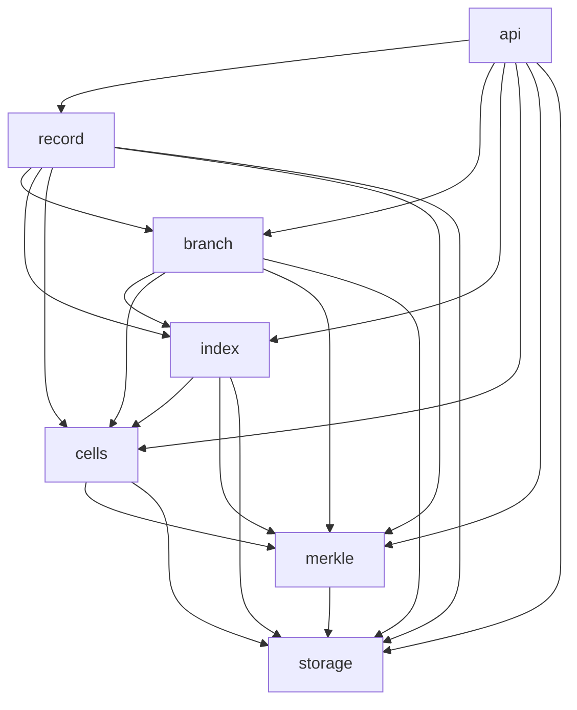

# Implementation review: API and genesis

One place for every observation made so far about the implemented state, compared against the
documents that describe it:

| Source | What it is | Cited as |
| --- | --- | --- |
| **Implementation** | `crates/*/src` and its behaviour at runtime | _impl_ |
| **README** | `crates/api/README.md` and the doc comments on the `Api` trait (`crates/api/src/lib.rs`) | _README_ |
| **API spec** | `docs/golem-db-api.md` | _spec_ |
| **Design** | `docs/golem-db-design.md` | _design §n_ |

First reviewed 2026-10-02 at `c0f18a7` (branch `feature/golem-db-api`). **Updated 2026-10-03 for
revision `9ee62d6` (branch `matthiaszimmermann/refactor/namings`)**, after the renames of Part 0:
Parts A–C use the current names and line numbers, and every finding was re-checked against that
revision. Part 0 is the record of the naming decisions and keeps the old names where it describes
what changed. **Updated again 2026-10-04 for revision `6d5e332`** after the API refactorings N11–N17
(constructors, `StoreConfig`, `Genesis::DEV`, the `internals` feature, `StoreFull`, the store file);
references and findings in Parts A–C were re-checked against it. The code added by N11–N17 is
recorded in Part 0 and covered by tests, but has not had the in-depth review Parts A–C give the
original code. **Updated for PR #30 at revision `6ada31e`** (branch
`matthiaszimmermann/feat/record-ops`): record operations with receipts, empty records with `#meta`,
and key modes, as specified in [record-ops.md](record-ops.md) (N18–N21 below). Findings resolved by
it are marked, and line references were re-checked. **Part 0** records naming and API decisions,
**Part A** covers the public API, **Part B** covers genesis, the Superblock and the reserved records,
and **Part C** collects code comments per file.

**Method.** All sources were read in full: `crates/api`, plus the parts of `cells`, `branch`,
`record` and `merkle` that genesis and commits depend on. Behavioural claims were checked by running
the README examples and probe code as temporary tests, removed afterwards. The crate's own suite
passes: `cargo test -p golemdb-api --features mdbx`, 58 tests at `6ada31e` (40 at `6d5e332`, 33 at
the first review), including 13 on opening and genesis. The re-checks on 2026-10-03 and 2026-10-04
re-ran the behavioural probes (C1–C4, R4, R7) and the README examples against the changed code;
all results are unchanged.

---

## Discuss before moving forward

Ranked by how expensive they become later.

0. **Naming and API shape** (Part 0): done in code (PR #29): the renames N4–N10 and the
   refactorings N11–N17. Still open: sign-off on the product name *GolemDB* (P10), the spec
   vocabulary and `StoreFull` in the API spec (S16, F31), and the repo and doc file renames (T07);
   see [naming-migration.md](naming-migration.md). Operational gaps: B6. Record operations
   (N18–N21, PR #30) are done in code; their spec side is in naming-migration.md section 10.
1. **Genesis is not final, but already identity-hashed and persisted** (B5, G3, G4). `genesis_id`
   hashes every genesis cell, so adding `#minRetention`, `#shardSpan`, `#immutableDataSegments` or
   the metering model later changes the identity. Every database created today will then fail with
   `GenesisMismatch`. Commits also write no history or change-set rows yet. **Decide now whether
   current databases are disposable** (and say so in the README), or freeze the genesis content
   first. `#minRetention` is already decided (P06) and could be added now.
2. ~~**The design contradicts itself on `#recordKeys` at genesis** (G1).~~ Resolved 2026-10-02: the
   design now binds every system and admin record at genesis, matching the code.
3. **Normative values the code has pinned and the design has not** (G6, G7, G8): the `hash_fn`
   numbers, `EMPTY_ROOT = H("")`, and the type tag of the `#roots` value. P07 makes the reserved
   layout normative for a second implementation, so these belong in D09 and Appendix A.
4. **`genesis_id`: adopt or drop** (G2). It's a useful safety check, but it isn't in the design, and
   its preimage would have to be specified for another implementation to reproduce it.
5. **Read-only opens are impossible** (G9). Every open takes a write transaction, and the design's
   read-only replica and tooling convention depends on the opposite.
6. **`#rootIndex` is reserved but never written** (G5): implement it or move it out of v1.
7. **Sealed-branch reads and stale-branch commit** (C1–C3, D15) in the API contract.

---

# Part 0: Naming

Decisions agreed 2026-10-03 (N1–N10) and 2026-10-04 (N11–N17). The product name (N1) is a branding
decision and needs sign-off beyond this review.

**Background.** Rust fixes the casing; a project only chooses the words. Package names are
kebab-case (`golemdb-api`), Cargo turns `-` into `_` for use in code (`golemdb_api`), types are
UpperCamelCase with abbreviations written as words (`Db`, not `DB`), functions are snake_case. A
database product whose name is written as one word conventionally gets a one-word, lowercase
package prefix and repo name.

| # | Item | Decision | Notes |
| --- | --- | --- | --- |
| N1 | **Product name** | "Golem DB" becomes **GolemDB** | Precedents: RocksDB, FoundationDB, SurrealDB, LanceDB. Changes prose only: 25 "Golem DB" in the design, 2 in the API spec, the doc titles. The 4 crate doc headers that say "GolemDB" become correct. Doc file names follow N2 (`golem-db-design.md` → `golemdb-design.md`) |
| N2 | **Repo name** | `golemfactory/golem-db` becomes **`golemfactory/golemdb`** | Precedents: `facebook/rocksdb`, `apple/foundationdb`, `surrealdb/surrealdb`, `lancedb/lancedb`. GitHub redirects the old URL. About 47 `golem-db` mentions in docs, README and `.devcontainer` (volume names such as `golem-db-target`), plus local clone paths. Strict identifiers use `golemdb` from now on; the genesis domain tag `"golemdb/genesis/v1"` already does |
| N3 | **Package names** | **unchanged**: `golemdb-*`, used as `golemdb_*` | Consistent with N1 |
| N4 | **Storage layer** | `Database` becomes **`Store`** | Frees the name `Database` for the facade, and matches the crate name `golemdb-storage`. Table below |
| N5 | **Facade type** | `GolemDb` becomes **`Database`** | Only after N4, otherwise two different `Database`s are public. Precedents for not repeating the product name in the type: `sled::Db`, `redb::Database`, `surrealdb::Surreal`. The private struct behind it becomes **`Inner`**, see N9 |
| N6 | **Methods** | renamed with N4/N5 | `into_golem_db()` and `into_database()` are not duplicates. Both consume `OpenedDatabase<D>`, i.e. storage that passed genesis validation: `into_golem_db()` builds the public facade, `into_database()` returns the raw storage for trusted code. The confusion came from "database" meaning the storage layer |
| N7 | **Vocabulary** | **database**: what a caller opens and talks to · **store**: the key/value layer underneath · **reserved**: non-user records and names. **"engine" is dropped entirely** from spec and code, identifiers included | Table below. Distinguishing the running program from the stored data is deferred; context settles it for now |
| N8 | **Spec identifiers** | `EngineAssigned` becomes **`Generated`** (`CallerAssigned` stays); `machineId` becomes **`nodeId`** ("database-assigned") | "Generated keys" is already the README's term. An unqualified "node" means a machine per the design glossary (S04). D11 recommends removing this cursor field altogether; the name applies if it survives |
| N9 | **Private shared state** | `struct Engine` becomes **`Inner`**, field `engine` becomes **`inner`** | **Rationale:** a cheap-to-clone public handle holding a private `inner: Arc<Inner>` that all clones share is idiomatic Rust: `std::thread::Thread` keeps its state in a private `Inner`, `Arc`/`Rc` point to `ArcInner`/`RcInner`, and dependencies of this workspace (`crossbeam-utils`, `regex-automata`, `serde_json`, `clap_builder`) do the same. **This repo already uses it** in exactly this role: `Branches` has `inner: Arc<Inner<D, H>>` (`crates/branch/src/manager.rs:53,82`) and `MemoryDatabase` has `inner: Arc<Inner>` (`crates/storage/src/memory.rs:14,23`). `GolemDb` is the one place that breaks the pattern. "Engine" also overstates the struct: it is a thin adapter that forwards each `Api` call to `Records` or `Branches` (its own comment: "Business rules, locking, and transaction boundaries remain in record and branch, not in this adapter"). The field is typed `Arc<dyn Api + Send + Sync>`, so today only its name hints at what it holds |
| N10 | **"backend"** | dropped. **store** where it means the store instance being opened; **store implementation** where it means the memory or MDBX implementation as such | "Backend" had two senses: the store a caller passes in (`open_backend`, `from_backend`, "a backend instance") and an implementation of the `Store` trait ("`MemoryStore` is the initial backend", "memory and optional MDBX backends"). Neither is one of the N7 words. Identifiers follow: `StorageError::Backend` becomes **`StorageError::Implementation`** (the catch-all for failures inside a store implementation, not MDBX-specific: test faults and the seal buffer use it too), the private helper `backend(libmdbx::Error)` becomes **`mdbx_error`**, the bench helper `backend(…)` becomes **`bench_store(…)`** |
| N11 | **Configuration types** | `OpenConfig` becomes **`Config`**, `GenesisConfig` becomes **`Genesis`**; **`OpenMode` stays**, now `#[non_exhaustive]` | `Genesis` follows the Ethereum-client convention for the parsed genesis file (`alloy_genesis::Genesis`). `Config` relies on the crate path for context, like `sled::Config`. A bare `Mode` would be ambiguous: the API spec also has a key assignment mode and a paging mode. `#[non_exhaustive]` lets a read-only mode (G9) be added without breaking callers |
| N12 | **Constructors** | **`Database::open(store, &config)`**, **`Database::open_memory(&genesis)`**, **`Database::from_store(store, &config)`**; removed `open_database`, the `open` alias and `open_with_options` | `open` takes anything that converts into `StoreConfig`: a path means MDBX with default options (`Database::open("./data", &config)`), `StoreConfig::Mdbx { path, options }` tunes capacity, `StoreConfig::Memory` is throwaway. The store is a separate argument so that `from_store` never has to ignore a field of `Config`. `open_memory` takes only a genesis: a fresh store makes the mode meaningless. Documented opening corner cases: missing vs. empty directory under `ExistingOnly`; one open per MDBX directory per process; another process gets separate branches and `Conflict`; `from_store` trusts its store and does not get `open`'s path guarantees; a store backs one open database at a time (sequential reuse is fine) |
| N13 | **Store configuration** | **`StoreConfig`** (`Memory`, `Mdbx { path, options }`); `StoreConfig`, `Config` and `MdbxOptions` are **`#[non_exhaustive]`**; `Config::with_mode` | Non-breaking later: a new store (new variant), a store-neutral option (field of `Config`), an MDBX option (field of `MdbxOptions`, built from `Default`). `Config` holds what applies to every store (genesis, mode); store settings are node-local and never part of the genesis identity. MDBX on reopen: a larger `max_map_size` takes effect, a smaller one is ignored; a changed `growth_step` takes effect in both directions (measured) |
| N14 | **Development genesis** | **`Genesis::DEV`**, an associated const; no `Default` for `Genesis` | Genesis is consensus-relevant: a `Default` could change between releases and silently split nodes. Named presets follow reth (`MAINNET`, `SEPOLIA`, `DEV`). `DEV` is for development, tests and examples only and may change between releases. A deployment's genesis (Arkiv's) lives with the deployment, not in GolemDB (P04) |
| N15 | **Lower-level opening layer** | `open_store` and `OpenedStore` public only with the **`internals`** feature; the free functions `open_memory`, `open_database`, `open`, `open_with_options` **removed** | Resolves R3. Only this crate's tests used the layer; they enable the feature through a self dev-dependency. Trusted tooling can opt in |
| N16 | **Full store** | **`StorageError::Full`** (from `MDBX_MAP_FULL`) → **`ApiError::StoreFull`**; `StorageError` becomes `#[non_exhaustive]` | `StoreFull` is environmental, not deterministic: it must never become part of a result other nodes see. The failed commit writes nothing; after reopening with a larger cap the node continues from its last commit. Operations: B6 |
| N17 | **Store file** | **`StoreConfig::load(path)`** / **`from_yaml(text)`**, errors as **`OpenError::StoreYaml`** | Separate from the genesis file: genesis never changes, store settings may change between restarts. `mdbx:` with `path` and optional `options`, or `memory`; omitted options keep their defaults, unknown fields are rejected; `load` resolves a relative path against the file's directory |
| N18 | **Record operations** | **`RecordOp<op::Create \| Patch \| Get \| Delete>`** for all four record calls; `RecordInput`, `PatchInput` and `Projection` removed | One typestate builder: `RecordOp::create()`, `patch(key)`, `get(key)`, `delete(key)`. Compile-time: no remove on a create, a key on every patch/get/delete, `.key()` only on a create. Builder steps are infallible; errors are reported by the call. Every write declares its kind (`attribute` / `field`); there is no kind-preserving `set`. Values come from Rust types (`IntoCellValue`). Details: [record-ops.md](record-ops.md) section 4 |
| N19 | **Metered outcomes** | record calls return **`Metered<T>`** = `{ result, receipt }`; **`Receipt { cost, priced_at, details }`**; `RecordOp::budget(n)` and **`ApiError::OutOfBudget`** exist but are not enforced | The receipt is present on failure too, so hosts can charge failed calls. `cost` is 0 until metering. `details` (D4 effects) are always present; they may become optional later. The ledger comes with metering. Section 5 |
| N20 | **Record model** | **empty records** are legal; every user record has **`#meta`**: four `u64` counts over its user cells (`RecordMeta`, `Record::meta()`) | `#meta` enables completeness proofs for full reads and a deletion-cost bound. It is maintained from the same effects as the receipt details. Sections 1–2 |
| N21 | **Key modes** | **`Genesis::record_keys`**: `CallerAssigned` or `Generated { seed }`; `#keyMode` / `#keySeed` in `#params`; **`ApiError::KeyModeMismatch`** | Generated keys are `H("golemdb/record-key/v1" ‖ seed ‖ id)`. The modes are exclusive because generated keys are predictable. Required in the genesis file, no default. Section 3 |

**Status (2026-10-04).** Applied in code on `matthiaszimmermann/refactor/namings` (PR #29): N4–N6,
N9–N17, and N7 for the code and its READMEs. N3 needed no change. Pending, with instructions in
[naming-migration.md](naming-migration.md): N7 and N8 in the API and metering specs (register S16),
`StoreFull` in the API spec's error set (F31), N1 (product name, P10), N2 (repo and doc file renames,
T07).

**Renames in code (N4–N6, N9–N16, N18):**

| Today | New |
| --- | --- |
| `golemdb_storage::Database` (trait) | `Store` |
| `MemoryDatabase`, `MdbxDatabase` | `MemoryStore`, `MdbxStore` |
| `database: D` (variables, `branch`, `api`) | `store: S` |
| `OpenedDatabase<D>` | `OpenedStore<S>` |
| `OpenedDatabase::into_database()` | `into_store()` |
| `open_backend`, `GolemDb::from_backend`; "backend" in README and docs | `open_store`, `Database::from_store`; "store" |
| `GolemDb` | `Database` |
| `into_golem_db()` | `into_database()` |
| `struct Engine<D, H>` (private, `api/src/database.rs`) | `Inner<S, H>` (N9) |
| field `GolemDb::engine` | `Database::inner` (N9) |
| `CellNameRef::parse_engine` (`cells/src/name.rs`) | `parse_reserved` (N7) |
| `StorageError::Backend` ("storage backend error") | `StorageError::Implementation` ("store implementation error") (N10) |
| `fn backend(libmdbx::Error)` (private, `storage/src/mdbx.rs`) | `mdbx_error` (N10) |
| `fn backend(…)` (`index/benches/index.rs`), `each_backend` (`api/tests/facade.rs`) | `bench_store(…)`, `each_store` (N10) |
| `OpenConfig`, `GenesisConfig` | `Config`, `Genesis` (N11) |
| `Database::open_database(path, &config)`, `Database::open(path, &config)` (alias), `Database::open_with_options(path, &config, options)` | `Database::open(store, &config)` (N12) |
| `Database::open_memory(&config)` | `Database::open_memory(&genesis)` (N12) |
| free functions `open_memory`, `open_database`, `open`, `open_with_options` | removed (N15) |
| `open_store`, `OpenedStore` (always public) | public with the `internals` feature (N15) |
| `MDBX_MAP_FULL` as `StorageError::Implementation(…)` / `ApiError::Internal` | `StorageError::Full` / `ApiError::StoreFull` (N16) |
| `create(branch, key, RecordInput)`, `patch(branch, key, PatchInput)`, `get(target, key, Projection)`, `delete(branch, key)` | `create(branch, RecordOp<op::Create>)`, `patch(branch, RecordOp<op::Patch>)`, `get(target, RecordOp<op::Get>)`, `delete(branch, RecordOp<op::Delete>)`, each returning `Metered<T>` (N18, N19) |
| `RecordInput::insert`, `PatchInput::set` (kind-preserving) | removed; `attribute` / `field` only (N18) |
| re-exports `RecordCells`, `RecordPatch`, `CellPatch` | no longer public (N18) |

**N7 replacing "engine":** 15 uses in the API spec, about 60 in code (mostly comments), about 80 in
the design, which is deferred with the program/data distinction.

| "engine" meant | Example | Becomes |
| --- | --- | --- |
| GolemDB as callers see it | "the engine owns a handful of records", `Internal` = "engine fault" | **database** |
| non-user names and records | "engine names", `CellNameRef::parse_engine`, "belong to the engine" (IDs 0–63) | **reserved** (records 0–63; "system" alone would exclude admin records) |
| storage rows that are neither user cells nor reserved records | "engine rows", "16 KiB engine values" (trie nodes, metadata) | **internal** |
| privileged code that bypasses checks | "trusted engine code/operation/access" | **trusted library code** (design §4's term) |
| whatever uses a lower crate (`cells`, `index`, `merkle`) | "those belong to the engine", "the engine can write its head" | **the layers above**, or the specific layer ("the record layer", "the branch layer", "the caller") |
| MDBX | "the storage engine's runtime accounting" (spec line 607) | **store** or "MDBX" |
| the software being upgraded | "it changes by upgrading the engine" (spec line 560) | "it changes with a new release" ("upgrading the database" could be read as migrating data) |
| "the store" (spec lines 62, 390, 403) | "the store mints keys deterministically" | **database** |

**Package dependencies** (from the `Cargo.toml` files; arrows point to dependencies):



| Package | External dependencies |
| --- | --- |
| `golemdb-storage` | `libmdbx`, `mdbx-sys` (with the `mdbx` feature) |
| `golemdb-merkle` | `sha3`, `blake3`, `serde`, `serde-saphyr` |
| `golemdb-cells` | `serde` |
| `golemdb-index` | `roaring` |
| `golemdb-branch`, `golemdb-record` | none beyond `thiserror` |
| `golemdb-api` | `serde`, `serde-saphyr` |

All packages use `thiserror`. The layering has no cycles. One surprise: `merkle` depends on
`storage`, because the trie reads and writes its own nodes, which ties the hashing crate to the
storage traits.

## Target naming

The end state after N1–N21, written with the new names only, so it can be discussed on its own.

**Words**

| Word | Means | Used in |
| --- | --- | --- |
| **GolemDB** | the product | prose: docs, READMEs, doc comments |
| **`golemdb`** | the product as an identifier | repo, package prefix, file names, domain tags |
| **database** | what a caller opens and talks to | spec, README, the `Database` type |
| **store** | the transactional key/value layer underneath (memory or MDBX) | `golemdb-storage`, the `Store` trait |
| **store implementation** | one implementation of the `Store` trait: memory or MDBX | storage docs, `StorageError::Implementation` |
| **internal** | storage rows that are neither user cells nor reserved records: trie nodes, metadata | `api` opening checks ("internal rows", "internal values") |
| **trusted library code** | privileged code that bypasses checks (design §4's term) | `branch`, `record` and `api` docs, e.g. `OpenedStore::into_store()` |
| **reserved** | the records 0–63 and their `#`/`@` names, as opposed to user records and names | design, spec, `parse_reserved` |
| **genesis file** / **store file** | the deployment's YAML (identical on every node, never changes) / one node's YAML (may change between restarts) | `Genesis::load`, `StoreConfig::load` |

**Repository and documents**

| Item | Name |
| --- | --- |
| Repository | `golemfactory/golemdb` |
| Design | `docs/golemdb-design.md`, titled "GolemDB — Technical Design" |
| API spec | `docs/golemdb-api.md`, titled "GolemDB — API" |
| Genesis domain tag | `"golemdb/genesis/v1"` |

**Packages** (directory → package → path in code)

| Directory | Package | In code | Role |
| --- | --- | --- | --- |
| `crates/storage` | `golemdb-storage` | `golemdb_storage` | the store: `Store`, `MemoryStore`, `MdbxStore`, `MdbxOptions` |
| `crates/merkle` | `golemdb-merkle` | `golemdb_merkle` | tries and hashing |
| `crates/cells` | `golemdb-cells` | `golemdb_cells` | cell keys, names and typed values |
| `crates/index` | `golemdb-index` | `golemdb_index` | index terms and posting lists |
| `crates/branch` | `golemdb-branch` | `golemdb_branch` | branches, frames, seal, commit |
| `crates/record` | `golemdb-record` | `golemdb_record` | record CRUD rules |
| `crates/api` | `golemdb-api` | `golemdb_api` | the public `Api` trait and the `Database` handle |

**Public API**

| Name | What it is |
| --- | --- |
| `golemdb_api::Database` | the cloneable handle a caller opens; implements `Api` |
| `golemdb_api::Api` | the trait with record and branch operations |
| `RecordOp<op::Create \| Patch \| Get \| Delete>` | one record operation; `RecordOp::create()`, `patch(key)`, `get(key)`, `delete(key)` |
| `Metered<T>`, `Receipt`, `Details` | a record call's outcome with its receipt: cost, `priced_at`, effects |
| `RecordMeta`, `Record::meta()` | the decoded `#meta` counts of a record |
| `RecordKeys` | `CallerAssigned` or `Generated { seed }`, in `Genesis::record_keys` |
| `Database::open(store, &config)` | open on a built-in store; `store` is a path (MDBX, default options) or a `StoreConfig` |
| `Database::open_memory(&genesis)` | a fresh in-memory database, for tests |
| `Database::from_store(store, &config)` | open on a caller-supplied (trusted) store |
| `Config` | `genesis` + `mode`; `Config::new(genesis)`, `with_mode(mode)` |
| `Genesis`, `Genesis::DEV` | the deployment's genesis (`load`, `from_yaml`); the development preset |
| `OpenMode` | `CreateIfMissing` (default), `ExistingOnly`, `CreateNew` |
| `StoreConfig` | `Memory`, `Mdbx { path, options }`; `StoreConfig::mdbx(path)`, `load`, `from_yaml` |
| `MdbxOptions` | `max_tables`, `max_map_size`, `growth_step`; start from `Default` |
| `ApiError::StoreFull`, `OpenError::StoreYaml` | the store reached its cap; an invalid store file |
| `ApiError::KeyModeMismatch`, `ApiError::OutOfBudget` | a create that does not match the key mode; a call over its budget (not returned until metering) |
| `open_store`, `OpenedStore<S>` (`internals` feature) | the lower-level layer: validate a store, then `into_database()` or `into_store()` |
| `golemdb_storage::Store` | the store trait; implemented by `MemoryStore` and `MdbxStore` |
| `CellNameRef::parse_user`, `parse_reserved`, `raw` | the three ways to make a cell name |
| cursor field `nodeId` | database-assigned routing hint (spec; may be removed by D11) |

**Inside `golemdb-api`**

```rust
pub struct Database {
    inner: Arc<dyn Api + Send + Sync>, // shared by all clones
    genesis: Genesis,
    info: OpenInfo,
}

struct Inner<S, H> {                    // private; implements Api by forwarding
    branches: Branches<S, H>,
    records: Records<S, H>,
}
```

**A caller's view**

```rust
use golemdb_api::{Api, Config, Database, Genesis, ReadTarget, RecordOp, StoreConfig};

let db = Database::open_memory(&Genesis::DEV)?;                       // tests
let config = Config::new(Genesis::load("genesis.yaml")?);
let db = Database::open(StoreConfig::load("store.yaml")?, &config)?;  // a node
let branch = db.begin()?;
db.create(branch, RecordOp::create().key(key).attribute("price", 50i32)).into_result()?;
db.commit(branch)?;
let saved = db.get(ReadTarget::Head, RecordOp::get(key)).into_result()?;
let fee_basis = saved.meta().unwrap();   // #meta: cells and bytes
```

**Still open**

- **Read-only open** (G9): prepared by `OpenMode` being `#[non_exhaustive]`; not designed yet.
- **Store usage reporting and the `StoreFull` runbook** (B6).
- **`Genesis` evolution:** it gained a required field in N21 and will gain more (`#minRetention`,
  segments). `#[non_exhaustive]` with a constructor would stop such additions from breaking
  callers' `Genesis { … }` literals.
- The constructor and free-function questions recorded here earlier are settled by N12 and N15.

---

# Part A: public API

## A1. Behavioural conflicts between the implementation and the spec

| # | Topic | Spec | README / trait | Implementation (observed) |
| --- | --- | --- | --- | --- |
| C1 | **Reads on a sealed branch** | "A sealed branch is still `get`-readable through its overlay" | "a sealed branch rejects record reads/writes" | `get(Branch(sealed))` ⇒ `Err(Sealed)` |
| C2 | **Writes on a sealed branch** | rejected with `HandleInvalid` | rejected (error not named) | `create`, `checkpoint` ⇒ `Err(Sealed)`, a variant the spec does not have |
| C3 | **Commit of a stale branch** | "the losers' `commit` ⇒ `Conflict`"; every later call ⇒ `HandleInvalid` | "A live stale branch's commit returns `Conflict` … handles already invalidated by another operation return `HandleInvalid`" | Depends on call order. If `commit` is the first call after another branch wins ⇒ `Conflict`. If any other call (`get`, `create`, `branch_info`) comes first, that call ⇒ `HandleInvalid`, and the later `commit` ⇒ `HandleInvalid` too, never `Conflict` |
| C4 | **Rollback at the first frame** | `begin` opens the first frame; `rollback` "steps back one checkpoint boundary" and is repeatable | "Undo one frame. Repeated rollback moves to preceding frames." | Without a checkpoint, `rollback` undoes all branch work so far. With no frame left ⇒ `NoFrameToRollback`. The next write starts a new frame implicitly. Consistent with both texts, but neither states the edge cases (relates to D16) |

**C1/C2** is a contract decision. The spec's readable sealed branch is what lets a caller inspect
state between `seal` and `commit`. The implementation freezes reads as well. One of the two has to
change, and the error for a write should be agreed (`Sealed` or `HandleInvalid`).

**C3** matters for hosts. A host that reads a branch after losing the race, for example to log it,
sees `HandleInvalid` and never learns it lost a race. This is the substance of open decision D15.

## A2. Spec surface that is not implemented

| Spec feature | Impl | README says deferred? |
| --- | --- | --- |
| Cost receipts, `budget?`, `OutOfBudget`, `debug` ledger, `priced_at` | **partly, since PR #30:** receipts with `priced_at` and details; `cost` 0; `budget` and `OutOfBudget` present but not enforced; no ledger (N19) | yes ("metering … deferred") |
| `expected_version?` (OCC, provisional in spec) | absent | yes ("OCC") |
| Key modes: `EngineAssigned`, `KeyModeMismatch`, `key?` optional on `create` | **implemented since PR #30** (N21): `CallerAssigned` / `Generated` in genesis, `KeyModeMismatch`. Before, `create` always took a key | – |
| Historical `get` at a past `CommitId` | only the current head; otherwise `CommitUnavailable` | yes |
| `begin(at?)` | `begin()` takes no argument | **no** |
| `branch_info → {origin, frame_depth}` | `{commit_id, branch_id, version, sealed}`; `version` counts undo entries, not frames | **no** |
| `BranchHandle = (commitNr, branchNr)` | `BranchId = u64`, process-local; origin only via `branch_info` | **no** |
| `branch_hash` | absent | **no** |
| `rewind` | absent (and not in v1 per F30, see A6) | **no** |
| `query`, `count`, filtering, sorting, paging, cursors | absent | **no** |
| Proofs | absent (signature not pinned in spec either) | **no** |
| Introspection `roots(at?)`, `params()` | absent; `Database::info()` gives the roots *at opening*, `genesis()` the config | **no** |
| Metering API, separate admin handle from `open()` | absent; one `Database` handle | partly ("metering is deferred") |
| Immutable data | trait methods exist; every call ⇒ `NotImplemented` | yes |
| `#params` contents: `#minRetention`, `#shardSpan`, `#immutableDataSegments` | absent (G3) | **no** |
| Errors `InvalidQuery`, `LimitExceeded`, `Pruned` | absent from `ApiError` (`OutOfBudget` and `KeyModeMismatch` exist since PR #30) | follows from the above |

The README's *Current scope* section should list everything marked **no**, so a reader of the crate
does not have to diff it against the spec.

## A3. Implementation surface that the spec does not have

| # | Item | Notes |
| --- | --- | --- |
| E1 | **Immutable-data keys**: `immutable_data_append(…, key: Option<ImmutableDataKey>, …)`, `ImmutableDataAddress::Key` | Spec signatures are `(b, seg, row)` and `(seg, ordinal)`; no keys. The README links to the spec as describing "pruning and rewind of key bindings", which the spec does not contain |
| E2 | **`ReadTarget::Head`** | Spec has branch handle or `CommitId`. A useful addition (head resolved and read in one snapshot); the spec should adopt it |
| E3 | **Errors `Sealed`, `NoFrameToRollback`, `CommitUnavailable`, `NotImplemented`** | Not in the spec's shared error set. `Sealed` conflicts with C2; the other three need a row each |
| E4 | **Opening API**: `Config`, `OpenMode`, `Genesis` (YAML, `DEV`), `StoreConfig` (YAML), `OpenError`, `Database::open`/`open_memory`/`from_store`; `open_store`/`OpenedStore` with `internals` | The spec has no opening section. Probably right for a call-level spec, but the genesis inputs are consensus-relevant (Part B) |
| E5 | **`Projection::only` accepts raw byte names** | Needed to read reserved records' binary cell keys; spec says only "cell names" |

## A4. README accuracy

Confirmed by running the code: all six examples (quickstart, inputs, catalogue, YAML genesis, node
sizing, store file);
`blake3` YAML; `Conflict` then `HandleInvalid`; `CommitUnavailable` for a non-head commit;
`NotFound` for an empty projection on a missing record; empty `create` rejected; reserved records
readable by `get`; dyn compatibility (`Database` wraps `Arc<dyn Api + Send + Sync>`,
`crates/api/src/database.rs:30`); trie-path checking on reopen (B3); the claims about
`tests/consumer.rs`, `tests/facade.rs` and `tests/facade_errors.rs`.

| # | Finding | Where |
| --- | --- | --- |
| R1 | ~~**The opening summary lists only record and branch operations.**~~ **Resolved** in PR #30: the summary now lists the immutable-data calls and points to *Current scope*. The four `immutable_data_*` methods appear only under *Current scope* | README lines 5–6 |
| R2 | ~~**"previous-root history" is overstated.**~~ **Resolved** in PR #30: the README now says "the previous commit's root entry". Reopen checks one `#roots` entry, the one for `head − 1` | `crates/api/src/genesis.rs:217-227` |
| R3 | ~~**Free opening functions mirrored the constructors** (`open_memory`, `open_database`, `open`, `open_with_options`) under the same names but returned `OpenedStore`.~~ **Resolved** by N12 and N15: the free functions are removed, `Database` has three constructors, and the README describes the `internals` layer | `crates/api/src/lib.rs:55-58` |
| R4 | **Error messages print twice.** Converting `RecordError::InvalidArgument` copies the message into `message` and keeps the same error as `source`, so a chain reporter prints "cannot remove the last user cell" twice | `crates/api/src/error.rs:107-110` |
| R5 | **Rollback edge cases undocumented** | see C4 |
| R6 | **"Adding required methods requires updating implementations and mocks" understates the cost.** The private `Inner` implements the public `Api` and `Database` forwards each method by hand, so one new method means edits in the trait, `Database`, `Inner` and every mock | `crates/api/src/database.rs` |
| R7 | **Misleading message for the name `$`**: rejected correctly, but with "cell name is empty" | `crates/cells/src/name.rs:53-54` |
| R8 | ~~**"All four iterations are implemented"** is project-internal jargon~~ **Resolved** in PR #30: replaced by a plain implemented / deferred list | README line 372 |
| R9 | **The README does not say that databases created now may not reopen under a later build** | see item 1 at the top |

## A5. Spec rules the implementation follows

Confirmed by probe (rules at the first review; see the note below for PR #30): cell-name grammar (`$x`, `a-b.c:d` accepted; `$`, `a$`, `$1`, `1a` rejected);
`#maxCellNameLen` enforced at `create`, not in the builder; NaN rejected; `-0.0` equals `+0.0`;
`bytes` attribute rejected; `create`/`patch`/`delete` on reserved records ⇒ `Reserved`; `create` on
an existing key ⇒ `AlreadyExists`; `patch`/`delete` of a missing record ⇒ `NotFound`; removing the
last user cell ⇒ `InvalidArgument`; delete then re-create of the same key in one branch is an
ordinary `create` (D08); a discarded handle ⇒ `HandleInvalid`; first-committer-wins.

Not checked: custom type ids 64–127; the "one class of failure surfaces late" rule beyond what
`tests/facade_errors.rs` covers.

**Changed by PR #30:** removing the last user cell is no longer an error: empty records are legal
(N20). This branch's API spec still says `patch` "may not remove the last cell"; the spec branch
already allows it, so the two agree once the branches meet.

## A6. Inconsistencies inside the documentation

| # | Finding |
| --- | --- |
| S1 | `CHANGES.md` F30 records that `rewind` is not in v1 and lists `golem-db-api.md` *Commits* and *Operations* as updated. On this branch the spec still says "Reorgs use `rewind`" and lists `rewind` in the operations table. The F30 edit has either not reached this branch or not been made |
| S2 | ~~The README points to the spec for immutable-data key bindings, pruning and rewind; the spec has none of these (see E1)~~ **Resolved** in PR #30: the README now says the spec does not cover row keys yet |
| S3 | The spec's `HandleInvalid` row says "a consumed branch handle, or one whose origin is no longer the head", while its *Branches* section says only the losers' `commit` ⇒ `Conflict`. Read together, a stale branch's first `commit` is both. The implementation resolves this by call order (C3) |

## A7. Tests and tooling

| # | Finding |
| --- | --- |
| T1 | **The README examples are not tested.** The crate does not include the README as documentation (`include_str!`), so CI's `cargo test --doc` skips them. They pass today but can drift. They also need the `mdbx` feature and write to `./golemdb-*` in the working directory |
| T2 | **The root README's test command skips MDBX.** `cargo nextest run --workspace` runs without the `mdbx` feature, so the MDBX half of `tests/facade.rs` and other MDBX-gated tests do not run locally. CI covers them with `cargo hack nextest run --feature-powerset` |

---

# Part B: genesis, Superblock and reserved records

## B1. What is implemented

**Superblock** (table `Superblock`, uncommitted), written once by genesis in
`crates/api/src/genesis.rs:109-131`:

| Row | Value | Design §4 |
| --- | --- | --- |
| `format` | `1` as `u32` BE | ✓ |
| `hash_fn` | `1` = Keccak-256, `2` = BLAKE3, `u16` BE | ✓ row; numbers not in design (G7) |
| `roaring` | `1` as `u16` BE | ✓ |
| `genesis_id` | 32-byte hash, see B2 | **not in design** (G2) |
| `head` | `commitNr u64 BE ‖ StateRoot ‖ IndexRoot`, 72 bytes | ✓; rewritten by every commit (`crates/branch/src/commit.rs:46-53`) |

**Genesis cells**, 19 in total (20 with generated keys), all `field`s (`crates/api/src/genesis.rs:22-64`):

| recordID | Record | Cells |
| --- | --- | --- |
| 0 | `#params` | `#key`; `#maxCellNameLen`, `#maxStrLen`, `#maxBytesLen` (`u32`); `#keyMode` (`u32`: 0 caller-assigned, 1 generated); `#keySeed` (`bytes32`, generated mode only) |
| 1 | `#alloc` | `#key`; `#nextRecordID = 64` (`u64`) |
| 2 | `#roots` | `#key` |
| 3 | `#recordKeys` | `#key`; 7 bindings, one per reserved record (raw 32-byte key → `u64` ID) |
| 4 | `#rootIndex` | `#key` |
| 32 | `@meteringModel` | `#key` |
| 33 | `@modelWeight` | `#key` |

`StateRoot` is the cell trie over these cells. `IndexRoot` is `H("")`, the empty-trie root, since
no genesis cell is an attribute.

**Later commits** add, as database side effects:
- the lag-one `#roots` cell for the previous commit, written at `seal` as a 64-byte `bytes` value
  `StateRoot ‖ IndexRoot`, refusing to overwrite an existing one (`crates/branch/src/seal.rs:45-63`);
- `#alloc.#nextRecordID` and a `#recordKeys` binding on every `create`
  (`crates/record/src/crud.rs:101-102`);
- since PR #30, a `#meta` cell per user record, written by `create` and updated by `patch`;
- removal of the binding on `delete`, without rewinding the allocator, as decided in D08
  (`crates/record/src/crud.rs:175-190`).

Nothing writes `#rootIndex`, the metering records, history tables or change-set tables.

## B2. How opening works

- **One writer transaction** covers detection, validation and initialization
  (`crates/api/src/open.rs:68-94`), so concurrent initializers serialize and genesis is atomic.
  Panics during preparation drop the transaction before unwinding.
- **Pristine detection:** no `head` row plus completely empty storage creates genesis. No head but
  some tables or rows is `CorruptState`. MDBX counts even an empty foreign table as not pristine.
- **Modes:** `CreateIfMissing`, `ExistingOnly`, `CreateNew`, as documented in the README.
- **Genesis identity:** `genesis_id = H("golemdb/genesis/v1\0" ‖ format ‖ hash_fn ‖ roaring ‖ count ‖
  each (key, value) length-framed, sorted)` with the deployment's own hash
  (`crates/api/src/genesis.rs:72-91`). Reopening recomputes it from the supplied config and compares,
  so a changed genesis file fails with `GenesisMismatch`, independent of YAML formatting.
- **Physical ceilings** are checked before anything is written (`crates/api/src/config.rs:28-55`).
  Keys must fit `max(name + 8, name + 2 + max(maxStrLen, 32), 40)` bytes, and values must fit
  `max(1 + max(maxBytesLen, maxStrLen), 16 KiB)`.

## B3. Reopen validation

On every reopen (`crates/api/src/genesis.rs:135-157`, `168-239`):

1. `format`, `hash_fn`, `roaring` must be known values; `genesis_id` and `hash_fn` must match the config.
2. Both trie roots must load.
3. The allocator must be a non-indexable `u64` ≥ 64, its ID must have no cells, and at commit 0 it
   must still be 64.
4. Every genesis cell must exist with its exact value; at commit 0 no other cell may exist and the
   index root must be empty.
5. At commit > 0 the `#roots` cell for `head − 1` must exist and be 64 bytes.
6. All checked cells are verified against their trie paths by calling `Cells::apply` with the
   unchanged values. `apply` runs `trie.check` even for no-ops (`crates/cells/src/cells.rs:110`), and
   the transaction is aborted afterwards, so nothing is written.

This is a sound startup check, not an audit: older `#roots` entries, user records and index
subtrees are not verified, which matches the README apart from R2.

## B4. Design vs implementation

| # | Design | Implementation | Assessment |
| --- | --- | --- | --- |
| G1 | §4 *Genesis*: "`#roots` and `#recordKeys` empty" | 7 bindings for the reserved records | **The design is inconsistent.** §4 says `get` of record 1's `#key` returns `"#alloc"`, and the spec says `get` on `#params` returns the caps; both need a binding to resolve the key. The record layer even treats a missing reserved binding as `CorruptState` (`crates/record/src/state.rs:23-30`). **Resolved 2026-10-02:** §4 *Genesis*, *Common properties of reserved records* and `#recordKeys` now state one binding per system and admin record |
| G2 | §4 *Superblock*: four rows | adds `genesis_id` | A good idea: it catches a changed genesis file before any divergence. It belongs in the design, with its preimage, if a second implementation must reproduce it (P07); otherwise state that it is local and optional |
| G3 | §4 `#params`: six chain parameters | five: the three length caps and, since PR #30, `#keyMode` / `#keySeed` (not in the design's list yet) | `#minRetention` is decided (P06) and has a fixed type, so it can be added now. `#shardSpan` and `#immutableDataSegments` wait on §11 and D09. Each addition changes `genesis_id` (item 1 at the top). `GenesisConfig` holds only `hash_function` and `cell_limits`, so the YAML schema grows with them |
| G4 | §4 *Genesis*: model version 1 installed complete (`@meteringModel` activation 0, full `@modelWeight` set) | only `#key` cells | Follows from metering being deferred. Same identity consequence as G3 |
| G5 | §11: `#rootIndex` written lag-one alongside `#roots` | never written | The record exists with only `#key`. Implement in `seal` next to the `#roots` write, or mark it not-v1 in the design |
| G6 | §4 `#roots`: value `StateRoot ‖ IndexRoot` (64 B); type tag of reserved layouts open (D09) | `bytes` cell, 64 bytes | A reasonable choice that is now effectively normative: it is inside every `StateRoot`. Record it in D09 |
| G7 | §2/§4: `hash_fn` is a `u16` ID; numbers not assigned | `1` = Keccak-256, `2` = BLAKE3 | Must be written down for a second implementation (P07). Also note that `genesis_id` and every root depend on it |
| G8 | §8: `EMPTY_ROOT` is "a normative constant every implementation must agree on"; value open (D09) | `H("")` under the deployment's hash (`crates/merkle/src/trie.rs:25-31`), used for both tries | Record it in D09. It is the genesis `IndexRoot`, so it is already in every head |
| G9 | §4 *Conventions*: read-only opens via MDBX `RDONLY` for replicas and tooling | every open uses `begin_write`, even a reopen that writes nothing (`crates/api/src/open.rs:72`); no read-only option exists in `golemdb-storage` | **Conflict.** Either add a read-only open path that validates under a read transaction, or drop the convention |
| G10 | §4: reserved keys are names zero-padded to 32 bytes; ID ranges 0–31 / 32–63 / ≥ 64; `#nextRecordID` starts at 64 | as specified (`crates/cells/src/system.rs`) | ✓ |
| G11 | §4 `#roots`: lag-one, written at the start of commit `n+1` from `head` | written at `seal` of commit `n+1` from the origin head; refuses an existing cell | ✓ |
| G12 | §4: `#alloc` changes only at commits that create a record; deletes never rewind it | as specified | ✓ |
| G13 | §4 (D08): `delete` removes the binding | as specified | ✓ |
| G14 | §4: record 5 reserved for `#logDigests` (D19 open) | not in the catalogue | ✓ consistent with D19 being open |

## B5. Assessment of the code

**What is done well**
- Genesis is atomic, serialized against other openers and committers, and safe under panics. Tests
  inject a storage failure at *every* write and check that nothing persists
  (`tests/opening_failure.rs`).
- Opening is deliberately strict: no defaults, `deny_unknown_fields` YAML, no repair of partial or
  foreign state, and ceilings checked before any write.
- The genesis identity is canonical (independent of YAML formatting and field order) and covers the
  format IDs as well as the cells.
- Reopen validation is cheap and still checks trie paths, which catches a flat table and a trie
  that disagree.
- Memory and MDBX run the same genesis code path, and tests check that both produce identical state.

**What should change or be discussed**

| # | Observation |
| --- | --- |
| B5.1 | **Databases are not forward compatible yet.** Genesis content will grow (G3, G4) and commits write no history or change-set rows (`crates/branch/src/commit.rs:44`), so any database created now cannot be served by the finished implementation. There is no format bump or migration story. See item 1 at the top |
| B5.2 | **Superblock ownership is split across crates.** The table name is defined in both `crates/api/src/genesis.rs:11` and `crates/branch/src/head.rs:6`. `format`, `hash_fn` and `roaring` are known only to `api`, while `branch` reads and writes `head` without them. A single module owning the Superblock layout would keep the two from drifting |
| B5.3 | **The genesis config cannot express the rest of `#params`.** `GenesisConfig` is `{hash_function, cell_limits}` and `CellLimits` lives in `golemdb-cells`. Adding retention, segments or the metering model needs a new config shape, a YAML schema change and new identity inputs. Worth designing once, not parameter by parameter |
| B5.4 | **Reopen validation depends on a side contract of `Cells::apply`** (no-op puts are still trie-checked). It is documented in `golemdb-cells`, but a dedicated `verify` call would make the intent explicit and survive a refactor of `apply` |
| B5.5 | **Reopen takes the writer lock** (G9). Besides blocking read-only opens, a reopen waits for any in-flight commit from another handle on the same environment |
| B5.6 | **The `hash_fn` mapping is private to `api`** and checked twice (`hash_id` and `matches!(hash, 1 \| 2)`). Moving it next to `HashAlgorithm` in `golemdb-merkle` gives one definition |

## B6. Operations

Findings from the `StoreFull` work (N16) and the MDBX reopen experiments. Recovery is possible
without data loss: the failed commit writes nothing, and after a restart with a larger
`max_map_size` (or more disk, or a move to a larger host) the node continues from its last commit
and catches up.

| # | Finding |
| --- | --- |
| OPS-1 | **No way to query store usage.** Neither `Database` nor `MdbxStore` reports used size against the cap, so an operator can only watch the size of `mdbx.dat` from outside, and the file never shrinks. Monitoring at, say, 80% of the cap needs a usage report |
| OPS-2 | **Fleet-wide `StoreFull`.** Nodes processing the same chain grow at almost the same rate. If they share one cap value (the default, or a deployment template), they reach `StoreFull` at nearly the same block and the whole network stops. The cap must be set per node from its own disk, never fleet-wide |
| OPS-3 | **No runbook yet** (deferred from N16): stop the node; add disk or move to a larger host (a stopped store is safe to copy: `mdbx.dat` without `mdbx.lck`); raise `max_map_size`; restart with `ExistingOnly`. The reserve on the disk must cover at least one `growth_step` and every other file there, including the future segment files of design §11 |
| OPS-4 | **Raising the cap needs a restart.** MDBX can change the size limits of an open environment, so growing at runtime may be possible; its behaviour with active readers and an open writer is unverified |

---

# Part C: code comments per file

Line-level remarks collected while reading the code, one section per file. IDs are stable so they
can be referenced from issues and PRs.

## `crates/api/src/genesis.rs`

| # | Lines | Comment |
| --- | --- | --- |
| GEN-1 | 93-97, `prepare` | **The hash function is passed twice**: as `config.genesis.hash_function` and as the `hasher` argument. Nothing checks they agree. A mismatched pair would write `hash_fn = 2` while computing roots and `genesis_id` with Keccak. Safe today only because the one caller (`open.rs:73-76`) matches them. Suggested fix: add `const ALGORITHM: HashAlgorithm` to `HashProvider` and derive the `hash_fn` ID from `H::ALGORITHM`, so `prepare` takes the hasher alone |
| GEN-2 | 77, 100, 109-116, 135-147 | **Superblock keys are string literals** (`b"head"`, `b"format"`, `b"hash_fn"`, `b"roaring"`, `b"genesis_id"`), each written two or three times. `b"head"` also duplicates the private `HEAD_KEY` in `crates/branch/src/head.rs:7`, and the `"Superblock"` table name is defined in both files (B5.2). A typo in one place would compile and only fail at runtime. Suggested fix: one Superblock module owning the table name, the row keys and their value types, used by both `genesis.rs` and `head.rs`. The domain tag `"golemdb/genesis/v1\0"` (line 77) belongs with the other domain-separation constants |
| GEN-3 | 15-20, 140 | **Hash-function IDs appear as bare numbers twice**: the mapping in `hash_id` and the separate check `matches!(hash, 1 \| 2)`. Adding a third algorithm means updating both. Suggested fix: one `HashAlgorithm::from_id` / `to_id` pair next to the enum in `golemdb-merkle` (B5.6), with the check written as `from_id(hash).is_none()` |
| GEN-4 | 129, 213 | **The empty root is written as `hasher.hash(&[])`** rather than through the trie's own definition (`RootRef::Empty.hash(hasher)`). The values agree today, but if `EMPTY_ROOT` is ever pinned differently in D09 (G8), these two sites would silently disagree with the trie |
| GEN-5 | 102, 161, 165, 179, 184, 186, 194, 201, 211, 214, 223, 225 | **Corruption is reported as free text**: `OpenError::CorruptState(&'static str)`, raised from twelve distinct checks. The opening tests can only match `CorruptState(_)` (`tests/opening.rs:262`, `555`), so a test aimed at one corruption also passes if a different check fires. The strings carry no detail: "missing or inconsistent reserved identity, binding, or parameter" covers 18 cells without naming one. Suggested fix: a `Corruption` enum with data (row name, cell key, found value) and a `Display`; `OpenError` is already `#[non_exhaustive]`. `RecordError::CorruptState(&'static str)` (`crates/record/src/error.rs:16`) has the same shape; decide once for both |

## Suggested next steps

1. Decide items 1–6 at the top; they all concern data that is persisted or hashed.
2. Record G2, G6, G7 and G8 in D09 and Appendix A (G1 is done).
3. Decide C1/C2 and C3 (D15), then align the code or the spec.
4. Add the spec's missing error rows (E3) and decide on immutable-data keys (E1, S2).
5. Extend the README's *Current scope* with the unmarked items from A2, and fix R1, R2, R4–R9
   (R3 is resolved).
6. Land F30 in the spec on this branch (S1).
7. Include the README as a doctest (T1).
8. Apply the documentation side of Part 0 with [naming-migration.md](naming-migration.md), and
   address the operational findings OPS-1 to OPS-4 (B6).
